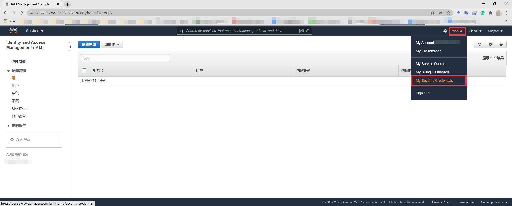
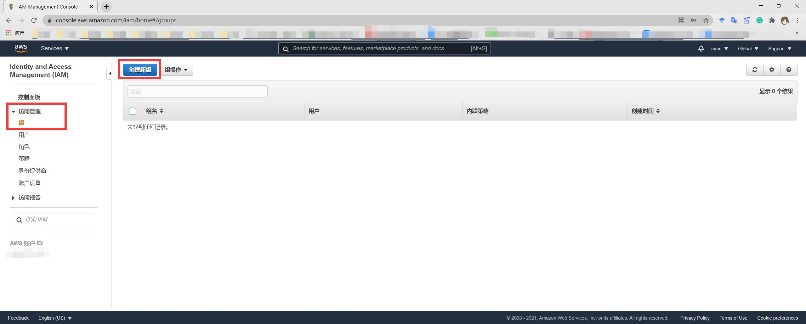
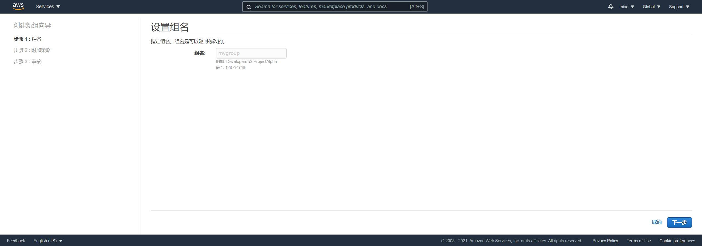
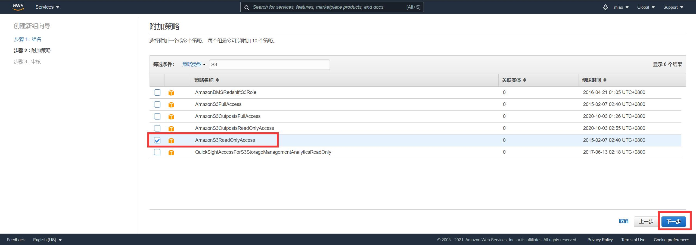
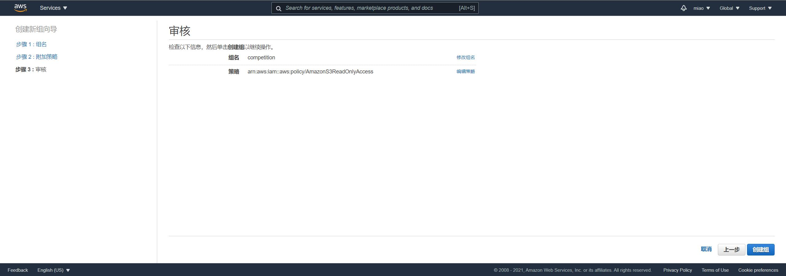
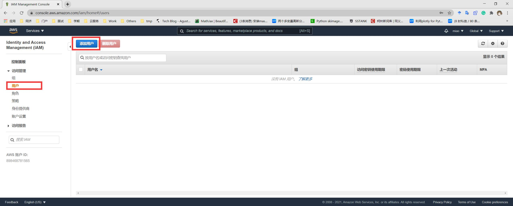
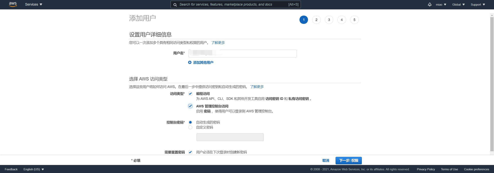
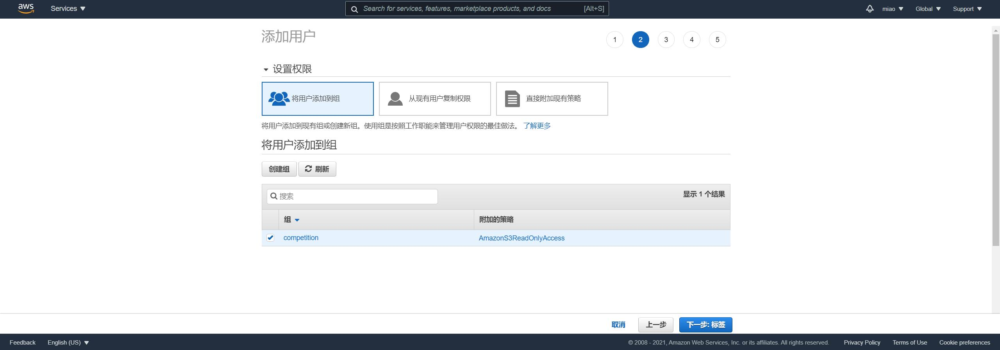
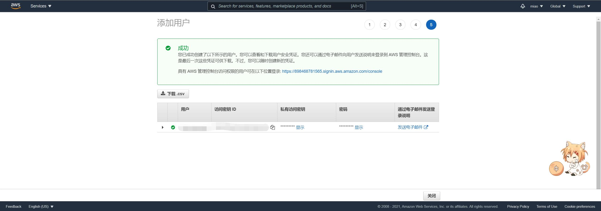
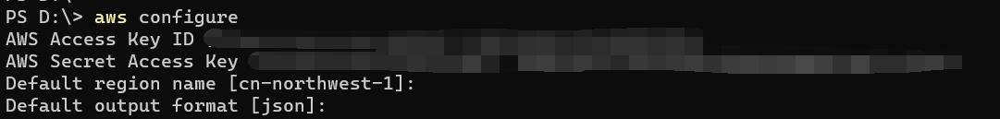

## 创建AWS账户

## 创建组

进入控制台：https://console.aws.amazon.com/



创建组



设置组名




设置策略：s3-readonly和审核





## 创建用户



设置用户名，访问权限



将用户添加到组



之后一路next，直到获得访问密钥



## 安装CLI

https://docs.aws.amazon.com/cli/latest/userguide/install-cliv2-windows.html
https://awscli.amazonaws.com/AWSCLIV2.msi

## 配置CLI

将前面的访问ID和私有访问密钥


## aws s3命令下载数据集

```bash
aws s3 cp "s3://ml-inat-competition-datasets/2021/train.tar.gz" ./ --recursive
```

## 加速

https://blog.csdn.net/xuanwu_yan/article/details/79160034

修改配置文件vim ~/.aws/config，末尾加入
```
[default]
output = json 
s3 = 
  max_concurrent_requests =500 
  max_queue_size = 10001 
  multipart_threshold = 500MB
```