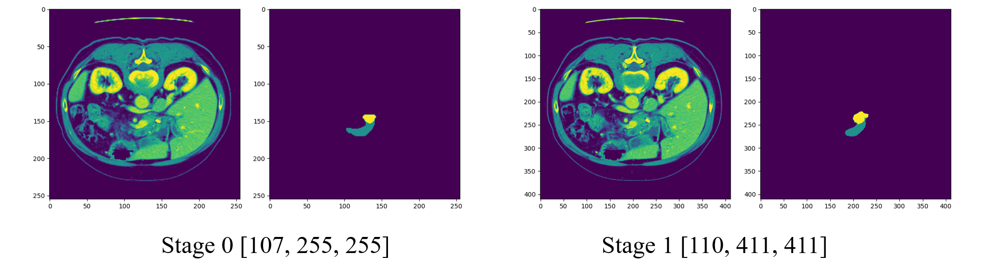
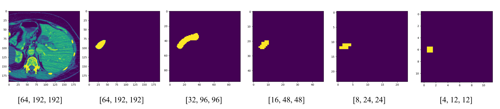

[TOC]

- 数据集：Decathlon Task07_Pancreas
- 平台： Ubuntu为主 (windows作测试用，其中很多不准)
- 参考：
  - https://zhuanlan.zhihu.com/p/125730993
  - https://zhuanlan.zhihu.com/p/125630560
  - https://zhuanlan.zhihu.com/p/123901100
  - https://zhuanlan.zhihu.com/p/100014604

- [准备&Decathlon数据集使用](#准备decathlon数据集使用)
  - [设定数据集路径](#设定数据集路径)
  - [将Decathlon数据集进行转换](#将decathlon数据集进行转换)
  - [进行前处理](#进行前处理)
    - [**对数据进行整理（裁剪4D数据）**](#对数据进行整理裁剪4d数据)
    - [**对数据集进行分析**](#对数据集进行分析)
    - [**对3D网络进行数据集前处理 planner_3d**](#对3d网络进行数据集前处理-planner_3d)
- [进行训练](#进行训练)
  - [损失函数](#损失函数)
  - [生成训练数据集](#生成训练数据集)
- [更改（windows）](#更改windows)

## 准备&Decathlon数据集使用

### 设定数据集路径

在环境路径中，设定网络的基本路径：
- **[nnUNet_raw_data_base]** - D:\Projects\nnUNet\data_base\nnUNet_raw_data
- **[nnUNet_preprocessed]**  - D:\Projects\nnUNet\data_base\nnUNet_preprocessed
- **[RESULTS_FOLDER]** - D:\Projects\nnUNet\data_base\result_folder

```bash
export nnUNet_raw_data_base="/MiaoMiaoYang/nnUNet/data/nnUNet_raw"
export nnUNet_preprocessed="/MiaoMiaoYang/nnUNet/data/nnUNet_preprocessed"
export RESULTS_FOLDER="/MiaoMiaoYang/nnUNet/data/result_folder"
```

### 将Decathlon数据集进行转换

因为有一些数据是4D时序的数据，比如心脏，所以在这里，他将decathlon数据集转换成统一格式。

- 如果是3D数据，则文件内容不变，更改文件名，Eg: pancreas_001.nii.gz $\rightarrow$ pancreas_001_0000.nii.gz
- 如果是4D数据，则拆分成各个3D内容，在后面4位角标进行标注


```bash
nnUNet_convert_decathlon_task -i FOLDER_TO_TASK_AS_DOWNLOADED_FROM_MSD -p NUM_PROCESSES

# Example: 
nnUNet_convert_decathlon_task -i D:/Projects/nnUNet/data_base/nnUNet_raw_data/Task07_Pancreas -p 1
```

转换后，**[nnUNet_raw_data_base]**\ nnUNet_raw_data\ Task007_Pancreas 下的文件如下所示：
```
|-- nnUNet_preprocessed
|-- nnUNet_raw
|   |-- nnUNet_cropped_data
|   `-- nnUNet_raw_data
|       `-- Task007_Pancreas
|           |-- dataset.json
|           |-- imagesTr
|           |   |-- pancreas_001_0000.nii.gz
|           |   |-- pancreas_004_0000.nii.gz
|           |   |-- ...
|           |   `-- pancreas_421_0000.nii.gz
|           |-- imagesTs
|           |   |-- pancreas_002_0000.nii.gz
|           |   |-- pancreas_003_0000.nii.gz
|           |   |-- ...
|           |   `-- pancreas_420_0000.nii.gz
|           `-- labelsTr
|               |-- pancreas_001.nii.gz
|               |-- pancreas_004.nii.gz
|               |-- ...
|               `-- pancreas_421.nii.gz
`-- result_folder
    `-- nnUNet
```

### 进行前处理

```bash
nnUNet_plan_and_preprocess -t XXX --verify_dataset_integrity

## Example
nnUNet_plan_and_preprocess -t 007 --verify_dataset_integrity
```

#### **对数据进行整理（裁剪4D数据）**

```python
def crop(task_string, override=False, num_threads=default_num_threads):

    ## cropped_out_dir:D:\Projects\nnUNet\data_base\nnUNet_raw_data\nnUNet_cropped_data\Task007_Pancreas
    cropped_out_dir = join(nnUNet_cropped_data, task_string)
    os.makedirs(cropped_out_dir,exist_ok=True)

    if override and isdir(cropped_out_dir):
        shutil.rmtree(cropped_out_dir)
        maybe_mkdir_p(cropped_out_dir)

    ## splitted_4d_output_dir_task:D:\Projects\nnUNet\data_base\nnUNet_raw_data\nnUNet_raw_data\Task007_Pancreas
    splitted_4d_output_dir_task = join(nnUNet_raw_data, task_string)

    ## lists
    ## [['D:\\Projects\\nnUNet\\data_base\\nnUNet_raw_data\\nnUNet_raw_data\\Task007_Pancreas\\imagesTr\\pancreas_290_0000.nii.gz',
    ##   'D:\\Projects\\nnUNet\\data_base\\nnUNet_raw_data\\nnUNet_raw_data\\Task007_Pancreas\\labelsTr\\pancreas_290.nii.gz'],
    ##   ...]
    lists, _ = create_lists_from_splitted_dataset(splitted_4d_output_dir_task)

    ## nnunet > preprocessing > cropping.py > [class ImageCropper]
    imgcrop = ImageCropper(num_threads, cropped_out_dir)
    imgcrop.run_cropping(lists, overwrite_existing=override)
    shutil.copy(join(nnUNet_raw_data, task_string, "dataset.json"), cropped_out_dir)
```

在 **[nnUNet_raw_data_base]** \nnUNet_cropped_data \Task007_Pancreas 下生成了图像(.npz，包含图像和标注)和他的属性信息(.pkl)，并且生成gt_segmentation保存分割的金标准

```python
## Example: pancreas_290.npz
data = np.load(r"D:\Projects\nnUNet\data_base\nnUNet_raw_data\nnUNet_raw_data\Task007_Pancreas\imagesTr\pancreas_290.npz")
print(data['data'].shape) 
## Output: (2,97,512,512)

-----------------------------------------------

import pickle
from pprint import pprint
with open(r"D:\Projects\nnUNet\data_base\nnUNet_raw_data\nnUNet_raw_data\Task007_Pancreas\imagesTr\pancreas_290.pkl",'rb') as f:
    data = pickle.load(f)
    pprint(data)
## Output:
# OrderedDict([('original_size_of_raw_data', array([ 97, 512, 512])),
#              ('original_spacing', array([2.5       , 0.91601598, 0.91601598])),
#              ('list_of_data_files',
#               ['D:\\Projects\\nnUNet\\data_base\\nnUNet_raw_data\\nnUNet_raw_data\\Task007_Pancreas\\imagesTr\\pancreas_290_0000.nii.gz']),
#              ('seg_file',
#               'D:\\Projects\\nnUNet\\data_base\\nnUNet_raw_data\\nnUNet_raw_data\\Task007_Pancreas\\labelsTr\\pancreas_290.nii.gz'),
#              ('itk_origin', (468.08416748046875, 468.08416748046875, 0.0)),
#              ('itk_spacing', (0.9160159826278687, 0.9160159826278687, 2.5)),
#              ('itk_direction', (-1.0, 0.0, 0.0, 0.0, -1.0, 0.0, 0.0, 0.0, 1.0)),
#              ('crop_bbox', [[0, 97], [0, 512], [0, 512]]),
#              ('classes', array([-1.,  0.,  1.,  2.], dtype=float32)),
#              ('size_after_cropping', (97, 512, 512))])
```

结束后的文件加是
```
|-- nnUNet_preprocessed
|
|-- nnUNet_raw
|   |
|   |-- nnUNet_cropped_data
|   |   |
|   |   `-- Task007_Pancreas
|   |       |
|   |       |-- dataset.json
|   |       |
|   |       |-- gt_segmentations
|   |       |   |-- pancreas_001.nii.gz
|   |       |   |-- pancreas_004.nii.gz
|   |       |   |-- ...
|   |       |   `-- pancreas_421.nii.gz
|   |       |
|   |       |-- pancreas_001.npz
|   |       |-- pancreas_001.pkl
|   |       |-- pancreas_004.npz
|   |       |-- pancreas_004.pkl
|   |       |-- ... .npz
|   |       |-- ... .pkl
|   |       |-- pancreas_421.npz
|   |       `-- pancreas_421.pkl
|   |      
|   `-- nnUNet_raw_data
|       |
|       `-- Task007_Pancreas
|           |
|           |-- dataset.json
|           |
|           |-- imagesTr
|           |   |-- pancreas_001_0000.nii.gz
|           |   |-- pancreas_004_0000.nii.gz
|           |   |-- ...
|           |   `-- pancreas_421_0000.nii.gz
|           |
|           |-- imagesTs
|           |   |-- pancreas_002_0000.nii.gz
|           |   |-- pancreas_003_0000.nii.gz
|           |   |-- ...
|           |   `-- pancreas_420_0000.nii.gz
|           |
|           `-- labelsTr
|               |-- pancreas_001.nii.gz
|               |-- pancreas_004.nii.gz
|               |-- ...
|               `-- pancreas_421.nii.gz
|
`-- result_folder
    |
    `-- nnUNet
```

> 在这个过程中可能会出现报错“ multiprocessing.pool.MaybeEncoding Error: Error sending result: '<multiprocessing.pool.ExceptionWithTraceback object at 0x7f8ff58e8110>'. Reason: 'PicklingError("Can't pickle <class 'MemoryError'>: it's not the same object as builtins.MemoryError")'”
> 原因是在这个过程中RAM爆了，所以多跑几次把这个跑完就好了


#### **对数据集进行分析**

```python
dataset_analyzer = DatasetAnalyzer(cropped_out_dir, overwrite=False, num_processes=tf)  # this class creates the fingerprint
_ = dataset_analyzer.analyze_dataset(collect_intensityproperties)  # this will write output files that will be used by the ExperimentPlanner
```

进行数据集分析，储存在 **[nnUNet_raw_data_base]**\ nnUNet_cropped_data\ Task007_Pancreas\ dataset_properties.pkl中

```python
import pickle
from pprint import pprint
with open(r"D:\Projects\nnUNet\data_base\nnUNet_raw_data\nnUNet_cropped_data\Task007_Pancreas\dataset_properties.pkl",'rb') as f:
    data = pickle.load(f)
    pprint(data)
    
# {'all_classes': [1, 2],
#  'all_sizes': [(110, 512, 512),
#                (107, 512, 512),
#                ...
#                (131, 512, 512)],
#  'all_spacings': [array([2.5       , 0.64453101, 0.64453101]),
#                   array([1.5       , 0.97656202, 0.97656202]),
#                   ...
#                   array([2.        , 0.97265601, 0.97265601])],
#  'intensityproperties': OrderedDict([(0,
#                                       OrderedDict([('local_props',
#                                                     OrderedDict([('pancreas_001',
#                                                                   OrderedDict([('median',84.0),
#                                                                                ('mean',95.87825),
#                                                                                ('sd',179.51465),
#                                                                                ('mn',-71.0),
#                                                                                ('mx',3034.0),
#                                                                                ('percentile_99_5',1569.2499999999654),
#                                                                                ('percentile_00_5',-41.15)])),
#                                                                  ('pancreas_004',
#                                                                   OrderedDict([('median',78.0),
#                                                                                ('mean',72.81623),
#                                                                                ('sd',124.151405),
#                                                                                ('mn',-996.0),
#                                                                                ('mx',2226.0),
#                                                                                ('percentile_99_5',729.9399999999987),
#                                                                                ('percentile_00_5',-114.0)])),
#                                                                  ('pancreas_421',
#                                                                   OrderedDict([('median',62.0),
#                                                                                ('mean',52.686794),
#                                                                                ('sd',45.905533),
#                                                                                ('mn',-126.0),
#                                                                                ('mx',186.0),
#                                                                                ('percentile_99_5',140.0),
#                                                                                ('percentile_00_5',-103.515)]))])),
#                                                    ('median', 84.0),
#                                                    ('mean', 77.98502),
#                                                    ('sd', 75.32122),
#                                                    ('mn', -996.0),
#                                                    ('mx', 3071.0),
#                                                    ('percentile_99_5', 215.0),
#                                                    ('percentile_00_5',-96.0)]))]),
#  'modalities': {0: 'CT'},
#  'size_reductions': OrderedDict([('pancreas_001', 1.0),
#                                  ('pancreas_004', 1.0),
#                                  ...,
#                                  ('pancreas_421', 1.0)])}
```
之后将dataset_properties.pkl，还有dataset.json拷贝到了 **[nnUNet_preprocessed]**/Task007_Pancreas 中

#### **对3D网络进行数据集前处理 planner_3d**

nnunet $\rightarrow$ experiment_planning $\rightarrow$ experiment_planner_baseline_3DUNet.py


1. 归一化
    除CT外，其他模态使用的归一化都是z-scoring


    CT使用的是全局归一化. To this end, nnU-Net uses the 0.5 and 99.5 percentiles of the foreground voxels for clipping as well as the global foreground mean a standard deviation for normalization on all images

    ```python
    def determine_whether_to_use_mask_for_norm(self):
        # only use the nonzero mask for normalization of the cropping based on it resulted in a decrease in
        # image size (this is an indication that the data is something like brats/isles and then we want to
        # normalize in the brain region only)
        modalities = self.dataset_properties['modalities']
        num_modalities = len(list(modalities.keys()))
        use_nonzero_mask_for_norm = OrderedDict()

        for i in range(num_modalities):
            if "CT" in modalities[i]:
                use_nonzero_mask_for_norm[i] = False
            else:
                all_size_reductions = []
                for k in self.dataset_properties['size_reductions'].keys():
                    all_size_reductions.append(self.dataset_properties['size_reductions'][k])

                if np.median(all_size_reductions) < 3 / 4.:
                    print("using nonzero mask for normalization")
                    use_nonzero_mask_for_norm[i] = True
                else:
                    print("not using nonzero mask for normalization")
                    use_nonzero_mask_for_norm[i] = False

        for c in self.list_of_cropped_npz_files:
            case_identifier = get_case_identifier_from_npz(c)
            properties = self.load_properties_of_cropped(case_identifier)
            properties['use_nonzero_mask_for_norm'] = use_nonzero_mask_for_norm
            self.save_properties_of_cropped(case_identifier, properties)
        use_nonzero_mask_for_normalization = use_nonzero_mask_for_norm
        return use_nonzero_mask_for_normalization
    ```


2. 寻找目标的CT间隔(spacings)

    ```python
    def get_target_spacing(self):
        spacings = self.dataset_properties['all_spacings']
        # target = np.median(np.vstack(spacings), 0)
        # if target spacing is very anisotropic we may want to not downsample the axis with the worst spacing
        # uncomment after mystery task submission
        # 在初始化中设定：self.target_spacing_percentile = 50
        target = np.percentile(np.vstack(spacings), self.target_spacing_percentile, 0)
        return target
    ```
    将所有CT的中位数作为所有CT的目标spacing，之后利用新的spacing得到进行归一化的图像shape:
    ```python
    target_spacing = self.get_target_spacing()
    new_shapes = [np.array(i) / target_spacing * np.array(j) for i, j in zip(spacings, sizes)]

    print("target_spacing:")
    print(target_spacing)
    print("sizes:")
    print(sizes)
    print("new_shapes:")
    print(new_shapes)
    # target_spacing:
    # [2.5, 0.80273402, 0.80273402]
    # sizes:
    # [(110, 512, 512), (107, 512, 512), ..., (131, 512, 512)]
    # new_shapes:
    # [([110., 411.09492159, 411.09492159]), ([107., 473.38251017, 473.38251017]),...,([104.8, 620.37968636, 620.37968636])]
    ```
    可以看到，这里图像大小归一化的策略是根据spacing对图像的所有维度进行归一化，而不是只针对axial轴进行归一化。之后他进行了spacing的大小分析：
    ```python
    # we base our calculations on the median shape of the datasets
    median_shape = np.median(np.vstack(new_shapes), 0)
    print("the median shape of the dataset is ", median_shape)
    max_shape = np.max(np.vstack(new_shapes), 0)
    print("the max shape in the dataset is ", max_shape)
    min_shape = np.min(np.vstack(new_shapes), 0)
    print("the min shape in the dataset is ", min_shape)
    print("we don't want feature maps smaller than ", selfunet_featuremap_min_edge_length, " in the bottleneck")
    # the median shape of the dataset is [96. 512. 512.] 
    # the max shape in the dataset is [210.28361328 622.87101959 622.87101959]
    # the min shape in the dataset is [51. 386.18037278 386.18037278] 
    # we don't want feature maps smaller than  4  in the bottleneck
    ```

3. 自动计算训练策略

    ```python
    print("generating configuration for 3d_fullres")
    self.plans_per_stage.append(self.get_properties_for_stage(
        target_spacing_transposed,
        target_spacing_transposed,
        median_shape_transposed,
        len(self.list_of_cropped_npz_files),
        num_modalities,
        len(all_classes) + 1
    )

    print(self.plans_per_stage)
    # [{'batch_size': 2,
    #   'num_pool_per_axis': [3, 5, 5], 
    #   'patch_size': array([40, 224, 224]),
    #   'median_patient_size_in_voxels': array([96, 512, 512]),
    #   'current_spacing': array([2.5, 0.80273402, 0.80273402]),
    #   'original_spacing': array([2.5, 0.80273402, 0.80273402]), 
    #   'do_dummy_2D_data_aug': True,
    #   'pool_op_kernel_sizes': [[1, 2, 2], [2, 2, 2], [2, 2, 2], [2, 2, 2], [1, 2, 2]],
    #   'conv_kernel_sizes': [[1, 3, 3], [3, 3, 3], [3, 3, 3], [3, 3, 3], [3, 3, 3], [3, 3, 3]}]
    ```
    注意，这里的def get_properties_for_stage跳转到了experiments_planner_baseline_3DUNet.py中了

    根据spacing计算，如果spacing最大的方向的体素是512，那么这个feature map的shape是多少，然后和之前选中的那个shape进行比较，选小的一边

    ```python
    """
    current_spacing: [2.5 0.80273402 0.80273402]
    new_median_shape: [96 512 512]
    """
    # compute how many voxels are one mm
    # input_path_size  [0.4  1.24574265 1.24574265]
    input_patch_size = 1 / np.array(current_spacing) 

    # normalize voxels per mm
    # 这个归一化我其实不是很懂，是不是将path等比例缩放，因为后面是1/min()
    # 或者我觉得更有道理的normalize应该是对mm^3进行归一化
    # input_path_size  [0.41501162 1.29249419 1.29249419]
    input_patch_size /= input_patch_size.mean()

    # create an isotropic patch of size 512x512x512mm
    # 这里的意思其实是，如果建立一个各个方向spacing都是一样的，需要的voxels，也就是map的大小，
    # 这里设定了最小的一个方向的大小是 512 voxel
    # input_path_size  [ 512.  1594.55058874 1594.55058874]
    input_patch_size *= 1 / min(input_patch_size) * 512  # to get a starting value
    # input_path_size  [ 512 1595 1595]
    input_patch_size = np.round(input_patch_size).astype(int)


    # clip it to the median shape of the dataset because patches larger then that make not much sense
    # 各个方向上取一个最小的结果
    # input_path_size  [ 96 512 512]
    input_patch_size = [min(i, j) for i, j in zip(input_patch_size, new_median_shape)]
    ```

    根据输入的大小，计算网络结构以及可除尽的大小
    ```python
    network_num_pool_per_axis, pool_op_kernel_sizes, conv_kernel_sizes, new_shp, \
    shape_must_be_divisible_by = get_pool_and_conv_props(
            current_spacing,
            input_patch_size,
            self.unet_featuremap_min_edge_length,
            self.unet_max_numpool)
    ## network_num_pool_per_axis: [4, 7, 7]
    ## pool_op_kernel_sizes: [[1, 2, 2], [2, 2, 2], [2, 2, 2], [2, 2, 2], [2, 2, 2], [1, 2, 2], [1, 2, 2]]
    ## conv_kernel_sizes: [[1, 3, 3], [3, 3, 3], [3, 3, 3], [3, 3, 3], [3, 3, 3], [3, 3, 3], [3, 3, 3], [3, 3, 3]]
    ##new_shape: [ 96 512 512]
    ##shape_must_be_divisible_by: [ 16 128 128]
    ```
    自动计算网络架构：

    网络中仅使用conv - >instance normalization -> Leaky relu。上采样使用的是转置卷积。确定好input_path_size后，对每个方向进行下采样，直到最终的feature map size小于 $4\times 4\times 4$
    ```python
    def get_pool_and_conv_props(spacing, patch_size, min_feature_map_size, max_numpool):
        """
        :param spacing:
        :param patch_size:
        :param min_feature_map_size: min edge length of feature maps in bottleneck
        """
        dim = len(spacing)      
        current_spacing = deepcopy(list(spacing))
        current_size = deepcopy(list(patch_size))       
        pool_op_kernel_sizes = []
        conv_kernel_sizes = []      
        num_pool_per_axis = [0] * dim       
        while True:
            # This is a problem because sometimes we have spacing 20, 50, 50 and we want to still keep      pooling.
            # Here we would stop however. This is not what we want! Fixed in get_pool_and_conv_propsv2
            min_spacing = min(current_spacing)
            valid_axes_for_pool = [i for i in range(dim) if current_spacing[i] / min_spacing < 2]
            axes = []
            for a in range(dim):
                my_spacing = current_spacing[a]
                partners = [i for i in range(dim) if current_spacing[i] / my_spacing < 2 and        my_spacing / current_spacing[i] < 2]
                if len(partners) > len(axes):
                    axes = partners
            conv_kernel_size = [3 if i in axes else 1 for i in range(dim)]      
            # exclude axes that we cannot pool further because of min_feature_map_size constraint
            #before = len(valid_axes_for_pool)
            valid_axes_for_pool = [i for i in valid_axes_for_pool if current_size[i] >=     2*min_feature_map_size]
            #after = len(valid_axes_for_pool)
            #if after == 1 and before > 1:
            #    break      
            valid_axes_for_pool = [i for i in valid_axes_for_pool if num_pool_per_axis[i] <     max_numpool]    
            if len(valid_axes_for_pool) == 0:
                break       
            #print(current_spacing, current_size)       
            other_axes = [i for i in range(dim) if i not in valid_axes_for_pool]        
            pool_kernel_sizes = [0] * dim
            for v in valid_axes_for_pool:
                pool_kernel_sizes[v] = 2
                num_pool_per_axis[v] += 1
                current_spacing[v] *= 2
                current_size[v] = np.ceil(current_size[v] / 2)
            for nv in other_axes:
                pool_kernel_sizes[nv] = 1       
            pool_op_kernel_sizes.append(pool_kernel_sizes)
            conv_kernel_sizes.append(conv_kernel_size)
            #print(conv_kernel_sizes)       
        must_be_divisible_by = get_shape_must_be_divisible_by(num_pool_per_axis)
        patch_size = pad_shape(patch_size, must_be_divisible_by)        
        # we need to add one more conv_kernel_size for the bottleneck. We always use 3x3(x3) conv here
        conv_kernel_sizes.append([3]*dim)
        return num_pool_per_axis, pool_op_kernel_sizes, conv_kernel_sizes, patch_size,      must_be_divisible_by
    ```

4. 实施预处理

    nnunet $\rightarrow$ preprocessing $\rightarrow$ preprocessing.py $\rightarrow$ class GenericPreprocessor

    主要运行函数是def _run_internal

    - 加载cropped数据，之后进行resample

        这里的resample是根据target spacing对数据和标签进行重采样到指定的spacing
    
        然后进行数值的调整，clip掉$HU \in [... ,0.5\%] \& [99.5\%, ...]$
        然后对HU进行z-score归一化
        
    ```python
    def resample_and_normalize(self, data, target_spacing, properties, seg=None, force_separate_z=None):
        """
        data and seg must already have been transposed by transpose_forward. properties are the un-transposed values
        (spacing etc)
        :param data:
        :param target_spacing:
        :param properties:
        :param seg:
        :param force_separate_z:
        :return:
        """

        # target_spacing is already transposed, properties["original_spacing"] is not so we need to transpose it!
        # data, seg are already transposed. Double check this using the properties
        original_spacing_transposed = np.array(properties["original_spacing"])[self.transpose_forward]
        before = {
            'spacing': properties["original_spacing"],
            'spacing_transposed': original_spacing_transposed,
            'data.shape (data is transposed)': data.shape
        }

        # remove nans
        data[np.isnan(data)] = 0
        print('data shape: {}'.format(data.shape))

        data, seg = resample_patient(data, seg, np.array(original_spacing_transposed), target_spacing, 3, 1,
                                     force_separate_z=force_separate_z, order_z_data=0, order_z_seg=0,
                                     separate_z_anisotropy_threshold=self.resample_separate_z_anisotropy_threshold)


        after = {
            'spacing': target_spacing,
            'data.shape (data is resampled)': data.shape
        }
        print("before:", before, "\nafter: ", after, "\n")

        if seg is not None:  # hippocampus 243 has one voxel with -2 as label. wtf?
            seg[seg < -1] = 0

        properties["size_after_resampling"] = data[0].shape
        properties["spacing_after_resampling"] = target_spacing
        use_nonzero_mask = self.use_nonzero_mask

        assert len(self.normalization_scheme_per_modality) == len(data), "self.normalization_scheme_per_modality " \
                                                                         "must have as many entries as data has " \
                                                                         "modalities"
        assert len(self.use_nonzero_mask) == len(data), "self.use_nonzero_mask must have as many entries as data" \
                                                        " has modalities"

        for c in range(len(data)):
            scheme = self.normalization_scheme_per_modality[c]
            if scheme == "CT":
                # clip to lb and ub from train data foreground and use foreground mn and sd from training data
                assert self.intensityproperties is not None, "ERROR: if there is a CT then we need intensity properties"
                mean_intensity = self.intensityproperties[c]['mean']
                std_intensity = self.intensityproperties[c]['sd']
                lower_bound = self.intensityproperties[c]['percentile_00_5']
                upper_bound = self.intensityproperties[c]['percentile_99_5']
                data[c] = np.clip(data[c], lower_bound, upper_bound)
                data[c] = (data[c] - mean_intensity) / std_intensity
                if use_nonzero_mask[c]:
                    data[c][seg[-1] < 0] = 0
            elif scheme == "CT2":
                # clip to lb and ub from train data foreground, use mn and sd form each case for normalization
                assert self.intensityproperties is not None, "ERROR: if there is a CT then we need intensity properties"
                lower_bound = self.intensityproperties[c]['percentile_00_5']
                upper_bound = self.intensityproperties[c]['percentile_99_5']
                mask = (data[c] > lower_bound) & (data[c] < upper_bound)
                data[c] = np.clip(data[c], lower_bound, upper_bound)
                mn = data[c][mask].mean()
                sd = data[c][mask].std()
                data[c] = (data[c] - mn) / sd
                if use_nonzero_mask[c]:
                    data[c][seg[-1] < 0] = 0
            else:
                if use_nonzero_mask[c]:
                    mask = seg[-1] >= 0
                else:
                    mask = np.ones(seg.shape[1:], dtype=bool)
                data[c][mask] = (data[c][mask] - data[c][mask].mean()) / (data[c][mask].std() + 1e-8)
                data[c][mask == 0] = 0
        return data, seg, properties
    ```
    
    - **标签随机选点，平衡标签**
    
        这种平衡标签的方式真的是特别amazing，之前从来没想过可以这么平衡标签
    
        他把label中的所有坐标点提取出来，然后进行随机的选点，设定随机的点最多10000个，最小不能少于标签坐标的1%。
        这种的话就不需要对图像进行裁切来进行平衡，如果有斑驳的话也可以使用后期的出来来进行弥补
    
        最后data['class_locations']就是[num,3]的数组，保存了选择的label的点
    
        > 但是这个10000的选择不知道适不适用于其他的任何数据集？？？
    
        ```python
        # we need to find out where the classes are and sample some random locations
        # let's do 10.000 samples per class
        # seed this for reproducibility!
        num_samples = 10000
        min_percent_coverage = 0.01 # at least 1% of the class voxels need to be selected, otherwise it may be too sparse
        rndst = np.random.RandomState(1234)
        class_locs = {}
        for c in all_classes:
            all_locs = np.argwhere(all_data[-1] == c)
        
            if len(all_locs) == 0:
                class_locs[c] = []
                continue
        
            target_num_samples = min(num_samples, len(all_locs))
            target_num_samples = max(target_num_samples, int(np.ceil(len(all_locs) * min_percent_coverage)))
        
            selected = all_locs[rndst.choice(len(all_locs), target_num_samples, replace=False)]
            class_locs[c] = selected
            print(c, target_num_samples)
        
        properties['class_locations'] = class_locs
        ```
    
    - 两阶段Cascade Unet

        第一阶段unet是小图像 [107, 225, 225]，第二阶段是全图像 [110, 411, 411]。
        但是每个阶段的图像都是全景图像。

        


## 进行训练

> 使用 3D U-Net Cascade 进行训练
>
> 这一部分的代码在 nnunet -> run -> run_training.py 中

- 3D low resolution U-Net
    For FOLD in [0, 1, 2, 3, 4], run:
    ```bash
    nnUNet_train 3d_lowres nnUNetTrainerV2 TaskXXX_MYTASK FOLD --npz
    ## Example
    nnUNet_train 3d_lowres nnUNetTrainerV2 Task007_Pancreas 0 --npz
    ```

-  3D full resolution U-Net
    For FOLD in [0, 1, 2, 3, 4], run:
    ```bash
    nnUNet_train 3d_cascade_fullres nnUNetTrainerV2CascadeFullRes TaskXXX_MYTASK FOLD --npz
    ## Example
    nnUNet_train 3d_cascade_fullres nnUNetTrainerV2CascadeFullRes Task007_Pancreas 0 --npz
    ```

### 损失函数

> nnunet -> training -> loss_function -> dice_loss.py

```python
class DC_and_CE_loss(nn.Module):
    def __init__(self, soft_dice_kwargs, ce_kwargs, aggregate="sum", square_dice=False, weight_ce=1, weight_dice=1,
                 log_dice=False, ignore_label=None):
        """
        CAREFUL. Weights for CE and Dice do not need to sum to one. You can set whatever you want.
        :param soft_dice_kwargs:
        :param ce_kwargs:
        :param aggregate:
        :param square_dice:
        :param weight_ce:
        :param weight_dice:
        """
        super(DC_and_CE_loss, self).__init__()
        if ignore_label is not None:
            assert not square_dice, 'not implemented'
            ce_kwargs['reduction'] = 'none'
        self.log_dice = log_dice
        self.weight_dice = weight_dice
        self.weight_ce = weight_ce
        self.aggregate = aggregate
        self.ce = RobustCrossEntropyLoss(**ce_kwargs)

        self.ignore_label = ignore_label

        if not square_dice:
            self.dc = SoftDiceLoss(apply_nonlin=softmax_helper, **soft_dice_kwargs)
        else:
            self.dc = SoftDiceLossSquared(apply_nonlin=softmax_helper, **soft_dice_kwargs)

    def forward(self, net_output, target):
        """
        target must be b, c, x, y(, z) with c=1
        :param net_output:
        :param target:
        :return:
        """
        if self.ignore_label is not None:
            assert target.shape[1] == 1, 'not implemented for one hot encoding'
            mask = target != self.ignore_label
            target[~mask] = 0
            mask = mask.float()
        else:
            mask = None

        dc_loss = self.dc(net_output, target, loss_mask=mask) if self.weight_dice != 0 else 0
        if self.log_dice:
            dc_loss = -torch.log(-dc_loss)

        ce_loss = self.ce(net_output, target[:, 0].long()) if self.weight_ce != 0 else 0
        if self.ignore_label is not None:
            ce_loss *= mask[:, 0]
            ce_loss = ce_loss.sum() / mask.sum()

        if self.aggregate == "sum":
            result = self.weight_ce * ce_loss + self.weight_dice * dc_loss
        else:
            raise NotImplementedError("nah son") # reserved for other stuff (later)
        return result
```

使用方法：
```python
"""
self.batch_size: False
"""
loss = DC_and_CE_loss({'batch_dice': self.batch_dice, 'smooth': 1e-5, 'do_bg': False}, {})
```

如果是多个标签，会使用权重进行分配，在MultiOutputLoss2中

```python
class MultipleOutputLoss2(nn.Module):
    def __init__(self, loss, weight_factors=None):
        """
        use this if you have several outputs and ground truth (both list of same len) and the loss should be computed
        between them (x[0] and y[0], x[1] and y[1] etc)
        :param loss:
        :param weight_factors:
        """
        super(MultipleOutputLoss2, self).__init__()
        self.weight_factors = weight_factors
        self.loss = loss

    def forward(self, x, y):
        assert isinstance(x, (tuple, list)), "x must be either tuple or list"
        assert isinstance(y, (tuple, list)), "y must be either tuple or list"
        if self.weight_factors is None:
            weights = [1] * len(x)
        else:
            weights = self.weight_factors

        l = weights[0] * self.loss(x[0], y[0])
        for i in range(1, len(x)):
            if weights[i] != 0:
                l += weights[i] * self.loss(x[i], y[i])
        return l
```


### 生成训练数据集

> nnunet -> training -> network_training -> nnUNetTrainerV2.py 

```python
if training:
    self.dl_tr, self.dl_val = self.get_basic_generators()
```

> nnunet -> training -> network_training -> nnUNetTrainer.py 

```python
def load_dataset(self):
    self.dataset = load_dataset(self.folder_with_preprocessed_data)

def get_basic_generators(self):
    ## 加载数据集的基本情况
    self.load_dataset()

    ## 训练集和测试集的分割
    self.do_split()

    if self.threeD:
        dl_tr = DataLoader3D(self.dataset_tr, self.basic_generator_patch_size, self.patch_size, self.batch_size,
                             False, oversample_foreground_percent=self.oversample_foreground_percent,
                             pad_mode="constant", pad_sides=self.pad_all_sides, memmap_mode='r')
        dl_val = DataLoader3D(self.dataset_val, self.patch_size, self.patch_size, self.batch_size, False,
                              oversample_foreground_percent=self.oversample_foreground_percent,
                              pad_mode="constant", pad_sides=self.pad_all_sides, memmap_mode='r')
    else:
        dl_tr = DataLoader2D(self.dataset_tr, self.basic_generator_patch_size, self.patch_size, self.batch_size,
                             oversample_foreground_percent=self.oversample_foreground_percent,
                             pad_mode="constant", pad_sides=self.pad_all_sides, memmap_mode='r')
        dl_val = DataLoader2D(self.dataset_val, self.patch_size, self.patch_size, self.batch_size,
                              oversample_foreground_percent=self.oversample_foreground_percent,
                              pad_mode="constant", pad_sides=self.pad_all_sides, memmap_mode='r')
    return dl_tr, dl_val
```

> nnunet -> training -> dataloading -> dataloading.py -> def load_dataset()

```python
def load_dataset(folder, num_cases_properties_loading_threshold=1000):
    # we don't load the actual data but instead return the filename to the np file.
    print('loading dataset')
    case_identifiers = get_case_identifiers(folder)
    case_identifiers.sort()
    dataset = OrderedDict()
    for c in case_identifiers:
        dataset[c] = OrderedDict()
        dataset[c]['data_file'] = join(folder, "%s.npz" % c)

        # dataset[c]['properties'] = load_pickle(join(folder, "%s.pkl" % c))
        dataset[c]['properties_file'] = join(folder, "%s.pkl" % c)

        if dataset[c].get('seg_from_prev_stage_file') is not None:
            dataset[c]['seg_from_prev_stage_file'] = join(folder, "%s_segs.npz" % c)

    if len(case_identifiers) <= num_cases_properties_loading_threshold:
        print('loading all case properties')
        for i in dataset.keys():
            dataset[i]['properties'] = load_pickle(dataset[i]['properties_file'])

    return dataset
```

> nnunet -> training -> dataloading -> dataloading.py -> class DataLoader3D()

```python
class DataLoader3D(SlimDataLoaderBase):
    def __init__(self, data, patch_size, final_patch_size, batch_size, has_prev_stage=False,
                 oversample_foreground_percent=0.0, memmap_mode="r", pad_mode="edge", pad_kwargs_data=None,
                 pad_sides=None):
        """
        This is the basic data loader for 3D networks. It uses preprocessed data as produced by my (Fabian) preprocessing.
        You can load the data with load_dataset(folder) where folder is the folder where the npz files are located. If there
        are only npz files present in that folder, the data loader will unpack them on the fly. This may take a while
        and increase CPU usage. Therefore, I advise you to call unpack_dataset(folder) first, which will unpack all npz
        to npy. Don't forget to call delete_npy(folder) after you are done with training?
        Why all the hassle? Well the decathlon dataset is huge. Using npy for everything will consume >1 TB and that is uncool
        given that I (Fabian) will have to store that permanently on /datasets and my local computer. With this strategy all
        data is stored in a compressed format (factor 10 smaller) and only unpacked when needed.
        :param data: get this with load_dataset(folder, stage=0). Plug the return value in here and you are g2g (good to go)
        :param patch_size: what patch size will this data loader return? it is common practice to first load larger
        patches so that a central crop after data augmentation can be done to reduce border artifacts. If unsure, use
        get_patch_size() from data_augmentation.default_data_augmentation
        :param final_patch_size: what will the patch finally be cropped to (after data augmentation)? this is the patch
        size that goes into your network. We need this here because we will pad patients in here so that patches at the
        border of patients are sampled properly
        :param batch_size:
        :param num_batches: how many batches will the data loader produce before stopping? None=endless
        :param seed:
        :param stage: ignore this (Fabian only)
        :param random: Sample keys randomly; CAREFUL! non-random sampling requires batch_size=1, otherwise you will iterate batch_size times over the dataset
        :param oversample_foreground: half the batch will be forced to contain at least some foreground (equal prob for each of the foreground classes)
        """
        super(DataLoader3D, self).__init__(data, batch_size, None)
        if pad_kwargs_data is None:
            pad_kwargs_data = OrderedDict()
        self.pad_kwargs_data = pad_kwargs_data
        self.pad_mode = pad_mode
        self.oversample_foreground_percent = oversample_foreground_percent
        self.final_patch_size = final_patch_size
        self.has_prev_stage = has_prev_stage
        self.patch_size = patch_size
        self.list_of_keys = list(self._data.keys())
        # need_to_pad denotes by how much we need to pad the data so that if we sample a patch of size final_patch_size
        # (which is what the network will get) these patches will also cover the border of the patients
        self.need_to_pad = (np.array(patch_size) - np.array(final_patch_size)).astype(int)
        if pad_sides is not None:
            if not isinstance(pad_sides, np.ndarray):
                pad_sides = np.array(pad_sides)
            self.need_to_pad += pad_sides
        self.memmap_mode = memmap_mode
        self.num_channels = None
        self.pad_sides = pad_sides
        self.data_shape, self.seg_shape = self.determine_shapes()

    def get_do_oversample(self, batch_idx):
        return not batch_idx < round(self.batch_size * (1 - self.oversample_foreground_percent))

    def determine_shapes(self):
        if self.has_prev_stage:
            num_seg = 2
        else:
            num_seg = 1

        k = list(self._data.keys())[0]
        if isfile(self._data[k]['data_file'][:-4] + ".npy"):
            case_all_data = np.load(self._data[k]['data_file'][:-4] + ".npy", self.memmap_mode)
        else:
            case_all_data = np.load(self._data[k]['data_file'])['data']
        num_color_channels = case_all_data.shape[0] - 1
        data_shape = (self.batch_size, num_color_channels, *self.patch_size)
        seg_shape = (self.batch_size, num_seg, *self.patch_size)
        return data_shape, seg_shape

    def generate_train_batch(self):
        selected_keys = np.random.choice(self.list_of_keys, self.batch_size, True, None)
        data = np.zeros(self.data_shape, dtype=np.float32)
        seg = np.zeros(self.seg_shape, dtype=np.float32)
        case_properties = []
        for j, i in enumerate(selected_keys):
            # oversampling foreground will improve stability of model training, especially if many patches are empty
            # (Lung for example)
            if self.get_do_oversample(j):
                force_fg = True
            else:
                force_fg = False

            if 'properties' in self._data[i].keys():
                properties = self._data[i]['properties']
            else:
                properties = load_pickle(self._data[i]['properties_file'])
            case_properties.append(properties)

            # cases are stored as npz, but we require unpack_dataset to be run. This will decompress them into npy
            # which is much faster to access
            if isfile(self._data[i]['data_file'][:-4] + ".npy"):
                case_all_data = np.load(self._data[i]['data_file'][:-4] + ".npy", self.memmap_mode)
            else:
                case_all_data = np.load(self._data[i]['data_file'])['data']

            # If we are doing the cascade then we will also need to load the segmentation of the previous stage and
            # concatenate it. Here it will be concatenates to the segmentation because the augmentations need to be
            # applied to it in segmentation mode. Later in the data augmentation we move it from the segmentations to
            # the last channel of the data
            if self.has_prev_stage:
                if isfile(self._data[i]['seg_from_prev_stage_file'][:-4] + ".npy"):
                    segs_from_previous_stage = np.load(self._data[i]['seg_from_prev_stage_file'][:-4] + ".npy",
                                                       mmap_mode=self.memmap_mode)[None]
                else:
                    segs_from_previous_stage = np.load(self._data[i]['seg_from_prev_stage_file'])['data'][None]
                # we theoretically support several possible previsous segmentations from which only one is sampled. But
                # in practice this feature was never used so it's always only one segmentation
                seg_key = np.random.choice(segs_from_previous_stage.shape[0])
                seg_from_previous_stage = segs_from_previous_stage[seg_key:seg_key + 1]
                assert all([i == j for i, j in zip(seg_from_previous_stage.shape[1:], case_all_data.shape[1:])]), \
                    "seg_from_previous_stage does not match the shape of case_all_data: %s vs %s" % \
                    (str(seg_from_previous_stage.shape[1:]), str(case_all_data.shape[1:]))
            else:
                seg_from_previous_stage = None

            # do you trust me? You better do. Otherwise you'll have to go through this mess and honestly there are
            # better things you could do right now

            # (above) documentation of the day. Nice. Even myself coming back 1 months later I have not friggin idea
            # what's going on. I keep the above documentation just for fun but attempt to make things clearer now

            need_to_pad = self.need_to_pad
            for d in range(3):
                # if case_all_data.shape + need_to_pad is still < patch size we need to pad more! We pad on both sides
                # always
                if need_to_pad[d] + case_all_data.shape[d + 1] < self.patch_size[d]:
                    need_to_pad[d] = self.patch_size[d] - case_all_data.shape[d + 1]

            # we can now choose the bbox from -need_to_pad // 2 to shape - patch_size + need_to_pad // 2. Here we
            # define what the upper and lower bound can be to then sample form them with np.random.randint
            shape = case_all_data.shape[1:]
            lb_x = - need_to_pad[0] // 2
            ub_x = shape[0] + need_to_pad[0] // 2 + need_to_pad[0] % 2 - self.patch_size[0]
            lb_y = - need_to_pad[1] // 2
            ub_y = shape[1] + need_to_pad[1] // 2 + need_to_pad[1] % 2 - self.patch_size[1]
            lb_z = - need_to_pad[2] // 2
            ub_z = shape[2] + need_to_pad[2] // 2 + need_to_pad[2] % 2 - self.patch_size[2]

            # if not force_fg then we can just sample the bbox randomly from lb and ub. Else we need to make sure we get
            # at least one of the foreground classes in the patch
            if not force_fg:
                bbox_x_lb = np.random.randint(lb_x, ub_x + 1)
                bbox_y_lb = np.random.randint(lb_y, ub_y + 1)
                bbox_z_lb = np.random.randint(lb_z, ub_z + 1)
            else:
                # these values should have been precomputed
                if 'class_locations' not in properties.keys():
                    raise RuntimeError("Please rerun the preprocessing with the newest version of nnU-Net!")

                # this saves us a np.unique. Preprocessing already did that for all cases. Neat.
                foreground_classes = np.array(
                    [i for i in properties['class_locations'].keys() if len(properties['class_locations'][i]) != 0])
                foreground_classes = foreground_classes[foreground_classes > 0]

                if len(foreground_classes) == 0:
                    # this only happens if some image does not contain foreground voxels at all
                    selected_class = None
                    voxels_of_that_class = None
                    print('case does not contain any foreground classes', i)
                else:
                    selected_class = np.random.choice(foreground_classes)

                    voxels_of_that_class = properties['class_locations'][selected_class]

                if voxels_of_that_class is not None:
                    selected_voxel = voxels_of_that_class[np.random.choice(len(voxels_of_that_class))]
                    # selected voxel is center voxel. Subtract half the patch size to get lower bbox voxel.
                    # Make sure it is within the bounds of lb and ub
                    bbox_x_lb = max(lb_x, selected_voxel[0] - self.patch_size[0] // 2)
                    bbox_y_lb = max(lb_y, selected_voxel[1] - self.patch_size[1] // 2)
                    bbox_z_lb = max(lb_z, selected_voxel[2] - self.patch_size[2] // 2)
                else:
                    # If the image does not contain any foreground classes, we fall back to random cropping
                    bbox_x_lb = np.random.randint(lb_x, ub_x + 1)
                    bbox_y_lb = np.random.randint(lb_y, ub_y + 1)
                    bbox_z_lb = np.random.randint(lb_z, ub_z + 1)

            bbox_x_ub = bbox_x_lb + self.patch_size[0]
            bbox_y_ub = bbox_y_lb + self.patch_size[1]
            bbox_z_ub = bbox_z_lb + self.patch_size[2]

            # whoever wrote this knew what he was doing (hint: it was me). We first crop the data to the region of the
            # bbox that actually lies within the data. This will result in a smaller array which is then faster to pad.
            # valid_bbox is just the coord that lied within the data cube. It will be padded to match the patch size
            # later
            valid_bbox_x_lb = max(0, bbox_x_lb)
            valid_bbox_x_ub = min(shape[0], bbox_x_ub)
            valid_bbox_y_lb = max(0, bbox_y_lb)
            valid_bbox_y_ub = min(shape[1], bbox_y_ub)
            valid_bbox_z_lb = max(0, bbox_z_lb)
            valid_bbox_z_ub = min(shape[2], bbox_z_ub)

            # At this point you might ask yourself why we would treat seg differently from seg_from_previous_stage.
            # Why not just concatenate them here and forget about the if statements? Well that's because segneeds to
            # be padded with -1 constant whereas seg_from_previous_stage needs to be padded with 0s (we could also
            # remove label -1 in the data augmentation but this way it is less error prone)
            case_all_data = np.copy(case_all_data[:, valid_bbox_x_lb:valid_bbox_x_ub,
                                    valid_bbox_y_lb:valid_bbox_y_ub,
                                    valid_bbox_z_lb:valid_bbox_z_ub])
            if seg_from_previous_stage is not None:
                seg_from_previous_stage = seg_from_previous_stage[:, valid_bbox_x_lb:valid_bbox_x_ub,
                                          valid_bbox_y_lb:valid_bbox_y_ub,
                                          valid_bbox_z_lb:valid_bbox_z_ub]

            data[j] = np.pad(case_all_data[:-1], ((0, 0),
                                                  (-min(0, bbox_x_lb), max(bbox_x_ub - shape[0], 0)),
                                                  (-min(0, bbox_y_lb), max(bbox_y_ub - shape[1], 0)),
                                                  (-min(0, bbox_z_lb), max(bbox_z_ub - shape[2], 0))),
                             self.pad_mode, **self.pad_kwargs_data)

            seg[j, 0] = np.pad(case_all_data[-1:], ((0, 0),
                                                    (-min(0, bbox_x_lb), max(bbox_x_ub - shape[0], 0)),
                                                    (-min(0, bbox_y_lb), max(bbox_y_ub - shape[1], 0)),
                                                    (-min(0, bbox_z_lb), max(bbox_z_ub - shape[2], 0))),
                               'constant', **{'constant_values': -1})
            if seg_from_previous_stage is not None:
                seg[j, 1] = np.pad(seg_from_previous_stage, ((0, 0),
                                                             (-min(0, bbox_x_lb),
                                                              max(bbox_x_ub - shape[0], 0)),
                                                             (-min(0, bbox_y_lb),
                                                              max(bbox_y_ub - shape[1], 0)),
                                                             (-min(0, bbox_z_lb),
                                                              max(bbox_z_ub - shape[2], 0))),
                                   'constant', **{'constant_values': 0})

        return {'data': data, 'seg': seg, 'properties': case_properties, 'keys': selected_keys}
```

- 学习率初始是0.01
- 进行了梯度剪裁
    ```python
    torch.nn.utils.clip_grad_norm_(self.network.parameters(), 12)
    ```
- 网络当中还是随机裁剪了，进入网络path的大小为(2,1,64,192,192)
    
    图像为原尺寸大小，但是label被缩小成了每一层的大小。注意，这里的label包含了所有的标签，同时包含了胰腺和肿瘤
    

    网络也会同时输出五层的结果，在loss中通过权重进行分配，权重分别是体素的比


$$\begin{aligned}64 &\times &192 &\times &192 &(64)  &:  \\32 &\times &96  &\times &96  &(32)  &:  \\16 &\times &48  &\times &48  &(16)  &:  \\8  &\times &24  &\times &24  &(8)   &:  \\4  &\times &12  &\times &12  &(1)   &:\end{aligned}$$


## 更改（windows）

- maybe_mkdir_p $\rightarrow$ os.makedirs

