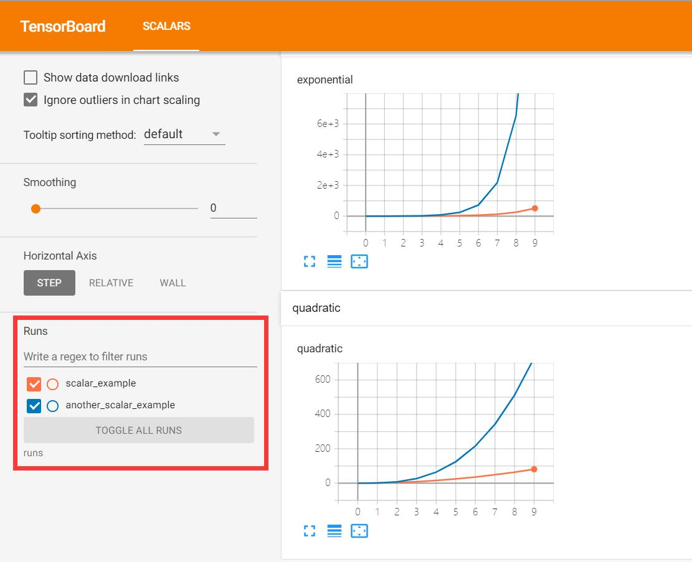
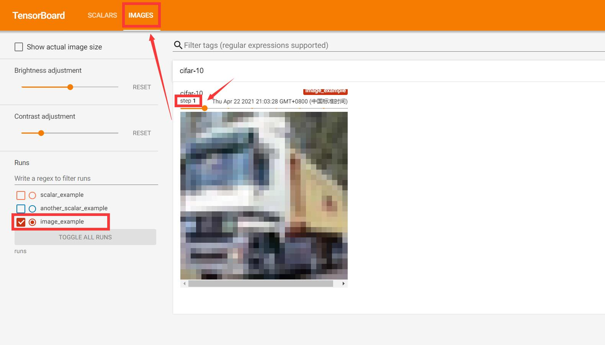
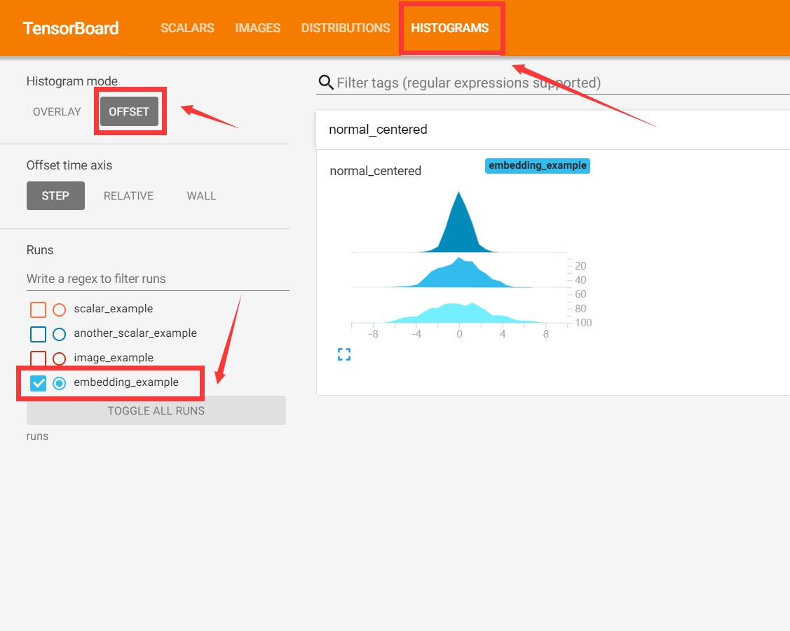
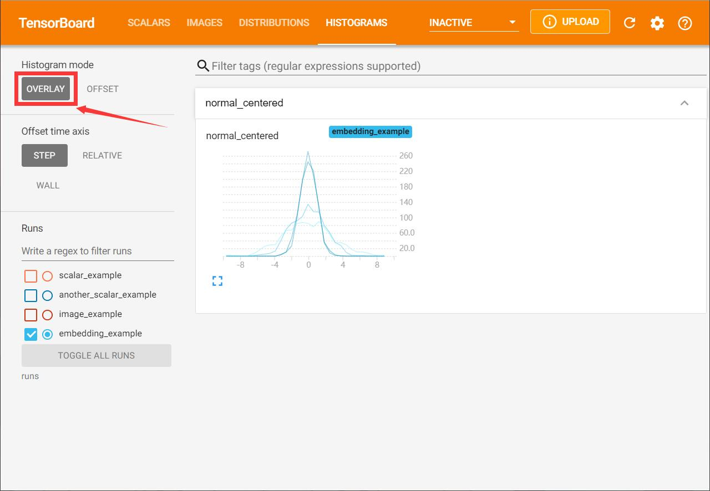
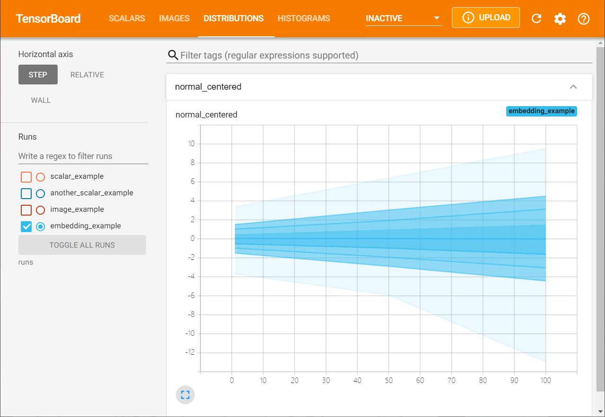
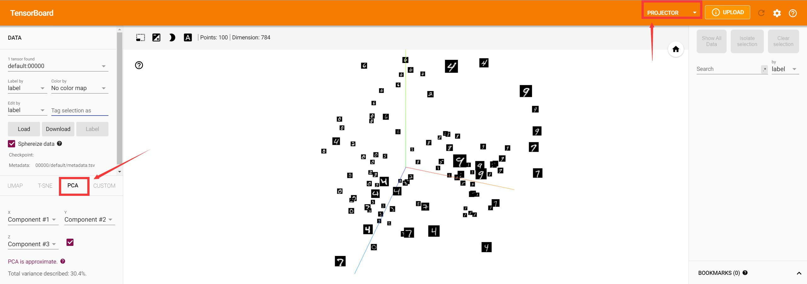

参考资料
- https://blog.csdn.net/bigbennyguo/article/details/87956434
- https://zhuanlan.zhihu.com/p/37022051

## 创建TensorBoardX

```python
from tensorboardX import SummaryWriter
writer = SummaryWriter('runs/exp')
writer = SummaryWriter()
writer = SummaryWriter(comment='resnet')
```

三种方式初始化TensorBoardX，创建SummaryWriter


1. 提供路径，使用该路径保存日志

2. 无参数，默认将使用**runs/日期时间**路径保存日志

3. 提供一个comment参数，将使用**runs/日期时间-comment**路径来保存日志

## 查看数据

在命令行中使用如下命令，启动浏览器可视化数据：
```bash
tensorboard --logdir=<log_dir>
```

其中的 **<log_dir>** 既可以是单个 run 的路径；也可以是多个 run 的父目录，如 runs/ 下面可能会有很多的子文件夹，每个文件夹都代表了一次实验，我们令 --logdir=runs/ 就可以在 tensorboard 可视化界面中方便地横向比较 runs/ 下不同次实验所得数据的差异。

```python
from tensorboardX import SummaryWriter
writer = SummaryWriter('runs/scalar_example')
for i in range(10):
    writer.add_scalar('quadratic', i**2, global_step=i)
    writer.add_scalar('exponential', 2**i, global_step=i)

writer = SummaryWriter('runs/another_scalar_example')
for i in range(10):
    writer.add_scalar('quadratic', i**3, global_step=i)
    writer.add_scalar('exponential', 3**i, global_step=i)
```

```bash
tensorboard --logdir=runs
```



可以看到，runs下文件夹所有的相同指标的都被放到了同一张图表下进行展示，以方便横向对比

### 指定端口

在启动tensorboard时添加端口号：

```bash
tensorboard --logdir=yourpath --port=6005
```

### 服务器中的docker启动

```bash
tensorboard --logdir=/MiaoMiaoYang/cifar-10/runs/ --port=5000 --bind_all
```

- 将Docker中的端口映射出去
- **logdir**中使用绝对路径
- 使用**--bind_all**，不然会出现拒绝访问

## 记录数据

### 数字 (scalar)

```python
add_scalar(tag, scalar_value, global_step=None, walltime=None)
```

- tag: 数据名称
- scalar_value: 数字常量 (float)，可以理解为纵轴如果是pytorch tensor，需要调用.item()获取其数值
- global_step:  训练的step，可以理解为横轴
- walltime:     记录放生的时间，default: time.time()

Example:
```python
writer = SummaryWriter()
for i in range(10):
    writer.add_scalar('quadratic', i**3, global_step=i)
    writer.add_scalar('exponential', 3**i, global_step=i)
```

### 图片 (image)

```python
add_image(tag, img_tensor, global_step=None, walltime=None, dataformats='CHW')
```

- tag: 数据名称
- img_tensor: 图像数据，支持numpy或torch tensor
- global_step: 训练的step，可以理解为横轴
- walltime: 记录发生的时间，默认为time.time()
- dataformats: 图像数据的格式，default: "CHW"

```python
import torchvision
import numpy as np
dataset = torchvision.datasets.CIFAR10(root='./data')

from tensorboardX import SummaryWriter

writer = SummaryWriter('runs/image_example')
for index, (image,label) in enumerate(dataset):
    ## image shape: (32,32,3)
    writer.add_image('cifar-10',np.asarray(image),global_step=index,dataformats='HWC')
    print('label:{} index:{}'.format(label,index))
    if index > 10:
        break

```



可以在image栏中看到随着step变化的图像变化

> add_image一次只能添加一张图片，可以使用torchvision中的[make_grid](https://pytorch.org/docs/stable/torchvision/utils.html)方法将多张图片拼接成一张图片，在使用add_image进行展示。或者使用[add_images](https://tensorboardx.readthedocs.io/en/latest/tensorboard.html#tensorboardX.SummaryWriter.add_images)。

### 直方图 (histogram)

```python
add_histogram(tag, values, global_step=None, bins='tensorflow', walltime=None, max_bins=None)
```

- tag: 数据名称
- values: 用来构建直方图的数据
- global_step: 训练的step，可以理解为横轴
- bins: 决定分桶的方式，有：tensorflow, auto, fd等参数，[详见](https://numpy.org/doc/stable/reference/generated/numpy.histogram.html)
- walltime: 记录发生的时间，默认为time.time()
- max_bins: 最大分桶数

```python
from tensorboardX import SummaryWriter
import numpy as np

writer = SummaryWriter('runs/embedding_example')
writer.add_histogram('normal_centered', np.random.normal(0, 1, 1000), global_step=1)
writer.add_histogram('normal_centered', np.random.normal(0, 2, 1000), global_step=50)
writer.add_histogram('normal_centered', np.random.normal(0, 3, 1000), global_step=100)
```

可以看到生成了两种图像可以看到数据的分布，一个是DISTRIBUTIONS，一个是HISTOGRAMS。



在表达直方图时，可以选择两种模式，一种是OFFSET，会展示每一个梯度下他的直方图，如上图。另一种是OVERLAY，会展示叠加在一起的直方图，如下图。



而DISTRIBUTION以另一种方式进行数据的展示，横轴是STEP，纵轴的五个点分别表示着数值的 [max, 93％, 84％, 69％, 50％, 31％, 16％, 7％, min]。

这些百分位数也可以看作标准偏差的正态分布：[max, μ+1.5σ, μ+σ, μ+0.5σ, μ, μ-0.5σ, μ-σ, μ-1.5σ, min]，使得从内侧读到外侧的着色区域分别具有宽度[σ，2σ，3σ]。



### 向量 (embedding)

```python
add_embedding(mat, metadata=None, label_img=None, global_step=None, tag='default', metadata_header=None)
```

- mat: 矩阵，识别torch.tensor / numpy.array。每行代表特征空间的一个数据点
- metadata (optional): 一个一维列表，表示mat每行数据的label，个数应与mat行数相同。识别torch.tensor / numpy.array
- label_img (optional): 一个形如 NxCxHxW 的张量，对应 mat 每一行数据显示出的图像，N 应和 mat 行数相同
- global_step: 训练的step
- tag: 数据名称


```python
from tensorboardX import SummaryWriter
import torchvision

writer = SummaryWriter('runs/embedding_example')
mnist = torchvision.datasets.MNIST('mnist', download=True)

writer.add_embedding(
    mnist.data.reshape((-1, 28 * 28))[:100,:],
    metadata=mnist.targets[:100],
    label_img = mnist.data[:100,:,:].reshape((-1, 1, 28, 28)).float() / 255,
    global_step=0
)
```

选择PROJECTOR进行查看向量空间。可以选择2D/3D空间进行可视化。可视化的方法可以是t-SNE/PCA或其他。



