参考资料：
- https://zhuanlan.zhihu.com/p/127155579
- https://www.bu.edu/math/files/2013/08/tikzpgfmanual.pdf
- https://www.latex4technics.com/
- https://texample.net/tikz/resources/


- [配置环境](#配置环境)
  - [基础环境](#基础环境)
  - [Vscode中输出SVG矢量图像](#vscode中输出svg矢量图像)
- [Tikz语法](#tikz语法)
  - [基本语法](#基本语法)
  - [绘制直线](#绘制直线)
    - [基本命令](#基本命令)
    - [变成圆角 {[rounded corners]}](#变成圆角-rounded-corners)
    - [封闭图形 {cycle}](#封闭图形-cycle)
  - [绘制基本图形](#绘制基本图形)
    - [矩形 {rectangle}](#矩形-rectangle)
    - [圆 {circle}](#圆-circle)
    - [椭圆 {ellipse}](#椭圆-ellipse)
    - [圆弧 {arc}](#圆弧-arc)
    - [曲线 {..}](#曲线-)
    - [抛物线 {parabola}](#抛物线-parabola)
    - [网格 {grid}](#网格-grid)
  - [选项[option]](#选项option)
    - [箭头](#箭头)
    - [线型、线宽](#线型线宽)
    - [变形](#变形)
      - [平移](#平移)
      - [缩放](#缩放)
      - [旋转](#旋转)
    - [颜色和填充](#颜色和填充)
  - [样式](#样式)
    - [全局样式](#全局样式)
    - [局部样式](#局部样式)
  - [节点 (node)](#节点-node)
    - [确定节点的样式](#确定节点的样式)
    - [利用节点画流程图](#利用节点画流程图)
    - [子节点](#子节点)
    - [插入外部图片](#插入外部图片)
  - [绘制函数](#绘制函数)

## 配置环境

### 基础环境

```latex
\documentclass{article}
\usepackage{tikz}

\begin{document}

\begin{tikzpicture}
...
\end{tikzpicture}

\end{document}
```

> 测试，xlatex和pdflatex均可通过

Tikz提供了 **\tikz** 和 **\tikzpicture** 环境两种。可以任意选择。

### Vscode中输出SVG矢量图像

- https://github.com/James-Yu/LaTeX-Workshop/issues/1762
- https://github.com/James-Yu/LaTeX-Workshop/wiki/FAQ#how-to-pass--shell-escape-to-latexmk
- https://github.com/James-Yu/LaTeX-Workshop/issues/464

平台：VScode + Latex Workshop

1. 在vscode插件Latex Workshop中设置latexmk编译器参数-shell-escape。

    第二个链接中，**How to pass -shell-escape to latexmk** 给出了三种解决办法，这里使用的第一种，直接加-shell-escape参数

    ```json
    "name": "latexmk",
    "command": "latexmk",
    "args": [
        "-shell-escape",
        "-synctex=1",
        "-interaction=nonstopmode",
        "-file-line-error",
        //"-pdf",
        "-outdir=%OUTDIR%",
        "%DOC%"
    ]
    ```

2. 使用dvisvgm生成svg

    这里使用的是vscode中latex workshop里面的批指令

    在设置settings.json -> **"latex-workshop.latex.tools"** 中添加dvisvgm命令

    ```json
    {
      "name": "dvisvgm",
      "command": "dvisvgm",
      "args": [
        "%DOCFILE%"
      ]
    },
    ```

    在settings.json -> **"latex-workshop.latex.recipes"** 中添加recipes：

    ```json
    {
      "name": "svg",
      "tools": [
        "latexmk",
        "dvisvgm"
      ]
    }
    ```

3. latex模板
    ```latex
    \documentclass[tikz]{standalone}
    \begin{document}
    \begin{tikzpicture}
    ...
    \end{tikzpicture}
    \end{document}
    ```


## Tikz语法

### 基本语法

```latex
\draw[option] ...
```

**\draw** 为绘图命令；后面的...为操作；[option]为选项部分，可不填。

### 绘制直线

#### 基本命令

在 **\draw** 命令后，输入点的坐标，并使用 **--** 连接起来即可，

```latex
\begin{tikzpicture}
    \draw (1,3)--(2,2)--(4,5);
\end{tikzpicture}
```

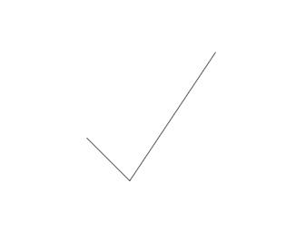


#### 变成圆角 {[rounded corners]}

```latex
\begin{tikzpicture}
    \draw[rounded corners] (1,3)--(2,2)--(4,5);
\end{tikzpicture}
```

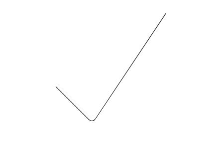

#### 封闭图形 {cycle}
```latex
\begin{tikzpicture}
    \draw[rounded corners] (1,3)--(2,2)--(4,5)--cycle;
\end{tikzpicture}
```

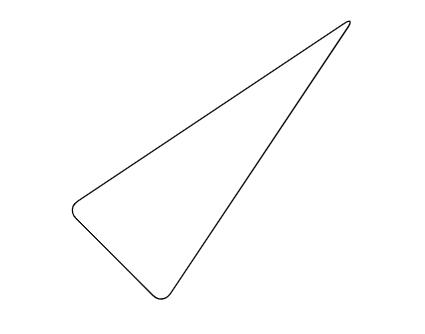

伪封闭图形：最后的连接处是不会执行圆角指令的，因为识别不出来是连接在一起的：

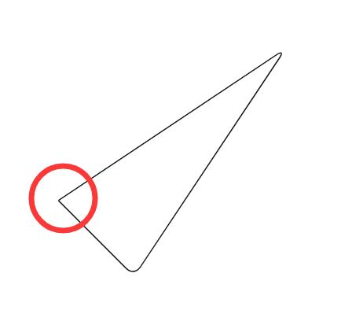


### 绘制基本图形

#### 矩形 {rectangle}

>参数：一对对角顶点

```latex
%% 基本命令
\begin{tikzpicture}
    \draw (0,0) rectangle (4,2);
\end{tikzpicture}

%% 圆角
\begin{tikzpicture}
    \draw[rounded corners] (0,0) rectangle (4,2);
\end{tikzpicture}
```

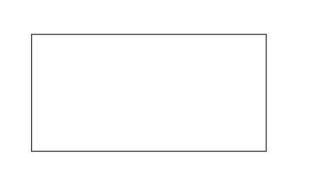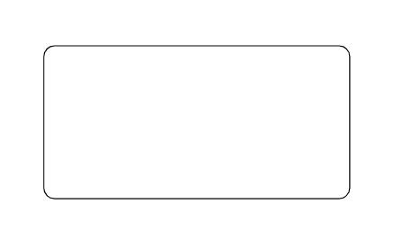


#### 圆 {circle}

> 参数：圆心坐标；半径（小括号括起来）

```latex
%% 圆心在(1,1) 半径为1的圆
\begin{tikzpicture}
    \draw (1,1) circle (1);
\end{tikzpicture}
```

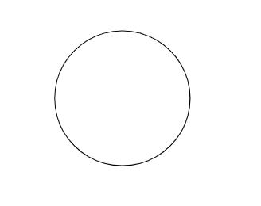


#### 椭圆 {ellipse}

> 参数：重心；长轴长，短轴长（小括号括起来，使用and间隔）

```latex
%% 重心在(1,1) 长轴长为2，短轴长为1的椭圆
\begin{tikzpicture}
    \draw (1,1) ellipse (2 and 1);
\end{tikzpicture}
```

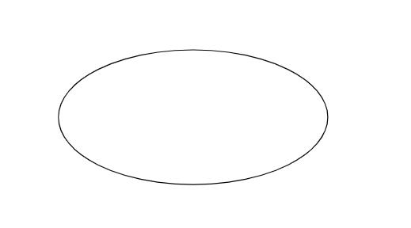


#### 圆弧 {arc}

> 参数：重心（中心）; 起始角度：终止角度：圆心（长轴长 and 短轴长）

```latex
\begin{tikzpicture}
    %% 绘制了圆心为(1,1)，半径为1，从0°到270°的圆弧
    \draw (1 ,1) arc (0:270:1);
    %% 绘制了重心为(6,1)，长轴2，短轴1，从0°到180°的椭圆弧
    \draw (6 ,1) arc (0:180:2 and 1);
\end{tikzpicture}
```

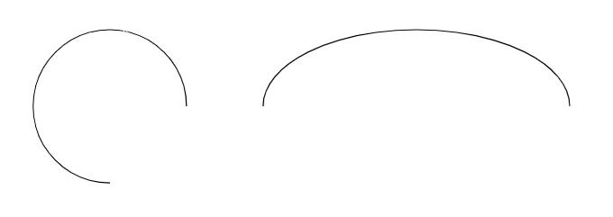


#### 曲线 {..}

> 参数：控制点

和直线的画法基本一致，需要将直线的--换为..

```latex
\begin{tikzpicture}
    %% 带一个控制点的贝塞尔曲线
    \filldraw [gray] (0,0) circle (.1)
                     (1,1) circle (.1)
                     (2,0) circle (.1);
    \draw (0,0) .. controls (1,1) .. (2,0);

    %% 带两个控制点的贝塞尔曲线
    \filldraw [blue] (3,0) circle (.1)
                     (4,1) circle (.1)
                     (5,1) circle (.1)
                     (5,0) circle (.1);
    \draw (3,0) .. controls (4,1) and (5,1) .. (5,0);

    %% 两端贝塞尔样条链接
    \filldraw [red]  (6,0) circle (.1)
                     (7,1) circle (.1)
                     (8,1) circle (.1)
                     (8,0) circle (.1)
                     (9,2) circle (.1)
                     (10,0) circle (.1);
    \draw (6,0) .. controls (7,1) and (8,1) .. 
          (8,0) .. controls (9,2) .. (10,0);
\end{tikzpicture}
```

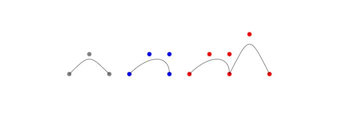

#### 抛物线 {parabola}

> 参数：起点；终点； [顶点：bend]

```latex
\begin{tikzpicture}
    %% 起点为(5,1) 终点为(7,2)的抛物线
    \filldraw [gray] (5,1) circle (.1)
                     (7,2) circle (.1);
    \draw (5,1) parabola (7,2);

    %% 起点为(10,1) 终点为(12,2) 顶点为(11,0) 的抛物线
    \filldraw [blue] (10,1) circle (.1)
                     (11,0) circle (.1)
                     (12,2) circle (.1);
    \draw (10,1) parabola bend (11,0) (12,2);
\end{tikzpicture}
```

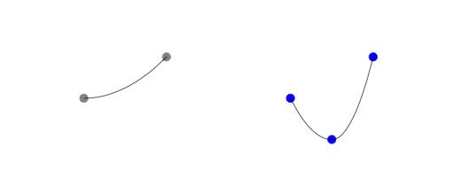

#### 网格 {grid}

> 参数：起始点，步长

```latex
\begin{tikzpicture}
    %% 左上：步长为20pt的网格
    \draw [step=20pt] (0,0) grid (3,2);
    %% 右上：步长为20pt,灰线为0.2pt（help lines）的网格
    \draw [help lines,step=20pt] (4,0) grid (7,2);
    %% 左下
    \draw [thick,step=20pt] (0,-3) grid (3,-1);
    %% 右下
    \draw [very thin,step=20pt] (4,-3) grid (7,-1);
\end{tikzpicture}
```

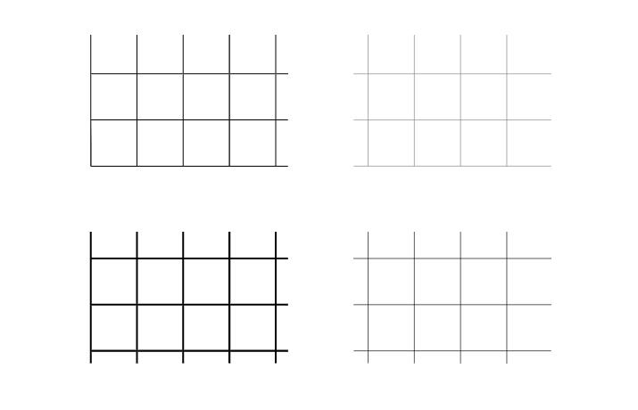


### 选项[option]

#### 箭头

```latex
\begin{tikzpicture}
    \draw [|<->|] (0,4)--(9,4);
    \draw [>->>] (0,3)--(9,3);
    \draw [<->] (0,2)--(9,2);
    \draw [<-] (0,1)--(9,1);
    \draw [->] (0,0)--(9,0);
\end{tikzpicture}
```

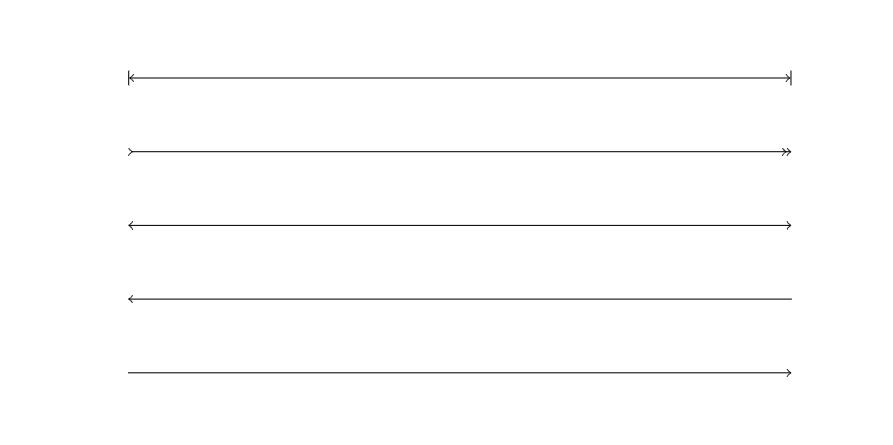

#### 线型、线宽

```latex
\begin{tikzpicture}
    \draw [loosely dashed]  (0,6)--(9,6); %较疏的线状虚线
    \draw [densely dashed]  (0,5)--(9,5); %较密的线状虚线
    \draw [dashed]          (0,4)--(9,4); %线状虚线
    \draw [loosely dotted]  (0,3)--(9,3); %较疏的点状虚线
    \draw [densely dotted]  (0,2)--(9,2); %较密的点状虚线
    \draw [dotted]          (0,1)--(9,1); %点状虚线
    \draw [line width =2pt] (0,0)--(9,0); %加粗实线
\end{tikzpicture}
```

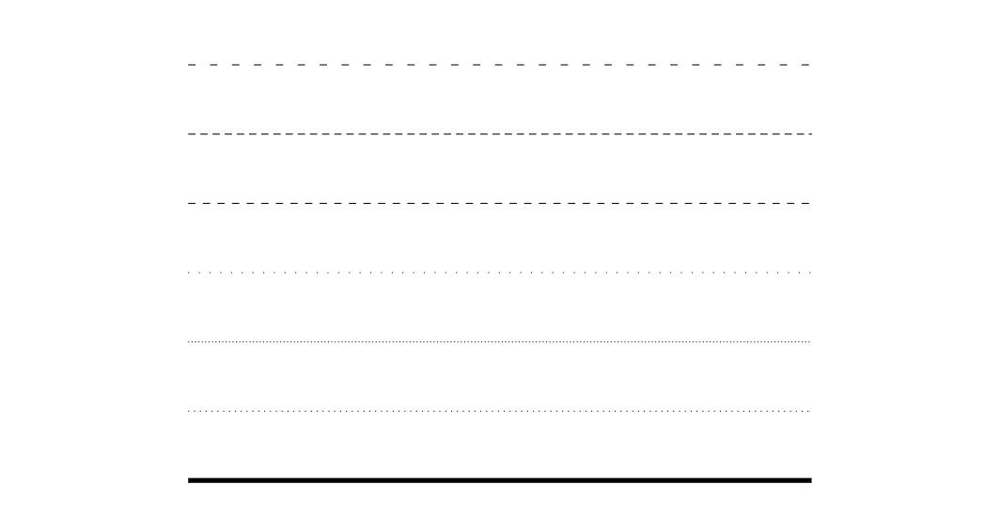

#### 变形

##### 平移

首先需要定义一个基础图形，**然后所有的移动都是相对这个基本图形来的**

```latex
\begin{tikzpicture}
    %% 首先定义一个基础图形
    \draw (0,0) rectangle (1,1);
    %% 平移shift，根据基本图形向右平移2个单位
    \draw[shift={(2,0)},color=red]  (0,0) rectangle (1,1);
    %% 沿y轴平移，根据基本图形向下平移，默认单位是pt；沿x轴平移同理
    \draw[yshift=-30,   color=blue] (0,0) rectangle (1,1);
\end{tikzpicture}
```

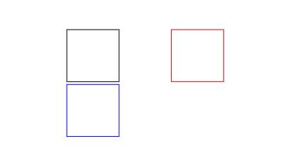

##### 缩放

缩放的中心是按照起始点进行缩放

```latex
\begin{tikzpicture}
    \draw (0,0) rectangle (2,2);
    \draw (0,0) circle (.5);
    %% 整体缩放，是按照起始点进行缩放
    \draw [scale =.5,  color = blue] (0,0) rectangle (2,2);
    \draw [scale =1.5, color = red]  (0,0) circle    (.5);
    %% 单个方向进行缩放
    \draw [xscale =.5, color = green] (0,0) circle (.5);
\end{tikzpicture}
```

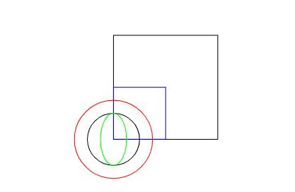

##### 旋转

旋转的数值是角度，正数表示逆时针选咋混的相应角度。旋转中心是起始点

```latex
\begin{tikzpicture}
    \draw (0,0) rectangle (2,2);
    %% 逆时针旋转45°
    \draw[rotate =45, color = red] (0,0) rectangle (2,2);
\end{tikzpicture}
```

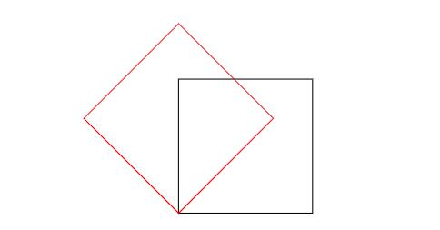

指定点进行旋转

```latex
\begin{tikzpicture}
    \draw (0,0) rectangle (1,2);
    %% 将整个图形以(1,2)点为中心进行逆时针旋转30°
    \draw[rotate around ={30:(1 ,2)}, color = red] (0,0) rectangle (1,2);
\end{tikzpicture}
```

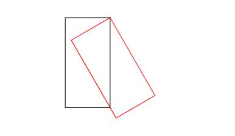

#### 颜色和填充

使用\filldraw命令可以填充图形，在选项中指定线条和填充的颜色

```latex
\begin{tikzpicture}
    %% 画一个中心点为(0,0)半径为1的圆
    %% 线条颜色是蓝色，透明度是80%
    %% 填充颜色是红色，透明度是20%
    \filldraw[draw=blue!80,fill=red!20] (0,0) circle (1);
\end{tikzpicture}
```

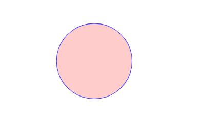

### 样式

#### 全局样式

在\begin{document}之前使用\tikzset指定样式


```latex
\documentclass{article}
\usepackage{tikz}

%% 样式名称：dline；内容：颜色为蓝；线宽2pt
\tikzset{
dline/.style ={color = blue, line width =2pt}
}

\begin{document}
\begin{tikzpicture}
    \draw[dline] (0,0) --(9,0);
\end{tikzpicture}
\end{document}
```

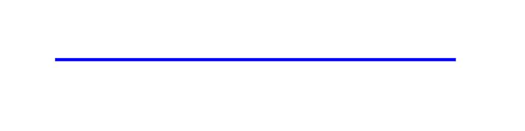

#### 局部样式

在\begin{tikzpicture}后使用[]添加局部样式选项
```latex
\documentclass{article}
\usepackage{tikz}
\begin{document}
%% 局部样式，名称：miao；内容：颜色为红色，线条宽度2pt
\begin{tikzpicture}[miao/.style ={color=red,line width =2pt}]
    \draw[miao] (0,0) --(9,0);
\end{tikzpicture}
\end{document}
```

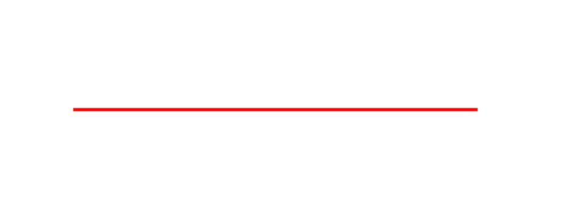


### 节点 (node)

#### 确定节点的样式

```latex
\tikzset{
box/.style ={
    rectangle, %矩形节点
    rounded corners =5pt, %圆角
    minimum width =50pt, %最小宽度
    minimum height =20pt, %最小高度
    inner sep=5pt, %文字和边框的距离
    draw=blue %边框颜色
}
}
```

|名称|选项|默认值|说明|
|---|--|--|--|
|内边距     |inner sep  |.333em |文本与边框之间的距离|
|水平内边距 |inner xsep |.333em |文本与边框之间的距离（水平方向）|
|垂直内边距 |inner ysep |.333em |文本与边框之间的距离（垂直方向）|
|外边距     |outer sep  |no     |边框之外的无形边距|
|水平外边距 |outer xsep  |.5pgflinewidth |边框之外的无形边距（水平方向）|
|垂直外边距 |outer ysep  |.5pgflinewidth |边框之外的无形边距（垂直方向）|
|最小高度   |minimum height |0pt|节点的最小高度，如果文本和内边距的高度小于最小高度，节点自动增大为最小高度|
|最小宽度   |minimum width  |0pt|节点的最小宽度，如果文本和内边距的高度小于最小宽度，节点自动增大为最小宽度|
|节点大小   |minimum size   |no |节点最小大小，节点的高度和宽度自动大于该值|
|宽高比|shape aspect|no|节点形状的宽高比|
|旋转节点|rotate|no|旋转整个节点|
|旋转边框|shape border rotate|no|旋转节点的边框|
|||||

#### 利用节点画流程图


```latex
\begin{tikzpicture}
    \filldraw[gray] (0,0) circle (.1);
    \node[box] (b1) at(0,0) {A};
    \node[box] (b2) at(4,0) {B};
    \node[box] (b3) at(8,0) {C};
    \draw[->] (b1)--(b2);
    \draw[->] (b2)--(b3);
    \node at(2,1) {a};
    \node at(6,1) {b};
\end{tikzpicture}
```

- **\node[box]** 指明了使用box风格的节点
- **(b1)** 指明了节点的名字
- **at(0,0)** 指明了节点的位置，位置为中心点
- **{A}** 指明节点的文字

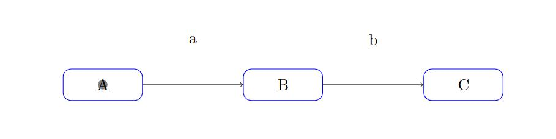

图中画了三个box节点，之后使用箭头连接起来。然后画了两个没有名字和边框的节点。

#### 子节点

使用 **\child** 关键词来声明子节点。相邻节点之间的间距可以使用**sibling distance**控制。

```latex
\begin{tikzpicture}[sibling distance =80pt]
    \node[box] {1}
        child { node[box] {2}}
        child { node[box] {3}
                    child {node[box] {4}}
                    child {node[box] {5}}
                    child {node[box] {6}}
              };
\end{tikzpicture}
```

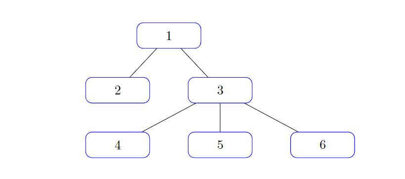

#### 插入外部图片

```
\begin{tikzpicture}
\node at (0,0) {\includegraphics[width=5cm,height=2cm]{pass.png}};
\end{tikzpicture}
```

### 绘制函数

```
\begin{tikzpicture}
    \draw[->] (-0.2,0) --(6,0) node[right] {$x$};
    \draw[->] (0,-0.2) --(0,6) node[above] {$f(x)$};
    \draw[domain=0:4] plot (\x,{0.1* exp(\x)}) node[right] {$f(x)=\frac{1}{10}e^x$};
\end{tikzpicture}
```

- **domain = 0:4** 设置了绘图的范围是0-4
- **plot** 是绘制操作
- **node[right]{}** 表示文字在箭头的右面，{}为文字内容

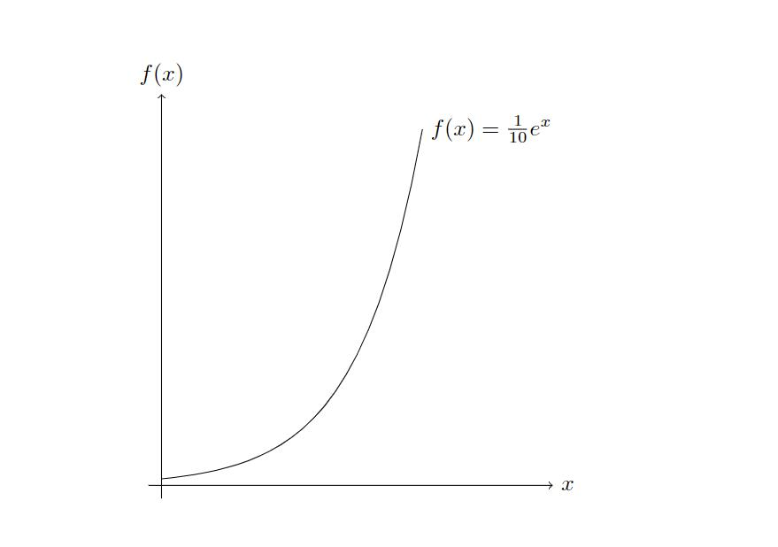

推荐pgfplots画函数：

http://pgfplots.sourceforge.net/gallery.html

```latex
\documentclass{article}
\usepackage{pgfplots}
\begin{document}
\begin{tikzpicture}
	\begin{axis}[
		xlabel=Cost,
		ylabel=Error]
	\addplot[color=red,mark=x] coordinates {
		(2,-2.8559703)
		(3,-3.5301677)
		(4,-4.3050655)
		(5,-5.1413136)
		(6,-6.0322865)
		(7,-6.9675052)
		(8,-7.9377747)
	};
	\end{axis}
\end{tikzpicture}
\end{document}
```

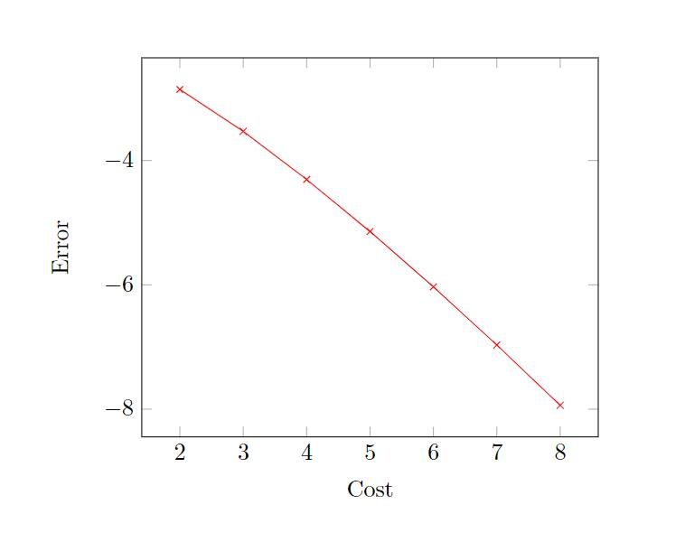

