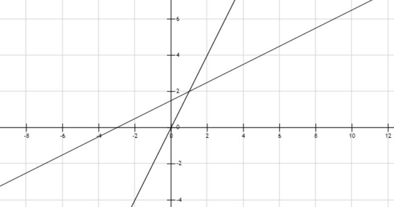
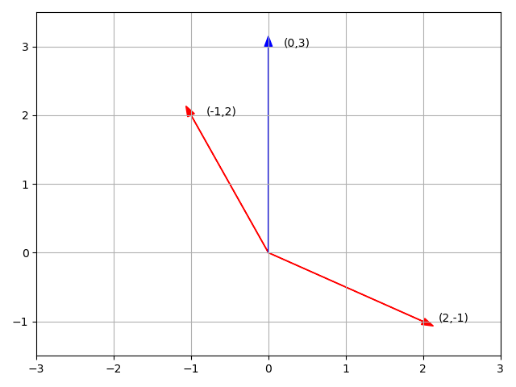

## 前言

MIT 18.06，之前看过，但是都忘了，所以这回快速的复习一下，记好一些的笔记，要做题！

重振小镇做题家之荣耀，我辈义不容辞！

https://mitmath.github.io/1806/

贴一张老爷子的照片，感谢！

---------------------------------

## 1. 方程组的集合解释

> **线性代数：求解方程组**

$$\begin{cases}& 2x - y =0 \\\\ &-x + 2y = 3 \end{cases} \rightarrow \begin{bmatrix} 2 &-1 \\\\ -1 &2 \end{bmatrix} \begin{bmatrix}\bold{x} \\\\\bold{y} \end{bmatrix} = \begin{bmatrix} 0 \\\\ 3 \end{bmatrix} \rightarrow AX=B $$

### 行图像 (Row picture)

两条直线的交点就是这个方程组的解

### 列图像 (Column picture)

$$ \begin{bmatrix} 2 &-1 \\\\ -1 &2 \end{bmatrix} \begin{bmatrix} \bold{x} \\\\ \bold{y} \end{bmatrix} =  \begin{bmatrix} 0 \\\\ 3 \end{bmatrix}\rightarrow x \begin{bmatrix} 2 \\\\ -1 \end{bmatrix} + y \begin{bmatrix} -1 \\\\ 2 \end{bmatrix} = \begin{bmatrix} 0 \\\\ 3 \end{bmatrix} \rightarrow Ax=b$$

这个方程的目的就是找到合适的$x$和$y$使得前两个向量组合可以得到后一个向量 **[也就是找到正确的线性组合]**，这里是列向量的线性组合

新的问题：**对于任意的b(右侧向量)，是否都能求解$Ax=b$**
也就是：列的线性组合能否覆盖整个空间？

### 矩阵

方程的矩阵形式：

$$Ax=b$$

矩阵A乘以向量x得到右侧的向量b

矩阵和向量的乘法的两种解：

- 使用列图像进行乘法（推荐）

    矩阵的每一列都看成是一列向量，外部的向量b其实就是每一列向量的系数

    或者可以将矩阵的每一列看成一个空间的基地，外部的向量b就是根据这个基地在每个方向上的长度

$$ \begin{bmatrix}     2 &5 \\\\ 1 & 3 \end{bmatrix} \begin{bmatrix}     1\\\\2 \end{bmatrix} = 1 \begin{bmatrix}     2\\\\ 1  \end{bmatrix} + 2 \begin{bmatrix}     5\\\\ 3 \end{bmatrix} =\begin{bmatrix}     12\\\\ 7 \end{bmatrix} $$

- 使用行图像进行计算

$$ \begin{bmatrix} 2 &5 \end{bmatrix} \begin{bmatrix}     1 \\\\ 2 \end{bmatrix} =12 $$

## 2. 消元法求解线性方程组

### 消元得到上三角矩阵

$$ \begin{cases}     x+  &2y+ &z  &=2  \\\\     3x+ &8y+ &z  &=12 \\\\         &4y+ &z  &=2 \end{cases} \rightarrow Ax=b \qquad A=\begin{bmatrix}     1 &2 &1 \\\\     3 &8 &1 \\\\     0 &4 &1 \end{bmatrix} $$

按顺序进行消元，对角线上的元素称为主元(pivot)，因为需要使用对角线上的元素迭代的消去下面等式中的对应元素。但是0不能作为主元

$$ A= \begin{bmatrix}      1 &2 &1 \\\\      3 &8 &1 \\\\      0 &4 &1  \end{bmatrix} \stackrel{(2,1)}{\rightarrow} \begin{bmatrix} 1 &2 &1  \\\\      0 &2 &-2 \\\\      0 &4 &1  \end{bmatrix} \stackrel{(3,2)}{\rightarrow} \begin{bmatrix} 1 &2 &1  \\\\      0 &2 &-2 \\\\      0 &0 &5  \end{bmatrix} = U$$

> 箭头上方表示想要消去的元素的位置

这里消元的目的就是为了从$A$得到上三角矩阵$U$.

### 消元法失效

如果主元是0的时候，需要进行行交换，让非0元素占据主元的位置。

如果行交换无法使主元是非0元素，那么这个方程就没有解，这个矩阵也就是不可逆的。

### 回代

当使用消元法从$A$得到$U$之后，就需要把右侧向量$b$带入，引入$b$作为新的一列向量加入到矩阵中，也就是**增广矩阵**

$$ \begin{bmatrix}       1 &2 &1 &2 \\\\       3 &8 &1 &12 \\\\       0 &4 &1 &2   \end{bmatrix} $$

因为对左侧矩阵进行变化的同时，右侧向量也会跟着做同样的变化，所以按照上面的消元法：

$$  \begin{bmatrix}       1 &2 &1 &2 \\\\       3 &8 &1 &12\\\\       0 &4 &1 &2  \end{bmatrix}  \stackrel{(2,1)}{\rightarrow}  \begin{bmatrix}  1 &2 &1  &2  \\\\       0 &2 &-2 &6 \\\\       0 &4 &1  &2   \end{bmatrix}  \stackrel{(3,2)}{\rightarrow}  \begin{bmatrix}  1 &2 &1  &2 \\\\       0 &2 &-2 &6 \\\\       0 &0 &5  &-10  \end{bmatrix} \rightarrow c=\begin{bmatrix}    2 \\\\ 6 \\\\ -10\end{bmatrix}$$

所以最终方程的形式是这样的：

$$\begin{cases}     x+  &2y+ &z   &=2  \\\\         &2y- &2z  &=6 \\\\             &    &5z  &=-10\end{cases}\rightarrow Ux=c$$

接下来进行回代求解：$z=-2; y=1; x=2$

### 矩阵形式描述消元法

#### 使用行进行计算

$$ \begin{bmatrix}     1 &2 &7 \end{bmatrix} \begin{bmatrix}     2 & 3 & 4 \\\\     1 & 3 & 4 \\\\     2 & 3 & 5 \end{bmatrix} =  \begin{bmatrix}2 &3 &4\end{bmatrix}\times 1 + ... + \begin{bmatrix}2 &3 &5\end{bmatrix}\times 7 = \begin{bmatrix}18 &30 &47\end{bmatrix}  $$

**左行右列，左乘行变换，右乘列变换**

- 列向量是乘在矩阵的**右边**，对矩阵的每一列进行线性合并，得到的是**列向量**
- 行向量是乘在矩阵的**左边**，对矩阵的每一行进行线性合并，得到的是**行向量**

#### 消元矩阵

$$\begin{bmatrix}      1 &2 &1 \\\\      3 &8 &1 \\\\      0 &4 &1  \end{bmatrix} \stackrel{(2,1)}{\rightarrow} \begin{bmatrix} 1 &2 &1  \\\\      0 &2 &-2 \\\\      0 &4 &1  \end{bmatrix} \Rightarrow \begin{bmatrix}     1  &0 &0 \\\\     -3 &1 &0 \\\\     0  &0 &1 \end{bmatrix} \begin{bmatrix}        1 &2 &1 \\\\        3 &8 &1 \\\\        0 &4 &1   \end{bmatrix} = \begin{bmatrix}   1 &2 &1  \\\\        0 &2 &-2 \\\\        0 &4 &1     \end{bmatrix}$$

原来的消元法就变成了一个特定的矩阵：**消元矩阵**

$$E_{21} = \begin{bmatrix}     1  &0 &0 \\\\     -3 &1 &0 \\\\     0  &0 &1 \end{bmatrix}$$

他的每一行都是对矩阵的行变换，同时也被称为**初等矩阵$E$**，因为是对(2,1)位置上进行消元，所以可以写成$E_{21}$

所以，整个过程使用矩阵形式表达：

$$E_{32}(E_{21}A)=U$$

矩阵乘法满足结合律，所以可以将括号移动，变成一个矩阵，来实现所有的消元任务。但是矩阵乘法不满足交换律，不可轻易调换他们的顺序

$$(E_{32}E_{21})A=U$$

### 置换矩阵 (pemutation)

对行进行调换：

$$ \begin{bmatrix}     0 &1 \\\\     1 &0 \end{bmatrix} \begin{bmatrix}     a &b \\\\     c &d \end{bmatrix} = \begin{bmatrix}     c &d \\\\     a &b \end{bmatrix} $$

其中，$P=\begin{bmatrix}    0 &1 \\\\    1 &0\end{bmatrix}$就是**置换矩阵**，将两行进行位置的调换

同理，如果想对列进行置换，那么需要将矩阵进行右乘，**左行右列**

可以看到，因为想要消除置换矩阵带来的影响，那就是把它再置换回去，那么置换矩阵的逆就是置换矩阵的转置

$$P^{-1}=P^{T}$$

分清**转置(T，是一个操作)** 和 **置换(P，是一个矩阵)**，两个不一样的东西

### 矩阵的逆

$$\begin{bmatrix}     1  &0 &0 \\\\     -3 &1 &0 \\\\     0  &0 &1 \end{bmatrix} \begin{bmatrix}        1 &2 &1 \\\\        3 &8 &1 \\\\        0 &4 &1   \end{bmatrix} = \begin{bmatrix}   1 &2 &1  \\\\        0 &2 &-2 \\\\        0 &4 &1     \end{bmatrix}$$

初等矩阵$E_{21} = \begin{bmatrix}     1  &0 &0 \\\\     -3 &1 &0 \\\\     0  &0 &1 \end{bmatrix}$，从行2中减去了三倍的行1，现在我想回做这一步，也就是找到某一个矩阵取消这次消元（左乘），即两者相成为单位阵$I$：

$$E^{-1}_{21}E\_{21}=I$$

那么对于$E_{21}$来说，他的含义相当于是从行2减去了三倍的行1，那么想消去这个行变换的影响，就应该让行2加回来三倍的行1，所以

$$E^{-1}_{21}=\begin{bmatrix}     1  &0 &0 \\\\     3 &1 &0 \\\\     0  &0 &1 \end{bmatrix}$$

## 3. 矩阵的乘法和逆

### 矩阵乘法

矩阵乘法：$AB=C$

#### 点乘法

其中矩阵$C$的3行4列的元素$C_{34}=A_{row-3}\cdot B_{col-4}=\sum_{k=1}^{n}{a_{3k}b_{k4}}$

#### 列向量法

$$A_{m\times n}B_{n\times p} = C_{m\times p}$$

可以将乘法考虑成一个矩阵右乘以一个列向量，得到一个列向量。也就是**矩阵A**右乘矩阵B中的**每一个列向量**

那么，**矩阵C的各列是矩阵A中各列的线性组合**

#### 行向量法

与列向量法类似，可以将乘法考虑成矩阵B左乘矩阵A中的行向量，

**矩阵C的各行是矩阵B中各行的线性组合**

#### 列 X 行

常规方法中，是A的行$\times$B的列，得到是相对应位置的标量

但是这里可以是A的列$\times$B的行

$AB$是A的各列$\times$B的各行的矩阵的和

#### 分块乘法

将矩阵进行分块，对每一个分块进行乘法

$$ \begin{bmatrix}   A_{1} & A_{2} \\\\   A_{3} & A_{4} \end{bmatrix} \begin{bmatrix}   B_{1} & B_{2} \\\\   B_{3} & B_{4} \end{bmatrix} = \begin{bmatrix}   A_{1}B_{1} + A_{2}B_{3} & A_{1}B_{2}+A_{2}B_{4} \\\\   A_{3}B_{1} + A_{4}B_{3} & A_{3}B_{2}+A+{4}B_{4} \end{bmatrix} $$

### 矩阵的逆 (Inverse)

只考虑方阵(square matrix) $A$

#### 逆是否存在

如果存在，可以成立：$A^{-1}A=I$，$I$为单位阵

其中，这里的是左逆，也可以有右逆，表达为：$AA^{-1}=I$

对于方阵，左逆=右逆，即$A^{-1}A=I=AA^{-1}$

如果逆存在，那么矩阵A是可逆的，也就是**非奇异**的(non-singular)

#### 奇异矩阵

如果存在非0向量$x$使得$Ax=0$，那么这个矩阵$A$是奇异的

也就是其实在矩阵A中的列向量，最少有一对向量是共平面的

#### 可逆矩阵

求矩阵的逆：

$$ \begin{bmatrix}   1 & 3 \\\\ 2 &7 \end{bmatrix} \begin{bmatrix}   a & c \\\\ b &d \end{bmatrix} = \begin{bmatrix}   1 & 0 \\\\ 0 &1 \end{bmatrix} \rightarrow AA^{-1}=I $$

> Gauss-Jordan：同时处理两个方程组

对增广矩阵($[AI]$)进行消元，得到$E[A|I]=[EA|EI]=[I|E]$，那么$E$就是$A^{-1}$

$$ \begin{bmatrix}  \begin{array}{cc|cc}   1 & 3 & 1 & 0 \\\\    2 &7 & 0 & 1    \end{array}   \end{bmatrix}    \rightarrow  \begin{bmatrix}   \begin{array}{cc|cc}  1 & 3 & 1 & 0 \\\\   0 &1 & -2 & 1  \end{array}  \end{bmatrix}   \rightarrow   \begin{bmatrix}     \begin{array}{cc|cc}  1 & 0 & 7 & -3 \\\\   0 &1 & -2 & 1      \end{array}  \end{bmatrix} $$

#### 矩阵乘积的逆

$A$和$B$都是可逆矩阵，那么他们乘积的逆是$(AB)^{-1}=B^{-1}A^{-1}$

#### 逆和转置

对于单个方阵，转置和逆可互换操作

$$(A^{-1})^{T} = (A^{T})^{-1}$$

## 4. 矩阵A的LU分解

考虑三维矩阵，对A进行消元得到U，即

$$E_{32}E_{31}E_{21}A=U$$

可以写成$A=LU$形式，即：

$$A=E_{21}^{-1}E_{31}^{-1}E_{32}^{-1}U$$

其中U表示的上三角矩阵，L表示的下三角矩阵

$$ \begin{cases}   A = LU \\\\   EA=U \end{cases} $$

下面讨论这两种形式，为什么要变成$A=LU$的形式

对于$A=LU$如果不存在行互换，消元乘数可以直接写进$L$里面

**举个例子**

$$ E_{32}=\begin{bmatrix}   1 &0 &0 \\\\ 0 &1 &0 \\\\ 0 & -5 &1 \end{bmatrix} E_{31} = I \quad E_{21}=\begin{bmatrix}   1 &0 &0 \\\\ -2 &1 &0 \\\\ 0 &0 &1 \end{bmatrix} $$

对矩阵进行消元，进行上述消元变化：$E_{21}$和$E_{32}$

$$ E=E_{32}E_{31}E_{21} = \begin{bmatrix}   1 &0 &0 \\\\ -2 &1 &0 \\\\ 10 &-5 &1 \end{bmatrix} $$
这种形式下可以看到行1通过行2影响到了行3，在(1,3)位置出现了10

$$ L = E_{21}^{-1}E_{32}^{-1}= \begin{bmatrix}    1 &0 &0 \\\\ 2 &1 &0 \\\\ 0 &0 &1 \end{bmatrix} \begin{bmatrix}    1 &0 &0 \\\\ 0 &1 &0 \\\\ 0 & 5 &1  \end{bmatrix} = \begin{bmatrix}   1 &0 &0 \\\\ 2 &1 &0 \\\\ 0 &5 &1 \end{bmatrix} $$

在这种形势下，2和5不会冲突产生10，也就是消元乘数可以直接写到$L$里

## 5. 置换、转置与向量空间

### 置换 (Permutation, $P$)

置换矩阵是行重新排列了的单位矩阵，是用来完成行互换的矩阵

对于需要进行置换操作的消元，$A=LU$就会变成了$PA=LU$

所有的置换矩阵都是可逆的，并且$P^{T} = P^{-1}$

对于n维方阵，共有$n!$个置换矩阵

### 转置 (Transpose)

$(A^{T})_{ij}=A\_{ji}$

### 对称矩阵 (symmetric)

对称矩阵：转置变换以后，没有变化的矩阵 $A^{T}=A$

所有的矩阵R转置乘以R都是对称的

$$ \begin{bmatrix}   1 &3 \\\\ 2 &3 \\\\ 4 &1 \end{bmatrix} \begin{bmatrix}   1 &2 &4 \\\\ 3 &3 &1 \end{bmatrix} = \begin{bmatrix}   10 &11 &7 \\\\   11 &13 &11 \\\\   7  &11 &17   \end{bmatrix} $$

证明：

$$(R^{T}R)^{T} = R^{T}R$$

### 向量空间

空间：满足加法和数乘（即可以进行线性运算），比如： $\mathbb{R}^{2}$，表示所有的二维实向量。(二维：即向量用两个实数表述)

$$ \begin{bmatrix}   3 \\\\ 2 \end{bmatrix}, \begin{bmatrix}   0 \\\\ 0 \end{bmatrix}, \begin{bmatrix}   \pi \\\\ e \end{bmatrix}, \cdots $$

$\mathbb{R}^{n}$包含所有的n维实向量

子空间：需要满足线性运算，但同时又是空间的子集，比如$\mathbb{R}^{2}$的子空间：

- $\mathbb{R}^{2}$本身
- 所有经过原点的直线
- (0,0)点

#### 列空间

从矩阵中构造一个子空间：

$$A=\begin{bmatrix}  1 &3 \\\\ 2 &3 \\\\ 4 &1 \end{bmatrix}$$

矩阵A的所有列都在$\mathbb{R}^{3}$空间中，他的列的所有线性组合都成一个子空间：**列空间**，记作$C(A)$

## 6. 列空间和零空间

向量空间：一些向量组成的空间，对加法和数乘运算封闭

有子空间$S$和$T$，他们的交集$S\cap T$仍是子空间

### 列空间

$$ A=\begin{bmatrix}   1 &1 &2 \\\\   2 &1 &3 \\\\   3 &1 &4 \\\\   4 &1 &5 \\\\ \end{bmatrix} $$

矩阵A的列看做向量，那么矩阵A的列空间是$\mathbb{R}^{4}$的子空间，记作$C(A)$

$C(A)$由这三个列向量线性组合的所有向量构成，因为矩阵A的三个列向量不是线性无关的，所以$C(A)$是$\mathbb{R}^{4}$中的二维子空间

下面开始讨论这个子空间有“多大”，并将它和线性方程组$Ax=b$联系起来，即

$Ax=b$是否对任意的$b$都有解，**满足什么条件的$b$可以满足$Ax=b$**

$Ax=b$有解当且仅当$b\in C(A)$

### 零空间

$A$的零空间包含$Ax=0$中所有的解$x=\begin{bmatrix}  x_{1} \\\\ x_{2} \\\\ x_{3}\end{bmatrix}$，对于矩阵$A$，他的零空间属于$\mathbb{R}^{3}$

$Ax=0$的特解：

$$ \begin{bmatrix}   0 \\\\ 0 \\\\ 0 \end{bmatrix}, \begin{bmatrix}   1 \\\\ 1 \\\\ -1 \end{bmatrix} $$

所以A的零空间包含了$c\begin{bmatrix}  1 \\\\ 1 \\\\ -1\end{bmatrix}$

所以A的零空间就是$\mathbb{R}^{3}$中的一条直线

## 7. 求解零空间Ax=0

之前讲过了列空间和零空间的基本概念，现在主要关注的是如何去求解列空间和零空间

$$ A=\begin{bmatrix}   1 &2 &2 &2 \\\\   2 &4 &6 &8 \\\\   3 &6 &8 &10 \end{bmatrix} $$

下面通过消元来求解$Ax=0$，消元并不会改变$Ax=0$的解

$$  A=\begin{bmatrix}   1 &2 &2 &2 \\\\   2 &4 &6 &8 \\\\   3 &6 &8 &10 \end{bmatrix}  \rightarrow  \begin{bmatrix}     1 &2 &2 &2 \\\\     0 &0 &2 &4 \\\\     0 &0 &2 &4   \end{bmatrix}  \rightarrow  \begin{bmatrix}     \colorbox{yellow}{\color{red}{1}} &2 &\colorbox{yellow}{2} &2 \\\\    \colorbox{yellow}{0} &0 &\colorbox{yellow}{\color{red}{2}} &4 \\\\     \colorbox{yellow}{0} &0 &\colorbox{yellow}{0} &0   \end{bmatrix}=U $$

最终得到了这种矩阵的阶梯形式(echelon form)，非零元素以一种阶梯形式出现。其中红色表示的就是矩阵的**主元(pivots)**

矩阵主元的个数称为该矩阵的**秩(rank)**

现在从$Ax=0$变换到了$Ux=0$，他的解没有变，也就是零空间没有变

所以下面通过$U$来求解$A$的零空间

主元所在列称为**主列(pivot column)**，也就是矩阵中的黄色部分；其他的列称为**自由列(free columns)**

> 自由列表示可以任意、自由的分配数值；列2和列4的乘数是任意的，即可以任意的分配$x_{2}$和$x_{4}$。当$x_{2}$和$x_{4}$固定下来，$x_{1}$和$x_{3}$随之固定

所以需要任意假定一个$x_{2}$和$x_{4}$数值，但是因为零向量肯定是零空间中的一个解，所以把自由列所对应的元素全假定成0没有意义，这里一般是采用one-hot想法，逐一假设成1来进行求解(这里的解应该是零空间的特解)

$$ x_{2}=1,x_{4}=0 \Rightarrow \begin{bmatrix}   -2 \\\\ 1 \\\\ 0 \\\\ 0 \end{bmatrix};x_{2}=0,x_{4}=1 \Rightarrow \begin{bmatrix}   2 \\\\ 0 \\\\ -2 \\\\ 1 \end{bmatrix} $$

所以，$Ax=0$的解就是

$$ c_{1}\begin{bmatrix}   2 \\\\ 0 \\\\ -2 \\\\ 1 \end{bmatrix}+ c_{2}\begin{bmatrix}   -2 \\\\ 1 \\\\ 0 \\\\ 0 \end{bmatrix} $$

如果矩阵$A_{m\times n}$的秩$r=2$，表示只有r个方程起作用。他的自由列、自由变量就有$n-r$个，可以采用one-hot形式进行取值，得到特解

> 可以看到，**使用列向量来理解**整个矩阵、方程组的求解，理解将会变得非常的顺畅

-----------------------------

下面继续对行阶梯形式的$U$进行再一次的简化，得到的简化行阶梯形式记为$R$ (Reduced row echelon form)。而简化行阶梯形式主元上下全是0，主元为1

$$U=\begin{bmatrix} 1 & 2 & 2 & 2 \\\\ 0 & 0 & 2 & 4 \\\\ 0 & 0 & 0 & 0 \end{bmatrix} \rightarrow \begin{bmatrix} 1 & 2 & 0 & -2 \\\\ 0 & 0 & 1 & 2 \\\\ 0 & 0 & 0 & 0 \end{bmatrix}=R$$

简化行阶梯形式$R$中包含了这些信息：

$$ R=\begin{bmatrix}  \colorbox{yellow}{1} & 2 & \colorbox{yellow}{0} & -2 \\\\  \colorbox{yellow}{0} & 0 & \colorbox{yellow}{1} & 2  \\\\  0 & 0 & 0 & 0  \end{bmatrix} \stackrel{col2\iff col3}{\longrightarrow}  \begin{array}{l}   \begin{bmatrix}  \colorbox{yellow}{1} & \colorbox{yellow}{0} &\colorbox{pink}{2}  & \colorbox{pink}{-2} \\\\  \colorbox{yellow}{0} & \colorbox{yellow}{1} &\colorbox{pink}{0}  & \colorbox{pink}{2} \\\\  \colorbox{orange}{0} & \colorbox{orange}{0} &\colorbox{orange}{0} &\colorbox{orange}{0} \end{bmatrix}\\\\   \quad c_{1} \quad c_{3} \quad c_{2} \quad c_{4} \end{array} \rightarrow \begin{bmatrix}  \colorbox{yellow}{I} \colorbox{pink}{F} \\\\ \colorbox{orange}{0\quad 0} \end{bmatrix} $$

其中$I_{r\times r}$，自由列$F_{r\times n-r}$

在经过列变换后，我们再求$Rx=0$的解

构造**零空间矩阵**：他的各列由特解组成，记为$N$，即满足$RN=0$

那么通过上面列变换之后的简化行阶梯形式，我们可以很容易得到

$$N=\begin{bmatrix}  -F \\\\ I\end{bmatrix}=\begin{bmatrix}  -2 & 2 \\\\ 0 & -2 \\\\ 1 &0 \\\\ 0 &1\end{bmatrix}$$

再把相应的行2和行3调换回去就可以了，就得到了之前得到的特解

## 8. 求解Ax=b

> 有了前面的铺垫，现在正是进入到求解线性方程组。
> 
> 线性代数的根本目的就是为了求解线性方程组

$$  A=\begin{bmatrix}   1 &2 &2 &2 \\\\   2 &4 &6 &8 \\\\   3 &6 &8 &10 \end{bmatrix}  \Rightarrow  \begin{cases}   x_{1} +&2x_{2}+&2x_{3}+&2x_{4} = b_{1} \\\\   2x_{1}+&4x_{2}+&6x_{3}+&8x_{4} = b_{2} \\\\   3x_{1}+&6x_{2}+&8x_{3}+&10x_{4} = b_{3} \end{cases} $$

考虑$Ax=b$的增广矩阵$[A|b]$：

$$ \begin{bmatrix}   \begin{array}{cccc|c}     1 &2 &2 &2  &b_{1} \\\\     2 &4 &6 &8  &b_{2} \\\\     3 &6 &8 &10 &b_{3}  \end{array}    \end{bmatrix}  $$

同上进行消元

$$  \begin{bmatrix}    \begin{array}{cccc|c}      1 &2 &2 &2  &b_{1}        \\\\      0 &0 &2 &4  &b_{2}-2b_{1} \\\\      0 &0 &0 &0  &b_{3}-b_{2}-b_{1}   \end{array}     \end{bmatrix}   $$

所以有解的条件就是$b_{3}-b_{2}-b_{1}=0$，因为第三个方程左边全是0

### 可解性

$Ax=b$有解，当且仅当$b$属于$A$的列空间时

由上面的$Ax=b$的求解过程可知，换一种表述为：

如果$A$各行的线性组合得到零行，那么$b$中元素的同样组合必然也是零，就像$b_{3}-b_{2}-b_{1}$

### 求Ax=b的所有解

1. 第一步只求一个特定的解，即特解(particular solution)

   其中一个方法就是，把所有的**自由变量**设为0，求出$Ax=b$的主变量

   按照上面进行举例: $x_{2}=0, x_{4}=0$可以得到

   $$\begin{cases} x_{1} +2x_{3} =1 \\\\ 2x_{3}=3 \end{cases} $$

   可得：$x_{1}=-2, \quad x_{3}=\frac{3}{2}$，特解向量为$x_{p}=\begin{bmatrix}-2 \\\\ 0 \\\\ \frac{3}{2} \\\\ 0 \end{bmatrix}$

2. 第二步，求解$A$的零空间$x_{n}$

3. 最终的解就是特解加上零空间中的任意向量$x=x_{p}+x_{n}$

   因为$Ax_{p}=b$，$Ax_{n}=0$

### 使用秩讨论Ax=b的求解

对于$m\times n$的矩阵$A_{m\times n}$，他的秩是$r$ ($r\le m, r\le n$)

#### 列满秩 (r=n<m)

每一列都有主元，没有自由变量。

这个时候$A$的零空间只有零向量$N(A) = \\{ 0\\}$

如果$Ax=b$有解，只存在一个解，就是特解，即$x=x_{p}$

#### 行满秩 (r=m<n)

这种情况下，将会得到$m$个主元，这个时候通过消元法我们可知不会出现零行，所以对于任意的$b$，$Ax=b$都有解

自由变量为$n-r$个

举个例子，有点不好理解

$$A=\begin{bmatrix}  1 &2 &6 &5 \\\\ 3 &1 &1 &1\end{bmatrix}$$

矩阵的秩是2，得到的简化阶梯型：

$$R=\begin{bmatrix}  1 &0 &\\_ &\\_ \\\\ 0 &1 &\\_ &\\_ \end{bmatrix}$$

$R$中没有零行，左边是单位阵，右边就是自由变量组成的矩阵$F$，可以任意设定

#### 满秩 (r=m=n)

这种矩阵肯定是方阵，他是可逆矩阵，简化阶梯型$R=I$，零空间只有0向量，$Ax=b$有且只有唯一解

> 矩阵的秩决定了方程组解的数目

## 9. 线性相关、向量空间的基和维数

“向量组”是线性相关、无关；“向量组”生成一个空间；“向量组”作为一组基

**他们都是针对的向量组进行讨论，而不是矩阵**

### 线性无关

> 什么条件下，向量$x_{1}, x_{2}, \cdots, x_{n}$是线性无关的？

如果不存在结果为零向量的组合，则向量组线性无关（除非系数全0）

当向量$x_{1}, x_{2}, \cdots, x_{n}$是矩阵$A$的列向量，如果矩阵$A$的零空间只存在零空间，那么这个向量组线性无关，即这个矩阵$A$的秩$r=n$

### 向量空间

设向量组$v_{1},v_{2},\cdots,v_{l}$生成(span)了一个向量空间，表示这个空间包含了这些向量的所有线性组合

向量空间的**基**：指一系列的向量$v_{1},v_{2},\cdots,v_{d}$，他们线性无关、可以生成整个向量空间

对于给定空间，$\mathbb{R}^{2},\mathbb{R}^{n},...$,空间中基的个数是相等的，即空间的**维度** 

$$ A=\begin{bmatrix}   1 &2 &3 &1 \\\\   1 &1 &2 &1 \\\\   1 &2 &3 &1 \end{bmatrix} $$

他的列空间$C(A)$，前两列向量就是这个列空间的基，那么这个**列空间的维数**就是矩阵$A$的秩。

(注意，这里说的不是矩阵$A$的维度，而是矩阵$A$的列空间的维度！)

零空间表达是这些向量组怎么线性相关的，零空间的维度是$dim N(A) = n-r$

## 10. 矩阵的四个基本子空间

对于矩阵$A_{m\times n}$

1. 列空间$C(A)\in \mathbb{R}^{m}$
   
2. 零空间$N(A)\in \mathbb{R}^{n}$

3. 行空间$C(A^{T}) \in \mathbb{R}^{n}$: 矩阵$A$转置的列的所有线性组合 

  > 因为一般不太喜欢处理行向量，所以进行转置之后处理列向量。爱的魔力转圈圈~~~

4. 左零空间$N(A^{T})\in \mathbb{R}^{m}$

关心这些空间的**一组基**，以及他们的**维数**

|子空间|维度|一组基|
|--|:--:|:--:|
|列空间|矩阵$A$的秩$rank(A)$|矩阵$A$的r个主列 (注意这里是矩阵$A$，不是$U$或是$R$)|
|行空间|矩阵$A$的秩$rank(A)$|行最简矩阵$R$的前r行|
|零空间|$n-r$|$Ax=0$得到的特殊解 (每个自由变量都可以得到一个特殊解)|
|左零空间|$m-r$|对$A$进行初等行变换到$R$的**矩阵$E$的**最后$m-r$行|

**关于行空间的一组基：**

$$A=\begin{bmatrix}  1 &2 &3 &1 \\\\ 1 &1 &2 &1 \\\\ 1 &2 &3 &1\end{bmatrix} \rightarrow \begin{bmatrix}  1 &0 & 1 &1 \\\\ 0 &1 &1 &0 \\\\ 0 &0 &0 &0\end{bmatrix}$$

因为在化成最简行阶梯形式$R$的过程中经历了行变化，此时$C(A)\neq C(R)$，但是他们的行空间却是相等的，所以行空间的一组基就是最简行阶梯形式$R$的前r行

**关于左零空间：**

$A^{T}y=0$，$y$就在$A$转置矩阵的零空间中

对两边进行转置，可得：$y^{T}A=0$，这个时候$y_{T}$对$A$进行左乘，所以得名左零空间

使用高斯-若当法(就是之前求逆的那个方法)，来求左零空间

$$ E\begin{bmatrix}  A_{m\times n}| I_{m\times m}\end{bmatrix} \rightarrow \begin{bmatrix}  R_{m\times n} | E_{m\times m}\end{bmatrix} $$

因为最简行阶梯矩阵$R$的形式是酱紫的：

$$E_{m\times m}A_{m\times n}=R_{m\times n}=\begin{bmatrix}  \colorbox{yellow}{I} \colorbox{pink}{F} \\\\ \colorbox{orange}{0\quad 0} \end{bmatrix}$$

$R$的下面$m-r$行都是0，所以对应于$E_{m\times m}$的最后$m-r$行就是左零空间的基

> 左乘是行变换(左行右列)，$E_{m\times m}$最后几行，左乘$A$得到的行都是0，所以是左零空间的基

## 11. 矩阵空间和秩1矩阵

### 矩阵空间

> 把矩阵当做向量，满足加法和数乘

这里讨论所有的3x3矩阵组成的空间$M$

对于$M$，他的一组基是

$$ \begin{bmatrix}  1 &0 &0 \\\\ 0 &0 &0 \\\\ 0 &0 &0 \end{bmatrix} \begin{bmatrix}  0 &1 &0 \\\\ 0 &0 &0 \\\\ 0 &0 &0 \end{bmatrix} \cdots \begin{bmatrix}  0 &0 &0 \\\\ 0 &0 &0 \\\\ 0 &0 &1 \end{bmatrix} $$

所以$M$的维度是9，(维度的定义即需要至少九组线性无关的基来生成整个空间)

$M$的子空间：所有的上三角矩阵、对称矩阵、对角矩阵，....

||维度||
|:--:|:--:|:--:|
|对称矩阵$S$|6| 对称矩阵不是对角矩阵|
|上三角矩阵$U$|6||
|对角矩阵$D$|3||

### 秩1矩阵

所有的秩1矩阵都可以写成䘝列向量乘以一个行向量的形式，即$A=uv^{T}$

$$A = \begin{bmatrix}  1 &4 &5 \\\\ 2 &8 &10 \end{bmatrix}=\begin{bmatrix}  1 \\\\2\end{bmatrix}\begin{bmatrix}  1 &4 &5\end{bmatrix}$$

通过秩1矩阵，可以搭建出来任何矩阵，比如秩4矩阵通过4个秩1矩阵进行线性组合就可以搭建出来

举个例子：

$S$表示所有4维空间中的向量$v=\begin{bmatrix}   v_{1}\\\\v_{2}\\\\v_{3}\\\\v_{4} \end{bmatrix}\in \mathbb{R}^{4}$，并且满足$v_{1}+v_{2}+v_{3}+v_{4}=0$

首先$S$是$\mathbb{R}^{4}$中的一个子空间，因为向量$v$满足加法和数乘的封闭

其次，$S$空间的基向量和维数：

令$Av=0$，可得到一个符合条件的矩阵$A=\begin{bmatrix}  1 &1 &1 &1\end{bmatrix}$，那么$S=N(A)$，$S$其实就是$A$的零空间，所以他的维数是3

同理，$S$的一组基是

$$ \begin{bmatrix}  -1 \\\\ 1 \\\\ 0 \\\\ 0 \end{bmatrix}, \quad \begin{bmatrix}  -1 \\\\ 0 \\\\ 1 \\\\ 0 \end{bmatrix}, \quad \begin{bmatrix}  -1 \\\\ 0 \\\\ 0 \\\\ 1 \end{bmatrix} $$

矩阵$A$的列空间是$\mathbb{R}^{1}$，矩阵$A$的转置零空间$N(A^{T})$是零维的，这个子空间只有一个空集，没有基

## 12. 线性代数的应用：图和网络

## 14. 正交向量与正交子空间

**正交向量(orthogonal vectors)：** 在n为空间中，这些向量的夹角是90° (垂直的另一种说法)。即 $x^{T}y=0$

简单的一种证明（从直角公式开始推）：

$$||x||^{2}+||y||^{2} = ||x+y||^{2}$$

$$\begin{array}{c} x^{T}x+y^{T}y&=(x+y)^{T}(x+y) \\\\\\\\   &\quad =x^{T}x+y^{T}y + 2x^{T}y \end{array}$$

**正交子空间(orthogonal subspace)：** 子空间$S$和子空间$T$正交，表示$S$中的每个向量都和$T$中的每个向量正交

- 行空间正交于零空间 $\because Ax=0$，$x$与$A$中的所有行都正交，同时垂直于他们的线性组合（即行空间）
  
  他们两个是$\mathbb{R}^{n}$空间的正交补(orthogonal complements) [补集]

- 同理，列空间正交于左零空间

-----------------------------------

如何求一个误解方程组的解，即当 $Ax=b$ 无解的时候，如何去解这个方程组(特别是$m>n$情况下)：**最小二乘法**

对矩阵$A_{m \times n}$来说，一个特别好的矩阵: $A^{T}A$

- $A^{T}A$是$n\times n$的方阵
- $A^{T}A$是对称阵
- $N(A^{T}A) = N(A)$， $rank(A^{T}A)=rank(A)$，所以$A^{T}A$可逆当且仅当$A$的各列线性无关，零空间只有一个零向量

 $Ax=A^{T}b$ 无解时， 可以通过 $A^{T}A\hat{x}=A^{T}b$ 求最优解， 但是 $A^{T}A\hat{x}=A^{T}b$ 和  $Ax=A^{T}b$ 的解是不一样的，所以加个小帽子以区分

## 15. 子空间投影

### 一维空间

$a$ 是一维空间，想要了解到在空间$a$上离向量$b$最近的一点

$a$ 上离 $b$ 最近的一点是 $p$，$p$ 和 $b$ 正交，$p$ 和 $b$ 之间的误差是 $e=b-p$

投影 $p$ 在空间 $a$ 上，是 $a$ 的 $x$ 倍 （$x$是一个标量，而$a$和$b$是向量），所以关键就是怎么求 $x$

$$a^{T}(b-xa) = 0$$

$$\therefore x=\frac{a^{T}b}{a^{T}a}$$

最终，$b$ 在 $a$ 上的 **投影** 就是

$$p=a\frac{a^{T}b}{a^{T}a}$$

由上式可知，投影是通过一个 **投影矩阵(projection matrix)** $P$ 完成的：

$$p=Pb, \qquad P_{n\times n} = \frac{aa^{T}}{a^{T}a}$$

下面主要来分析投影矩阵的一些性质：

- 投影矩阵的列空间 $C(P)$ 是通过 $a$ 的一条线，$rank(P)=1$
- 这个矩阵是对称的 $P^{T}=P$
- 投影矩阵的平方还是自己 $P^{2}=P$， (相当于投影两次)

### 高维空间

> 为什么需要投影？
> 
> $Ax=b$可能会误解，只能求解最接近这个解的解，所以通过投影来微调$b$，即 $A\hat{x}=p$， $p$ 是 $b$ 在列空间上的投影
> 
> $A\hat{x} = p = A(A^{T}A)^{-1} A^{T} b$
> 
> $\therefore A^{T}A\hat{x} = A^{T}b$

现在有一个向量 $b$ 想要投影到 $A$ 的列空间上，得到投影向量 $p$

令 $A$ 的列空间中两个基向量为 $a_{1}, a_{2}$

那么投影向量的表达为： $p = \hat{x_{1}}a_{1} + \hat{x_{2}}a_{2} = A\hat{x}$

同一维中的推理，需要通过垂直来辅助：

$$e = (b-p) = (b-A\hat{x}) \quad \bot \quad C(A)$$

$$ \therefore \begin{cases}   a_{1}^{T}(b-A\hat{x}) = 0 \\\\ a_{2}^{T}(b-A\hat{x}) = 0 \end{cases} $$

$$\therefore A^{T}(b-A\hat{x})=0$$

$e$ 在 $N(A^{T})$ 的空间中，即 $e\bot C(A)$，殊途同归。最终希望得到的 $\hat{x}$ 如下表达：

$$A^{T}A\hat{x} = A^{T}b$$

-------------------------------

**下面就是最重要的投影三个公式：**

系数 $\hat{x}$：

$$\hat{x} = (A^{T}A)^{-1} A^{T} b$$

投影 $p$：

$$p=A\hat{x}=A(A^{T}A)^{-1} A^{T} b$$

投影矩阵 $P$:

$$P = A(A^{T}A)^{-1} A^{T}$$

如果 $A$ 是一个可逆的方阵，那么他的列空间是整个$n$维空间，那么 $P=I$，相当于我投我自己，就没有用，所以上面是唯一一种形式

同一维情况一样

- 这个矩阵是对称的 $P^{T}=P$
- 投影矩阵的平方还是自己 $P^{2}=P$

## 16. 投影矩阵和最小二乘

### 投影矩阵

如果 $b$ 在列空间 $C(A)$ 中，$Pb = b$
如果 $b$ 垂直于列空间 $C(A)$ 中，$Pb = 0$

在几何上表示：列空间垂直于左零空间。对于一个典型的$b$，投影到列空间得到$p=Pb$

投影部分和误差部分加起来其实就是向量 $b$ ，即 $p+e = b$

而误差部分 $e=b-p=b-Pb = b(I-P)$ 其实相当于 $b$ 在左零空间上的投影

因为投影不管投影多少次都不会在变，所以平方的性质仍然存在 $(I-P)^{2} = (I-P)$

### 最小二乘法

举个例子：$(1,1); (2,2); (3,2)$ 拟合出来一条直线

设最优的直线是 $b = C+Dt$，需要确定 $C$ 和 $D$ 的参数。

带入上面三个点的参数，得到方程：

$$ \begin{cases}   C + D = 1 \\\\   C + 2D = 2 \\\\   C + 3D = 2 \\\\ \end{cases} $$

$$ \begin{bmatrix}   1 &1 \\\\ 1 &2 \\\\ 1 &3  \end{bmatrix} \begin{bmatrix}   C \\\\ D \end{bmatrix} = \begin{bmatrix}  1 \\\\ 2 \\\\ 3\end{bmatrix} \rightarrow Ax = b$$

这个方程是无解的，但是他可以有最优解，最优意味着最小化他的误差

$$\min{||e||^{2}}\rightarrow \min{||Ax-b||^{2}} = \min{(e_{1}^{2}+e_{2}^{2}+e_{3}^{2})}$$

$$\min{\[(C+D-1)^{2}+(C+2D-2)^{2}+(c+3D-2)^{2}\]}$$

所以可以通过对$C$和$D$求偏导进行求最优解

但是使用投影的方法可以利用线性方程组很快

$$\begin{bmatrix}   1 &1 &1 \\\\ 1 &2 &3 \end{bmatrix} \left\[\begin{array}{cc|c}   1 &1 &1 \\\\ 1 &2 &2 \\\\ 1 &3 &2  \end{array}\right\] = \left\[\begin{array}{cc|c}  3 &6 &5 \\\\ 6 &14 &11 \end{array}\right\]$$

> 这里还有一个小技巧，就是求解$A^{T}Ax=A^{T}b$的时候可以直接对$A^{T}[A|b]$进行计算

$$ \begin{cases}   3C + 6D = 5 \\\\ 6C + 14D = 11 \end{cases} $$

--------------------------------

下面对于最小二乘法只有一个难题，就是需要证明$A$是线性无关的时候，$A^{T}A$是可逆的

即$A^{T}Ax=0$只有一个零解

两边都点乘$x^{T}$，得到 $x^{T}A^{T}Ax=0$

$$(Ax)^{T}(Ax)=0 \Rightarrow Ax=0$$

> $x^{T}x$ 转置乘本身相当于求$x$的长度的平方

因为$A$线性无关，所以$Ax=0$只有一个零解

## 17. 正交基和正交矩阵

### 标准正交基

一组标准正交基(orthonormal vector)： $q_{1},q_{2},\cdots,q_{n}$，任意的$q$都和其他$q$正交，并且因为是“标准”的，所以他们的长度是1，即满足下面的条件

$$   q_{i}^{T}q_{j} =  \begin{cases} 1, \text{if } i = j \\\\ 0, \text{if } i \quad!= j   \end{cases} $$

> 上面的不等号渲染有问题，所以使用!=代替了

### 标准正交矩阵

标准正交矩阵（方阵）： $Q=\begin{bmatrix}  q_{1},q_{2},\cdots,q_{n}\end{bmatrix}$

下面研究一下标准正交矩阵的性质：

$$ Q^{T}Q = \begin{bmatrix}   q_{1}^{T} \\\\   q_{2}^{T} \\\\ \vdots \\\\ q_{n}^{T} \end{bmatrix} \begin{bmatrix}   q_{1}^{T} &q_{2}^{T} & \vdots & q_{n}^{T} \end{bmatrix}= \begin{bmatrix}   1 & 0 & \cdots & 0 \\\\   0 & 1 & \cdots & 0 \\\\   \vdots & \vdots & \ddots & \vdots  \\\\   0 & 0 & \cdots & 1 \\\\ \end{bmatrix} = I$$

即：$Q^{T} = Q^{-1}$，但是$Q$必须是方阵

> 对于投影矩阵$P$，他是 $P^{T} = P$

对标准正交基举个例子：

$$ \frac{1}{2} \begin{bmatrix}   1 &1  &1  &1  \\\\   1 &-1 &1  &-1 \\\\   1 &1  &-1 &-1 \\\\   1 &-1 &-1 &1  \\\\ \end{bmatrix}$$

---------------------------------

举几个标准正交基的好处：

**投影**

$Q$是标准正交基，现在要将向量投影到他的列空间中，投影矩阵：

$$P = Q(Q^{T}Q)^{-1}Q^{T}= QQ^{T}$$

当$Q$是方阵时，$Q$的列空间就是整个空间，所以投影矩阵是$I$；如果不是方阵，那么结果就是上述这个

**最小二乘法**

$$A^{T}A\hat{x} = A^{T}b \rightarrow Q^{T}Q\hat{x} = Q^{T}b \rightarrow \hat{x} = Q^{T}b$$

### 线性无关向量标准正交化

**格拉姆-施密特正交化法 (Gram-Schmidt)**

> 其实就是逐个向量减去之前向量的分量(即之前向量在这个向量空间上的投影)

对于两个向量 $a$ 和 $b$，标准正交化的向量 $q_{1}$ 和 $q_{2}$

$$a' = a;\qquad b'=b-Pa'=b-\frac{a'^{T}b}{a'^{T}a'}a'$$

$$q_{1} = \frac{a'}{||a'||};\qquad q_{2} = \frac{b'}{||b'||}$$

下面验证一下分量$a'$和$b'$正交

$$a'^{T}b' = a'^{T}(b-\frac{a'^{T}b}{a'^{T}a'}a') = 0$$

> 所有，以后对于列空间的基，可以有了性质更好的描述，就是标准正交基

-------------------------------

重新用矩阵的角度审视消元法：

$$A=LU \rightarrow A=Q^{T}R=QR$$

$$ \begin{bmatrix}   a &b \end{bmatrix} = \begin{bmatrix}   q_{1} &q_{2} \end{bmatrix} \begin{bmatrix}   a_{1}^{T}q_{1} &\cdots \\\\ a_{1}^{T}q_{2} &\cdots \end{bmatrix} $$

因为 $R$ 与 $A$ 的列空间一致，所以可以表达为每个分量

$$ A = \left[\begin{array}{lll} a & b & c \end{array}\right]=\left[\begin{array}{lll}  q_{1} & q_{2} & q_{3} \end{array}\right]\left[\begin{array}{lll} q_{1}^{T} a & q_{1}^{T} b & q_{1}^{T} c \\\\\\\\ & q_{2}^{T} b & q_{2}^{T} c \\\\\\\\ & & q_{3}^{T} c \end{array}\right] = QR$$

这个其实就相当于了格拉姆-施密特的正交过程了

而 $R$ 为什么是上三角矩阵，因为每一个后面的 $q$ 都要与前面的列向量正交

## 18. 行列式及其性质

接下来把重点放到了方阵上，行列式的目的是为了矩阵的**特征值**

矩阵的 **行列式(determinant)** 记作 $\det{A}$ 或者 $|A|$

行列式的**三个性质**定义了行列式是个什么东西：

1. $\det{I} = 1$，使得单位矩阵的行列式为1，(定义基准)
2. 交换行，行列式的值的符号会相反，(现在知道了置换矩阵的行列式)
3. 行列式是一个线性函数，对每一行都成立
  $$\begin{vmatrix}   ta &tb \\\\ c &d \end{vmatrix}= t \begin{vmatrix}   a &b \\\\ c &d     \end{vmatrix}$$

  $$\begin{vmatrix}   a+a' &b+b' \\\\ c &d \end{vmatrix}=  \begin{vmatrix}   a &b \\\\ c &d     \end{vmatrix}+\begin{vmatrix}   a' &b' \\\\ c &d     \end{vmatrix}$$

-----------------------

由上面三个性质可以继续推导出下面的性质来：

4. 两行相等使得行列式等于0 (可以由性质2得到)

5. 从行$k$减去行1的$i$倍，行列式不变（性质3+性质2）

6. 若有一行为0，那么行列式就是0 (性质3，$t=0$)

7. 上三角矩阵的行列式等于对角线元素的乘积
    $$\det{U}=\begin{vmatrix}   d_{1}  & \cdots & \cdots & \cdots \\\\          & d_{2}  & \cdots & \cdots \\\\          &        & \ddots & \vdots \\\\   \Huge0          &        &        &d_{n}   \\\\ \end{vmatrix}=d_{1}d_{2}\cdots d_{n}$$

    因为上三角矩阵$U$和原矩阵$A$之间只经过了性质6的线性变换，所以原矩阵$A$的行列式就等于上三角矩阵$U$的行列式

    如果其中一个对角线元素为0，那么将得到全0行，行列式为0

8. $\det{A}=0$ 当且仅当 $A$ 是奇异矩阵，(不可逆)

9. 两个方阵$A$和$B$的矩阵乘积的行列式等于他们行列式的乘积 $\det{AB}=\det{A}\times\det{B}$。所以可以推导出下面：
    
    $$\det{A^{-1}} = \frac{1}{\det{A}}$$

    > 这个其实也说明，如果没有逆，$det{A}=0$，逆就没有意义

    $$\det{A^{2}} = (\det{A})^{2}$$

    $$\det{2A} = \det{2I}\det{A} = 2^{n}\det{A}$$

10. 矩阵的行列式等于矩阵转置的行列式
    
    $$\det{A^{T}}=\det{A}$$

    > 从这里其实就可以发现，对于行列式来说，行和列并没有什么区别，都是进行行变换/列变换要改变符号的

    > 简单的证明一下：要证 $|A^{T}|=|A|\rightarrow |U^{T}L^{T}|=|LU|$
    >
    > $L$是一个下三角阵，并且对角线上全是1，所以$|L|=1$，同理，转置后的$L$对角线上也全是1，所以 $|U^{T}|=|U|$

## 19. 行列式公式和代数余子式

有了以上的性质，特别是性质7之后，可以给探究一下行列式的定义，即通过消元法来求行列式的值

**首先对于2阶矩阵：**

$$ \begin{bmatrix}   a &b \\\\ c &d \end{bmatrix} \rightarrow \begin{bmatrix}   a &b \\\\ 0 & d-\frac{c}{a}b \end{bmatrix} \rightarrow \det = a(d-\frac{c}{a}b) = ad-bc$$

**对于3阶矩阵的行列式：**

使用性质三，对一个三阶行列式进行分解：因为如果其中一行/列全是0则行列式等于0，所以分解结果得到的是6个有值的行列式

$$ \begin{aligned}     \left|\begin{aligned}          & a_{11} & a_{12} && a_{13} \\\\          & a_{21} & a_{22} && a_{23} \\\\          & a_{31} & a_{32} && a_{33} \\\\     \end{aligned}\right|     &=     \left|\begin{aligned}          & a_{11} & 0      && 0      \\\\          & 0      & a_{22} && 0      \\\\          & 0      & 0      && a_{33} \\\\     \end{aligned}\right|     +     \left|\begin{aligned}          & a_{11} & 0      && 0      \\\\          & 0      & 0      && a_{23} \\\\          & 0      & a_{33} && 0      \\\\     \end{aligned}\right|     +     \left|\begin{aligned}          & 0      & a_{12} && 0      \\\\          & a_{21} & 0      && 0      \\\\          & 0      & 0      && a_{33} \\\\     \end{aligned}\right|     \\\\     &+     \left|\begin{aligned}          & 0      & a_{12} && 0      \\\\          & 0      & 0      && a_{23} \\\\          & a_{31} & 0      && 0      \\\\     \end{aligned}\right|     +     \left|\begin{aligned}          & 0      & 0      && a_{13} \\\\          & a_{21} & 0      && 0      \\\\          & 0      & a_{32} && 0      \\\\     \end{aligned}\right|     +     \left|\begin{aligned}          & 0      & 0      && a_{13} \\\\          & 0      & a_{22} && 0      \\\\          & a_{31} & 0      && 0      \\\\     \end{aligned}\right|     \\\\     &=a_{11}a_{22}a_{33} - a_{11}a_{23}a_{32} - a_{12}a_{21}a_{33}     \\\\     &+a_{12}a_{23}a_{32} + a_{13}a_{21}a_{32} - a_{13}a_{22}a_{31} \end{aligned} $$

而在这里其实就能发现：

对于$n$阶矩阵($n\times n$)，他的行列式表达式中有 $n!$ 项，因为可以看出，如果其中一行/列全是0则行列式等于0，那么就是排列问题了，第一行有$n$中选择，第二行有$n-1$种可能，以此类推

所以$n$阶行列式的形式应该是这种形式的：

$$\det{A} = \sum{\pm a_{1\alpha}a_{2\beta}\cdots a_{n\gamma}}$$

$a_{ij}$表达了$i$行$j$列的元素，那么$\alpha,\beta,\cdots,\gamma$其实就是$(1,2,\cdots,n)$的一种排列

而前面的正负号其实取决于$(\alpha,\beta,\cdots,\gamma)\rightarrow (1,2,\cdots,n)$这两种排列需要进行变换的奇偶次数

将上面的进行凝练，通过代数余子式来说明行列式的求解：

### 代数余子式 (cofactors)

首先还是考虑简单的三阶情况：

$$ \begin{aligned}   \det    & =  a_{11}(a_{22}a_{33}-a_{23}a_{32}) \\\\   & +  a_{12}(\cdots) \\\\   & +  a_{13}(\cdots) \end{aligned} $$

可以将行列式表达换成上面的这种形式，选定第一行中的一个数，然后由剩余因子组成的表达式就是代数余子式，即以$a_{11}$括号内的$(a_{22}a_{33}-a_{23}a_{32})$就是$a_{11}$的代数余子式

$$\text{Cofactor}(a_{ij})=(-1)^{ij}\det(n-1\quad \text{matrix with}\begin{aligned}row_{i} \\\\ col_{j}\end{aligned} \text{earsed})$$

通过代数余子式，就可以进行**扩展到n阶行列式的计算：**
$$det\space A = \sum_{i}^{n}a_{1i}C_{1i}$$

## 20. 行列式的应用：逆矩阵、克拉默法则、体积

> 行列式引出的目的就是为了求解特征值，但是这不妨碍他还有一些其他的应用

### 逆矩阵

因为行列式关于矩阵逆的独特性质 $\det{A^{-1}} = \frac{1}{\det{A}}$

首先还是考虑 $2\times2$ 的逆矩阵情况：

$$ \begin{bmatrix}   a &b \\\\ c &d \end{bmatrix}^{-1}= \frac{1}{ad-bc} \begin{bmatrix}   d &b \\\\ -c &a \end{bmatrix} $$

可以看到，归一化的 $\frac{1}{ad-bc}=\det(A)$

右边的矩阵就是各个位置对应的代数余子式，即

$$A^{-1}=\frac{1}{\det(A)}C^{T}$$

其中，$C$是由代数余子式构成的矩阵，$C^{T}$一般称为伴随矩阵

----------------------------

下面简单证明一下：

$$ \begin{aligned}     & A^{-1}=\frac{1}{det(A)}C^{T} \Rightarrow AC^{T}=det(A)I \\\\     &      A=\begin{bmatrix}       \color{blue}a_{11}  & \color{blue}a_{12} & \color{blue}\cdots & \color{blue}a_{1n}        \\\\       a_{21}  & a_{22} & \cdots & a_{2n} \\\\       \vdots  & \vdots & \ddots & \vdots \\\\       a_{n1}  & a_{n2} & \cdots & a_{nn} \\\\     \end{bmatrix}     C^{T}=\begin{bmatrix}       \color{blue}c_{11}  & c_{21} & \cdots & c_{n1} \\\\       \color{blue}c_{12}  & c_{22} & \cdots & c_{n2} \\\\       \color{blue}\vdots  & \vdots & \ddots & \vdots \\\\       \color{blue}c_{1n}  & c_{2n} & \cdots & c_{nn} \\\\     \end{bmatrix} \end{aligned} $$

$AC^{T}$在对角线上的每一个值正好都是行列式的代数余子式表达，如果不在对角线，把他还原成对应矩阵，会有相同的两行，即奇异矩阵，$\det=0$

$$ AC^{T}= \begin{bmatrix}     detA    &      &        & \Huge0 \\\\             & detA &        &        \\\\             &      & \ddots &        \\\\     \Huge0  &      &        & detA    \end{bmatrix} =det(A)\cdot I $$

### 克拉默法则

> 提供一种代数形式的表达，但不适合计算

求解：$Ax=b$

$$x=A^{-1}b=\frac{1}{\det{A}}C^{T}b$$

其中，$x_{j}=\frac{det(B_{j})}{det(A)}$，$B_{j}$是$A$的第$j$列替换成$b$

举个例子：
$$ B_{1} =\begin{bmatrix}     b_{1}  & a_{12} & \cdots & a_{1n}  \\\\     b_{2}  & a_{22} & \cdots & a_{2n}  \\\\     \vdots  & \vdots & \ddots & \vdots \\\\     b_{n}  & a_{n2} & \cdots & a_{nn}  \\\\ \end{bmatrix} $$

即矩阵$A$的第$j$列用$b$来代替$\Rightarrow$克拉默法则

### 计算体积

还是先从简单的来说，比如 $3\times 3$的情况：

有3个向量：$(a_{11}, a_{12}, a_{13}); (a_{21}, a_{22}, a_{23}); (a_{31}, a_{32}, a_{33})$他们在空间中组成了一个“箱子”

这个箱子的体积就等于这几个向量构成的矩阵的行列式的绝对值，即 $|\det A|$

首先考虑最基本的情况：对于标准正交矩阵 $Q$，证明他的“箱子”的体积是1

$$ Q^{T}Q = I \rightarrow \det{Q^{T}}\det{Q} = \det{I} = 1 \rightarrow (\det{Q})^{2} =1 \rightarrow \det{Q}=1$$

在这个基础上，拓展成长方块也同样成立，接下来就是证明对于任意角度的向量都可以 [通过行列式的线性性质进行计算，也就是把平行四边形拆成一个长方形进行计算]

## 21. 特征值和特征向量

> 特征值和特征向量还是针对方阵而言的

给定矩阵$A$，作用在向量$x$，($A$就像是一个函数对$x$进行变换然后得到了一个新的向量)，得到的新的向量$Ax$与原向量$x$平行，即

$$Ax=\lambda x$$

其中，$\lambda$是一个系数，称为**特征值(eigen value)**，$x$是**特征向量(eigen vector)**

首先还是来看两个例子

**投影矩阵的特征值和特征向量**

当$x$在平面上时(即投影矩阵$P=A(A^{T}A)^{-1}A^{T}$所要投影到的$A$的列空间上，即$C(A)$)，$Px=x$，所以特征值为$\lambda=1$

当$x$垂直于平面是，$Px=0$，所以特征值为$\lambda=0$

所以我们可以知道投影矩阵$P$的两个特征值，分别是$\lambda=0,1$

**置换矩阵的特征值和特征向量**

这里使用$A=\begin{bmatrix}  0 &1 \\\\ 1 &0\end{bmatrix}$来表示置换向量，避免与上面的投影矩阵$P$混淆

他的一组特征向量和特征值可以是$x=\begin{bmatrix}  1 \\\\ 1\end{bmatrix}, \lambda = 1$；另一组可以是$x=\begin{bmatrix}  -1 \\\\ 1\end{bmatrix}, \lambda = -1$

------------------------------------

**如何求解特征值和特征向量，即$Ax=\lambda x$**

将上式重写成： $(A-\lambda I)x=0$，即如果存在$x$使得这个式子成立，那么$A$进行$\lambda I$的偏移后必须是奇异的

奇异矩阵的行列式为0，所以 $\det(A-\lambda I)=0$，这个方程被称为**特征方程/特征值方程**

**举个例子**：$A=\left|\begin{aligned}&3&1 \\\\ &1&3\end{aligned}\right|$

$\therefore \det(A-\lambda I)=\left|\begin{aligned} &3-\lambda & 1 \\\\ &1 &3-\lambda \end{aligned}\right|=(3-\lambda)^{2}-1=\lambda^{2}-\color{blue}{6}\color{red}\lambda+\color{green}8$
  
> 这里的 $\color{blue}{6}$ 是矩阵$A$的迹， $\color{green}{8}$ 是矩阵A的行列式值，对于二阶行列式有这个性质

$\therefore$ 有两个特征值：$\lambda_{1}=4$ $\lambda_{2}=2$

$\lambda_{1}=4$时，$(A-\lambda I)=\begin{bmatrix}-1 &1 \\\\ 1 &-1\end{bmatrix}$， $x_{1}=\begin{bmatrix}1 \\\\1\end{bmatrix}$

$\lambda_{2}=2$时，$(A-\lambda I)=\begin{bmatrix}1 &1 \\\\ 1 &1\end{bmatrix}$， $x_{2}=\begin{bmatrix}-1 \\\\1\end{bmatrix}$

**还有另一个例子**：$A=\left|\begin{aligned}&1&0 \\\\ &0&1\end{aligned}\right|$

得到他的两组特征值和特征向量是：

$\lambda_{1}=1$时，  $x_{1}=\begin{bmatrix}1 \\\\1\end{bmatrix}$

$\lambda_{2}=-1$时， $x_{2}=\begin{bmatrix}-1 \\\\1\end{bmatrix}$

从这两个例子看出来，第一个例子的矩阵成为$A_{1}$，第二个例子的矩阵称为$A_{2}$，
$A_{1} = A_{2} + 3I$。对于特征值来说其实就是相应的＋3，对于特征向量来说其实不变。
所以特征值和特征向量反应了一个矩阵的另一个属性。

------------------------------------

**特征值\特征向量比较糟糕的情况**

**1. 出现复数**

记旋转矩阵$Q$为使矩阵中每个向量旋转90°的矩阵，二维即：

$$Q=\begin{bmatrix} \cos{90^{\circ}} & -\sin{90^{\circ}}\\\\ \sin{90^{\circ}} & \cos{90^{\circ}} \end{bmatrix} =\begin{bmatrix} 0 & -1 \\\\ 1 & 0 \end{bmatrix}$$

通过刚才可以知道：

$$ \begin{cases} \text{trace} = 0+0 = \lambda_{1} + \lambda_{2} \\\\ \det = 1 = \lambda_{1}\lambda_{2}   \end{cases} $$

$\lambda_{1}$和$\lambda_{2}$没有实数解，有复数解：$\lambda_{1}=i$ 和 $\lambda_{2}=-i$
> 解释其实就是，对向量旋转90°，除非是零向量，否则不可能出现$Ax=\lambda x$中平行的情况

**2. 出现重根**

上三角矩阵： $A=\begin{bmatrix}  3 &1 \\\\ 0&3\end{bmatrix}$

> 顺带一提，上三角矩阵的特征值就是对角线上的元素

他的两个特征值都是： $\lambda_{1} = \lambda_{2} = 3$

所以这个矩阵的特征向量是：

$$ (A-\lambda I)x =  \begin{bmatrix}  0 &1 \\\\ 0 &0 \end{bmatrix}x = 0 \rightarrow x_{1} = \begin{bmatrix}  1 \\\\ 0\end{bmatrix} $$

只有一个特征向量，没有第二个无关的特征向量

------------------------------------

特征值的性质：

1. 特征值的和($\sum\lambda$)等于矩阵A对角线元素之和，即**迹(trace)**：$a_{11}+...+a_{nn}$

## 22. 对角化和幂

特征向量矩阵$S$：将矩阵$A$的n个线性无关的特征向量按列组成的矩阵（即可逆）
特征值矩阵$\Lambda$：矩阵$A$的n个特征值构成的矩阵，特征值在矩阵的对角线上

$$S^{-1}AS = \Lambda$$

$$AS=S\Lambda$$

$$A=S\Lambda S^{-1}$$

对上式进行一个推导：

$$ \begin{aligned} AS  & = A\begin{bmatrix}  x_{1} &x_{2} & \cdots &x_{n}\end{bmatrix} \\\\ & = \begin{bmatrix}\lambda_{1}x_{1} &\lambda_{2}x_{2} &\cdots &\lambda_{n}x_{n}\end{bmatrix} \\\\ & = \begin{bmatrix}  x_{1} &x_{2} & \cdots &x_{n}\end{bmatrix}\begin{bmatrix}   \lambda_{1} &0 &\cdots &0 \\\\   0 &\lambda_{2} &\cdots &0 \\\\   \vdots &\vdots &\ddots &\vdots \\\\   0 &0 &\cdots &\lambda_{n}   \end{bmatrix} \end{aligned} =S\Lambda $$

> 这个就是矩阵的对角化方法，最后得到矩阵$\Lambda$

--------------------------

$$A=S\Lambda S^{-1}$$

一种新的矩阵分解，可以拓展原来的思考，比如计算矩阵的平方$A^{2}$：

$$Ax = \lambda x \rightarrow A^{2}x = \lambda Ax = \lambda^{2}x$$

$$A^{2} = S\Lambda S^{-1}S\Lambda S^{-1} = S\Lambda^{2}S^{-1}$$

上面两个式子说明了同一件事：$A^{2}$的特征值是$A$的平方，$A$的特征向量和$A^{2}$一样，对角化提供了一种以矩阵形式思考的解决方法。

同理，可拓展到$K$次幂：

$$A^{k} = S\Lambda^{k}S^{-1}$$

> 但是对于$A=LU$分解这是不可用的

--------------------------

**进行对角化的条件：**

矩阵$A$没有重复的特征值（充分不必要）。如果存在重复的特征值，可能但不一定存在n个线性无关特征向量（比如n维的单位向量，特征值只有1，但是特征向量是每一列），只要没有重复的特征向量就行。

--------------------------

**求解差分方程：**

$$ \begin{cases}   \text{初始向量 } u_{0} \\\\   \text{差分方程 } u_{k+1} = Au_{k} \end{cases} $$

$$u_{k} = A^{k}u_{0}$$

其中，初始矩阵$u_{0}$可以写成$A$的特征向量的线性组合形式 (因为特征向量之间线性无关，$A$非奇异不会产生重复的特征向量看，所以特征向量矩阵的列空间铺满了整个空间)

$$u_{0} = c_{1}x_{1} + c_{2}x_{2} + \cdots + c_{n}x_{n}$$

$$Au_{0} = c_{1}\lambda_{1} x_{1} + c_{2}\lambda_{2}x_{2} + \cdots + c_{n}\lambda_{n}x_{n}$$

$$A^{100}u_{0} = c_{1}\lambda_{1}^{100} x_{1} + c_{2}\lambda_{2}^{100}x_{2} + \cdots + c_{n}\lambda_{n}^{100}x_{n}$$

**举个例子：斐波那契数列**

$$F_{k+2}=F_{k+1}+F_{k}\qquad [0, 1, 1, 2, 3, 5, 8, 13, 21, ...]$$

定义向量：$u_{k}=\begin{bmatrix}F_{k+1}\\\\F_{k}\end{bmatrix}\therefore\left\\{\begin{aligned}  &F_{k+2} = F_{k+1} + F_{k} \\\\    &F_{k+1} = F_{k+1} \end{aligned}\right.\Rightarrow u_{k+1}=Au_{k};A=\begin{bmatrix}    1 &1 \\    1 &0 \end{bmatrix}$

A的特征值：$\lambda=\frac{1\pm \sqrt{5}}{2}$

因为斐波那契数列是增长的，所以增长速度应该是 $\lambda_{1}=\frac{1+\sqrt{5}}{2}$

从$u_{0}=\begin{bmatrix}F_{1}\\\\F_{0}\end{bmatrix}=\begin{bmatrix}1\\\\0\end{bmatrix}=c_{1}x_{1}+c_{2}x_{2}$ 可以求得 $c_{1}=\frac{1}{\sqrt{5}}$，$c_{2}=-\frac{1}{\sqrt{5}}$

所以，$\begin{bmatrix}F_{100}\\\\F_{99}\end{bmatrix}=A^{99}\begin{bmatrix}F_{1}\\\\F_{0}\end{bmatrix}$，$F_{100}=c_{1}\lambda_{1}^{100}+c_{2}\lambda_{2}^{100}$

所以，$F_{100}\approx c_{1}\lambda_{1}^{100}$

## 23. 微分方程和exp(At)

这一部分看不太懂，看常微分方程的时候再回过头来看

## 24. 马尔科夫矩阵和傅里叶级数

> 特征值和特征矩阵的应用

### 马尔科夫矩阵

马尔科夫矩阵，**满足两条性质**：1. 每个元素大于等于0； 2. 每一列相加都等于0 (与概率有着非常紧密的联系)

假设使用马尔科夫矩连续乘以一个正的向量$u_{0}$，即

$$u_{1} = Au_{0}; \qquad u_{2} = Au_{1}; \quad \cdots;\quad u_{n} = Au_{n-1}$$

k步之后我们可以得到$A^{k}u$，这些向量会最终接近一个稳定状态，比如：

$$A=\begin{bmatrix} .8 & .3 \\\\ .2 & .7\end{bmatrix}$$

对于**每一个**$u_{0}=(a,1-a)$，都可以收敛到稳定的状态：$u_{\infty}=(0.6,0.4)$

-----------------------------

现在来讨论能到达稳态的条件：

1. $\lambda=1$是马尔科夫矩阵$A$的特征值
2. 马尔科夫矩阵$A$的其他特征值都绝对值小于1，即 $|\lambda|<1$

在遇到矩阵连乘时，根据特征值分解，我们可以得到：

$$u_{k} = A^{k}u_{0} = u_{0}(c_{1}\lambda_{1}^{k} x_{1} + c_{2}\lambda_{2}^{k}x_{2} + \cdots + c_{n}\lambda_{n}^{k}x_{n})$$

所以，要想$u_{\infty}$到达稳态，必须有一个特征值为1，其他特征值项逐渐消失才行

-----------------------------

现在要判断马尔科夫矩阵一定有一个特征值等于一，所以判断$A-I$是不是奇异的：

当$A-I$所有列相加得到0，就说明$A-I$是奇异的

因为马尔科夫矩阵每一列和为1，所以$A-I$每一列和为0，所以用行向量$(1,1,1)$左乘$A-I$可以得到0，即$(0,0,0)A=0$，说明(1,1,1)在$A-I$的左零空间中，行向量线性相关，矩阵是奇异的

> 这里其实就拓展出来好多，因为对于行列式来说行列是无关的$\det(A)=\det(A^{T})$，而只要 $\det=0$ 矩阵就奇异，所以只要零空间/左零空间有非0向量，那么这个矩阵就是奇异的

> 还有特征值的一个性质：矩阵和其转置的特征值是一样的
> 
> 证明：$\det(A-\lambda I)=0 \rightarrow \det(A^{T}-\lambda I)=0$

### 傅里叶级数

> 讨论一下带有标准正交基的投影问题

给定标准正交基 $q_{1},\cdots,q_{n}$，任意向量可以以标准正交基的一个组合进行表达：

$$v=x_{1}q_{1}+x_{2}q_{2}+\cdots+x_{n}q_{n}$$

现在想要知道，对于$v$，标准正交基的组合数$x_{1},x_{2},\cdots,x_{n}$是多少

那么标准正交基在这里就非常有用了，例如想求$x_{1}$，则左右两边都对$q_{1}$做内积，因为是正交的，所以除了$x_{1}$这一项，其他都是0

$$q^{T}\_{1}v=x_{1}q^{T}\_{1}q_{1}+0+\cdots+0$$

因为是**标准**正交基，所以$q^{T}\_{1}q_{1}=1$，即$x_{1}=q^{T}\_{1}v$

---------------------------------

使用矩阵形式可以得知：

$$v=Qx,\qquad Q=\begin{bmatrix}     q_{1} &q_{2} &\cdots &q_{n} \end{bmatrix},\qquad x=\begin{bmatrix}     x_{1} \\\\ \vdots \\\\ x_{n} \end{bmatrix}$$

可得：$x = Q^{-1}v$，因为$Q$是标准正交矩阵，所以$x=Q^{T}v$

---------------------------------

> 现在代入傅里叶级数

已知函数$f(x)$，我们想把它写成组合的形式，包含常数项，也包含$\cos$，$\sin$项等，即：

$$f(x) = a_{0} + a_{1}\cos{x}+b_{1}\sin{x}+a_{2}\cos{2x}+b_{2}\sin{2x}+\cdots$$

这个就是傅里叶级数，无穷维，并且$\cos$和$\sin$还正交，它作用在函数空间上，可以用函数$f(x)$来代替$v$，可以使用正交函数$\cos,\sin,\cdots$来代替正交向量$q_{1},q_{2},\cdots$

> **函数的正交**类比于向量的正交：
> 
> 向量的正交：两个向量的点积为0，即 $v^{T}w=v_{1}w_{1}+\cdots+v_{n}w_{n}$
> 
> 函数的正交：给定两个函数，记为$f$和$g$，类比于向量的正交取点积，即对于取值积$f(x)g(x)$的和为0，即 $f^{T}g=\int{f(x)g(x)}\mathrm{d}x$

现在我们关心如何求$a_{0},a_{1},\cdots$，以$a_{1}$为例，同刚才投影一样，两边对$\cos{x}$进行正交

$$\int_{0}^{2\pi}{f(x)\cos{x}\mathrm{d}x}=a_{1}\int^{2\pi}_{0}(\cos{x})^{2}=\pi a_{1}$$

## 26. 对称矩阵

对称矩阵(实数) $A=A^{T}$：

1. 特征值是实数；

2. 特征向量是垂直的(正交)

所以，特征值分解在对称矩阵情况下：

$$A=S\Lambda S^{-1} \rightarrow A=Q\Lambda Q^{-1}=Q\Lambda Q^{T}$$

> 这个等式称为“谱定理”
> 
> 谱：矩阵特征值的集合

---------------------------

下面简要推导一下：特征值都是实数

取式子的共轭复数，同时因为指定对称矩阵是实矩阵：
$$Ax=\lambda x \rightarrow \overline{A}\overline{x} = \overline{\lambda}\overline{x} \rightarrow A\overline{x} = \overline{\lambda}\overline{x}$$

对两边取转置，右乘$x$：

$$ \overline{x}^{T}A^{T} = \overline{x}^{T}\overline{\lambda} \rightarrow \overline{x}^{T}A = \overline{x}^{T}\overline{\lambda} \rightarrow \overline{x}^{T}Ax = \overline{x}^{T}\overline{\lambda}x $$

对原矩阵两边左乘$\overline{x}^{T}$，得到：

$$\overline{x}^{T}Ax = \overline{x}^{T}\lambda x$$

结合上面两式可得：

$$\overline{x}^{T}\overline{\lambda}x = \overline{x}^{T}\lambda x$$

所以 $\lambda=\overline{\lambda}$，特征值为实数

> 如果是复矩阵，上述性质如实现，仍需要满足共轭条件，即$A=\overline{A}^{T}$

---------------------------

对$A=Q\Lambda Q^{T}$继续探索：

$$ \begin{aligned} A=Q\Lambda Q^{T} &=\begin{bmatrix}    q_{1} &q_{2} &\cdots\end{bmatrix} \begin{bmatrix}     &\lambda_{1} && \\\\ &&\lambda_{2}& \\\\ &&&\ddots \end{bmatrix} \begin{bmatrix}     q_{1}^{T} \\\\q_{2}^{T} \\\\ \vdots \end{bmatrix}\\\\\\\\ &=\lambda_{1}q_{1}q_{1}^{T}+\lambda_{2}q_{2}q_{2}^{T}+\cdots \end{aligned} $$

$q_{1}q_{1}^{T}$ 是投影矩阵，是对称的

所以每一个对称矩阵都是由一些互相垂直的投影矩阵的组合

---------------------------

对对称矩阵来说，主元与特征值的符号个数一致 （正主元的个数=正特征值的个数）

## 27. 复数矩阵和快速傅里叶变换

## 28. 正定矩阵和最小值

**正定矩阵(postive definite matrix)**：所有特征值为正数的**对称矩阵**

对于正定矩阵的几种判定方法，以$A=\begin{bmatrix}  a &b \\\\ c &d\end{bmatrix}$为例：

1. 所有的特征值为正：$\lambda_{1}>0, \lambda_{2}>0$
2. 所有主子矩阵（即西雅图子矩阵，Seattle submatrices）的行列式都是正的：$a>0, ac-b^{2}>0$
3. 所有的主元都是正的： $a>0, \frac{ac-b^{2}}{a}>0$
4. $x^{T}Ax>0$

----------------------------

举个例子：

$$A=\begin{bmatrix}  2 &6 \\\\ 6 &18\end{bmatrix}$$

这个是半正定矩阵，因为是奇异矩阵，所以可以得到一个特征值$\lambda_{1}=0$（所以被称为“半正定”），另一个特征值为$\lambda_{2}=20$。矩阵只有一个主元2。

对于判定方法4：

$$ \begin{bmatrix}  x_{1}&x_{2}\end{bmatrix} \begin{bmatrix}  2 &6 \\\\ 6 &18\end{bmatrix} \begin{bmatrix}  x_{1} \\\\ x_{2}\end{bmatrix} =2x_{1}^{2} + 12x_{1}x_{2} + 18x_{2}^{2} $$

对于任意的$x$，如果$x^{T}Ax$总是正的，那么$A$是一个正定矩阵

但是对于这个矩阵$\begin{bmatrix}  2 &6 \\\\ 6 &18\end{bmatrix}$，$x^{2}Ax\ge 0$，所以他是半正定的

如果稍加修改，对矩阵$\begin{bmatrix}  2 &6 \\\\ 6 &7\end{bmatrix}$来说，$x^{T}Ax=2x_{1}^{2}+12x_{1}x_{2}+7x_{2}^{2}$是一个马鞍面，存在一点小于0，所以不是正定矩阵

对矩阵$\begin{bmatrix}  2 &6 \\\\ 6 &20\end{bmatrix}$来说，$x^{T}Ax=2x_{1}^{2}+12x_{1}x_{2}+20x_{2}^{2}>0$是一个碗面，对所有不等于0的$x$都成立。

再进一步，对得到的$x^{T}Ax$进行配方，得到$x^{T}Ax=2x_{1}^{2}+12x_{1}x_{2}+20x_{2}^{2}=2(x_{1}+3x_{2})^{2}+2x_{2}^{2}$。而矩阵进行LU分解后得到：$\begin{bmatrix}  2 &6 \\\\ 6 &20\end{bmatrix}=\begin{bmatrix}  1 &0 \\\\ 3 &1 \end{bmatrix}\begin{bmatrix}  2 &6 \\\\ 0 &2\end{bmatrix}$配方的本质其实就是消元，可以看到两个主元分别是两个平方的系数，$L$中的3就是配方的系数

> 正定可以检查函数是否存在最小值：
> 对于微积分来说，如果$\frac{\mathrm{d}^{2}u}{\mathrm{x}^{2}}>0$，则存在极小值
> 那么采用矩阵形式，则是$f(x_{1},x_{2},\cdots)$组成的矩阵是正定的

------------------------------

- 正定矩阵的逆也是正定的，因为特征值是原矩阵特征值的倒数，所以都是正的
- 矩阵$A, B$都是正定的， $A+B$也是正定的，因为$x^{T}(A+B)x>0$
- 对于长方矩阵$S_{m\times n}$，$S^{T}S$是正定的，$x^{T}A^{T}Ax=(Ax)^{T}Ax$，等于$Ax$的长度的平方$\ge 0$

## 29. 相似矩阵和若尔当形

**相似矩阵**：$A$和$B$是$n\times n$相似矩阵，意味着存在一个可逆矩阵$M$使得：$B=M^{-1}AM$

举个例子：特征值分解 $S^{-1}AS = \Lambda$，即$A$和$\Lambda$是相似的

**相似矩阵的共同点：**  他们具有相同的特征值，无关特征向量的数目也一样

> 简单证明一下：
> 
> $$ \begin{aligned}   & Ax=\lambda x \\\\   & AMM^{-1}x = \lambda x \\\\   & M^{-1}AMM^{-1}x = \lambda M^{-1}x \\\\   & BM^{-1}x = \lambda M^{-1}x \end{aligned} $$
> 即，$\lambda$也是矩阵$B$的特征值

--------------------------------------

**对于存在相等特征值的情况**：

例如两个特征值相等为4： $\lambda_{1}=\lambda_{2}=4$，可以分别是如下两种矩阵：

$$ \begin{bmatrix}    4 &0 \\\\ 0&4\end{bmatrix},\quad \begin{bmatrix}    4 &1 \\\\ 0&4\end{bmatrix} $$

但是这两种情况并不一样

$\begin{bmatrix}    4 &0 \\\\ 0&4\end{bmatrix}$只和自己相似，$M^{-1}4IM=4I$,

$\begin{bmatrix}    4 &1 \\\\ 0&4\end{bmatrix}$可以代表一个大家族，称为若尔当标准型，即最简单，最接近对角阵的一个(但他不能对角化，如果能的话，他就和上面的这个矩阵相似了)

再举一个特例：

$$\begin{bmatrix}    0 &1 &0 &0 \\\\    0 &0 &1 &0 \\\\    0 &0 &0 &0 \\\\    0 &0 &0 &0\end{bmatrix},\quad\begin{bmatrix}    0 &1 &0 &0 \\\\    0 &0 &0 &0 \\\\    0 &0 &0 &1 \\\\    0 &0 &0 &0\end{bmatrix}$$

这两个矩阵的特征值$\lambda_{1}=\lambda_{2}=\lambda_{3}=\lambda_{4}=0$，但是很明显他们不是相似的

若尔当解释他们的分块是不一样的，第一个矩阵的分块是$\begin{bmatrix}     0 &1 &0 \\\\    0 &0 &1 \\\\    0 &0 &0\end{bmatrix}$和$[0]$，第二个矩阵的分块是$\begin{bmatrix}    0 &1 \\\\ 0 &0\end{bmatrix}$ 和$\begin{bmatrix}    0 &1 \\\\ 0 &0\end{bmatrix}$，所以他们是不相似的

**若尔当定理：** 每个方阵$A$都相似于一个若尔当阵$J$，若尔当阵即由若干个若尔当块都成的矩阵：

$$J=\begin{bmatrix}     J_{1} &&& \\\\     &J_{2} && \\\\     &&\ddots& \\\\     &&&J_{d} \end{bmatrix}$$

若尔当块：特征值位于方阵的对角线上，若尔当块的数量等于特征向量的数量

## 30. 奇异值分解(SVD)

> 矩阵最终和最好的分解

$$A=U\Sigma V^{T}$$

- $\Sigma$是对角矩阵
- $U$ 和 $V$ 都是正交矩阵

任何矩阵都可以有奇异值分解，中间是一个对角矩阵，两边是两个正交矩阵

---------------------------

**Motivation**

行空间 $\in\mathbb{R}^{n}$ 中的标准正交基$v_{1},v_{2},\cdots$，寻找一个变换$A_{m\times n}$，使之变换成列空间 $\in\mathbb{R}^{m}$ 中的一组正交基$u_{1}=Av_{1},u_{2}=Av_{2},\cdots$，即

$$Av_{1} = \sigma_{1}u_{1} \\\\Av_{2} = \sigma_{2}u_{2}\\\\ \cdots$$

其中，$\sigma$是伸缩向量，目的是为了是使得$v$也是归一化后的标准正交基

化成矩阵形式即：

$$ A\begin{bmatrix}     v_{1} &v_{2} &\cdots &v_{r} \end{bmatrix} = \begin{bmatrix}     u_{1} &u_{2} &\cdots \end{bmatrix} \begin{bmatrix}     \sigma_{1} && \\\\     &\sigma_{2} & \\\\     &&\ddots \end{bmatrix} $$

即

$$AV = U\Sigma$$

$$A = U\Sigma V^{-1}$$

$$AV = U\Sigma V^{T}$$

> $V$ 是标准正交的

---------------------------

举个例子，对于矩阵$A=\begin{bmatrix}    4 &4 \\\\ -3 &3 \end{bmatrix}$

- 要寻找行空间中的$v_{1},v_{2} \in \mathbb{R}^{2}$
- 要寻找空间中的$v_{1},v_{2} \in \mathbb{R}^{2}$
- 找出归一化系数$\sigma_{1}>0, \sigma_{2}>0$

同时求 $U$ 和 $V$ 太困难了，所以我们想办法消去$U$，先求 $V$

$$ \begin{aligned}     A^{T}A &= V\Sigma^{T}U^{T}U\Sigma V^{T} \\\\\\\\            &= V\Sigma^{T}\Sigma V^{T}       \\\\\\\\            &= V\begin{bmatrix} \sigma_{1}^{2} && \\\\ &\sigma_{2}^{2}& \\\\ &&\ddots \end{bmatrix} V^{T} \end{aligned} $$

这里最后化简成了对称矩阵$A^{T}A$的对角化形式(特征值分解)$Q\Sigma Q^{T}$，其中$\begin{bmatrix} \sigma_{1}^{2} && \\\\ &\sigma_{2}^{2}& \\\\ &&\ddots \end{bmatrix}$是$A^{T}A$的特征值矩阵，$V$是$A^{T}A$的特征向量矩阵

> **所以如何求 $V$ 和 $U$:**
> 
> - $A^{T}A$的特征值向量就是$V$
> - $AA^{T}$的特征值向量就是$U$
> - $A^{T}A$的特征值就是$\sigma$的平方
> 
> 这里需要注意的是，通过上述我们无法确定特征向量的符号，在求出$V$后，只能根据$V$的符号来对应$U$的符号，即$Av_{i}=\sigma_{i}u_{i}$

下面来针对上面的矩阵$A=\begin{bmatrix}    4 &4 \\\\ -3 &3 \end{bmatrix}$实践一下

$$ A^{T}A =  \begin{bmatrix}    4 &-3 \\\\ 4 &3 \end{bmatrix} \begin{bmatrix}    4 &4 \\\\ -3 &3 \end{bmatrix}= \begin{bmatrix}    25 &7 \\\\ 7 &25\end{bmatrix} $$

标准化后的特征向量是

$$\begin{bmatrix}    \frac{1}{\sqrt{2}} \\\\ \frac{1}{\sqrt{2}}\end{bmatrix};\quad \begin{bmatrix}    \frac{1}{\sqrt{2}} \\\\ -\frac{1}{\sqrt{2}}\end{bmatrix}$$

得到的特征值是：

$$\lambda_{1} = 32; \quad \lambda_{2} = 18$$

所以可以得到SVD分解中的 $\Sigma$ 和 $V$:

$$ \Sigma = \begin{bmatrix}    \sqrt{32} &0 \\\\ 0 &\sqrt{18}\end{bmatrix};\qquad V=\begin{bmatrix}     \frac{1}{\sqrt{2}} & \frac{1}{\sqrt{2}} \\\\     \frac{1}{\sqrt{2}} & -\frac{1}{\sqrt{2}} \\\\ \end{bmatrix} $$

> 下面用相同的方法去求$U$
> 
> $$ AA^{T} =  \begin{bmatrix}    4 &4 \\\\ -3 &3 \end{bmatrix}\begin{bmatrix}    4 &-3 \\\\ 4 &3 \end{bmatrix} = \begin{bmatrix}    32 &0 \\\\ 0 &28 \end{bmatrix} $$
> 
> 标准化后的特征向量：
> 
> $$\begin{bmatrix}    1 \\\\ 0 \end{bmatrix};\quad\begin{bmatrix}    0 \\\\ 1 \end{bmatrix}$$
> 
> 得到 $U=\begin{bmatrix}    1 &0 \\\\ 0&1 \end{bmatrix}$
> 
> 但是这个$U$是不对的
> 
> $AV=\Sigma U$验算不回去，因为同样是特征向量，符号是可以不确定的，而这里选择正的特征向量刚刚好是错误的，所以在指定$V$的特征向量后，对应的$Av_{i}=\sigma_{i}u_{i}$的特征向量符号就出来了

所以这里计算$U$，应该使用$Av_{i}=\sigma_{i}u_{i}$,即：

$$ Av_{1} =  \begin{bmatrix}    4 &4 \\\\ -3 &3 \end{bmatrix} \begin{bmatrix}    \frac{1}{\sqrt{2}} \\\\ \frac{1}{\sqrt{2}}\end{bmatrix} = \begin{bmatrix}     4\sqrt{2}\\\\ 0 \end{bmatrix} =\sigma_{1}u_{1}=\sqrt{32}u_{1} $$

$$ Av_{2} =  \begin{bmatrix}    4 &4 \\\\ -3 &3 \end{bmatrix} \begin{bmatrix}    \frac{1}{\sqrt{2}} \\\\ -\frac{1}{\sqrt{2}}\end{bmatrix} = \begin{bmatrix}     0 \\\\ -3\sqrt{2} \end{bmatrix} =\sigma_{2}u_{2}=\sqrt{18}u_{1} $$

$$ u_{1} = \begin{bmatrix}     1 \\\\ 0 \end{bmatrix};\qquad u_{2} = \begin{bmatrix}     0 \\\\ -1 \end{bmatrix};\qquad U=\begin{bmatrix}     1 &0 \\\\ 0&-1 \end{bmatrix} $$

> 和上面的错误结果只有符号的差异

---------------------------

再举一个特殊的例子，秩1矩阵$\begin{bmatrix}    4 &3 \\\\ 8 &6\end{bmatrix}$

矩阵的行空间就是$\begin{bmatrix}    4 \\\\ 3\end{bmatrix}$的倍数，即所在所在的直线，在这个空间中选择标准基，即$v_{1}=\begin{bmatrix}    0.8 \\\\ 0.6\end{bmatrix}$

矩阵的列空间就是$\begin{bmatrix}    4 \\\\ 8\end{bmatrix}$的倍数，即所在所在的直线，在这个空间中选择标准基，即$u_{1}=\frac{1}{\sqrt{5}}\begin{bmatrix}    1 \\\\ 2\end{bmatrix}$

$$A^{T}A = \begin{bmatrix}    80 &60 \\\\ 60 &45\end{bmatrix}$$

得到$\lambda_{1}=0,\quad \lambda_{2}=125$

因为秩1，所以选择零空间和左零空间中的标准正交基来构成$U$和$V$

所以最后得到：

$$ A= \begin{bmatrix}    4 &3 \\\\ 8 &6\end{bmatrix}= \frac{1}{\sqrt{5}}\begin{bmatrix}    1 &2 \\\\ 2 &-1\end{bmatrix} \begin{bmatrix}    \sqrt{125} &0 \\\\ 0 &0 \end{bmatrix} \begin{bmatrix}    0.8 &0.6 \\\\ 0.6 &-0.8 \end{bmatrix} =U\Sigma V^{T}$$

## 31. 线性变换及对应矩阵

**线性变换**：加法和数乘，线性变换应该保证这两种运算的不变形，即：

$$ \begin{aligned}     T(v+w) &= T(v) + T(w) \\\\\\\\     T(cv)  &= cT(v) \end{aligned} $$

等同于判断：

$$T(cv+dw) = cT(v) + dT(w)$$

举个例子：投影就是线性变换

> 如果想要了解线性变换对输入空间的影响，只需要了解线性变换对这个输入空间的一组基进行的变换即可

---------------------------

**坐标**：源自于一组基，$v$的坐标是一组数字：$c_{1},c_{2},\cdots$，表示了$v$由多少个基向量组成，即$v=c_{1}v_{1}+c_{2}v_{2}+\cdots$

平时的话是因为默认存在了标准正交基，即$v=\begin{bmatrix}    3 \\\\ 2 \\\\ 4\end{bmatrix}$，但是里面的含义其实是：

$$ v =  3\begin{bmatrix}1 \\\\ 0 \\\\ 0\end{bmatrix} + 2\begin{bmatrix}1 \\\\ 1 \\\\ 0\end{bmatrix} + 4\begin{bmatrix}1 \\\\ 0 \\\\ 1\end{bmatrix} $$
