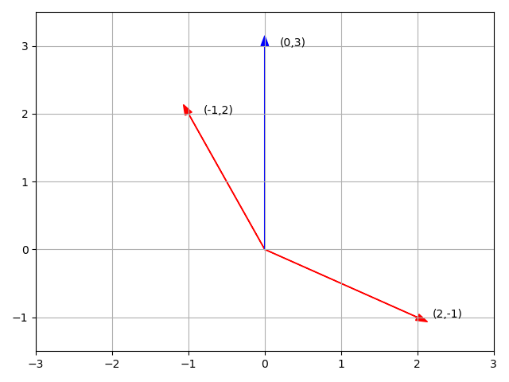

- [前沿](#前沿)
- [方程组的集合解释](#方程组的集合解释)
  - [行图像 (Row picture)](#行图像-row-picture)
  - [列图像 (Column picture)](#列图像-column-picture)
  - [矩阵](#矩阵)
- [消元法求解线性方程组](#消元法求解线性方程组)
  - [消元得到上三角矩阵](#消元得到上三角矩阵)
  - [消元法失效](#消元法失效)
  - [回代](#回代)
  - [矩阵形式描述消元法](#矩阵形式描述消元法)
    - [使用行进行计算](#使用行进行计算)
    - [消元矩阵](#消元矩阵)
  - [置换矩阵 (pemutation)](#置换矩阵-pemutation)
  - [矩阵的逆](#矩阵的逆)

## 前沿

MIT 18.06，之前看过，但是都忘了，所以这回快速的复习一下，记好一些的笔记，要做题！

重振小镇做题家之荣耀，我辈义不容辞！

https://mitmath.github.io/1806/

---------------------------------

## 方程组的集合解释

> **线性代数：求解方程组**

$$\begin{cases}& 2x - y =0 \\\\ &-x + 2y = 3 \end{cases} \rightarrow \begin{bmatrix} 2 &-1 \\\\ -1 &2 \end{bmatrix} \begin{bmatrix}\bold{x} \\\\\bold{y} \end{bmatrix} = \begin{bmatrix} 0 \\\\ 3 \end{bmatrix} \rightarrow AX=B $$

### 行图像 (Row picture)

两条直线的交点就是这个方程组的解

### 列图像 (Column picture)

$$ \begin{bmatrix} 2 &-1 \\\\ -1 &2 \end{bmatrix} \begin{bmatrix} \bold{x} \\\\ \bold{y} \end{bmatrix} =  \begin{bmatrix} 0 \\\\ 3 \end{bmatrix}\rightarrow x \begin{bmatrix} 2 \\\\ -1 \end{bmatrix} + y \begin{bmatrix} -1 \\\\ 2 \end{bmatrix} = \begin{bmatrix} 0 \\\\ 3 \end{bmatrix} \rightarrow Ax=b$$

这个方程的目的就是找到合适的$x$和$y$使得前两个向量组合可以得到后一个向量 **[也就是找到正确的线性组合]**，这里是列向量的线性组合

新的问题：**对于任意的b(右侧向量)，是否都能求解$Ax=b$**
也就是：列的线性组合能否覆盖整个空间？

### 矩阵

方程的矩阵形式：

$$Ax=b$$

矩阵A乘以向量x得到右侧的向量b

矩阵和向量的乘法的两种解：

- 使用列图像进行乘法（推荐）

    矩阵的每一列都看成是一列向量，外部的向量b其实就是每一列向量的系数

    或者可以将矩阵的每一列看成一个空间的基地，外部的向量b就是根据这个基地在每个方向上的长度

$$ \begin{bmatrix}     2 &5 \\\\ 1 & 3 \end{bmatrix} \begin{bmatrix}     1\\\\2 \end{bmatrix} = 1 \begin{bmatrix}     2\\\\ 1  \end{bmatrix} + 2 \begin{bmatrix}     5\\\\ 3 \end{bmatrix} =\begin{bmatrix}     12\\\\ 7 \end{bmatrix} $$

- 使用行图像进行计算

$$ \begin{bmatrix} 2 &5 \end{bmatrix} \begin{bmatrix}     1 \\\\ 2 \end{bmatrix} =12 $$

## 消元法求解线性方程组

### 消元得到上三角矩阵

$$ \begin{cases}     x+  &2y+ &z  &=2  \\\\     3x+ &8y+ &z  &=12 \\\\         &4y+ &z  &=2 \end{cases} \rightarrow Ax=b \qquad A=\begin{bmatrix}     1 &2 &1 \\\\     3 &8 &1 \\\\     0 &4 &1 \end{bmatrix} $$

按顺序进行消元，对角线上的元素称为主元(pivot)，因为需要使用对角线上的元素迭代的消去下面等式中的对应元素。但是0不能作为主元

$$ A= \begin{bmatrix}      1 &2 &1 \\\\      3 &8 &1 \\\\      0 &4 &1  \end{bmatrix} \stackrel{(2,1)}{\rightarrow} \begin{bmatrix} 1 &2 &1  \\\\      0 &2 &-2 \\\\      0 &4 &1  \end{bmatrix} \stackrel{(3,2)}{\rightarrow} \begin{bmatrix} 1 &2 &1  \\\\      0 &2 &-2 \\\\      0 &0 &5  \end{bmatrix} = U$$

> 箭头上方表示想要消去的元素的位置

这里消元的目的就是为了从$A$得到上三角矩阵$U$.

### 消元法失效

如果主元是0的时候，需要进行行交换，让非0元素占据主元的位置。

如果行交换无法使主元是非0元素，那么这个方程就没有解，这个矩阵也就是不可逆的。

### 回代

当使用消元法从$A$得到$U$之后，就需要把右侧向量$b$带入，引入$b$作为新的一列向量加入到矩阵中，也就是**增广矩阵**

$$ \begin{bmatrix}       1 &2 &1 &2 \\\\       3 &8 &1 &12 \\\\       0 &4 &1 &2   \end{bmatrix} $$

因为对左侧矩阵进行变化的同时，右侧向量也会跟着做同样的变化，所以按照上面的消元法：

$$  \begin{bmatrix}       1 &2 &1 &2 \\\\       3 &8 &1 &12\\\\       0 &4 &1 &2  \end{bmatrix}  \stackrel{(2,1)}{\rightarrow}  \begin{bmatrix}  1 &2 &1  &2  \\\\       0 &2 &-2 &6 \\\\       0 &4 &1  &2   \end{bmatrix}  \stackrel{(3,2)}{\rightarrow}  \begin{bmatrix}  1 &2 &1  &2 \\\\       0 &2 &-2 &6 \\\\       0 &0 &5  &-10  \end{bmatrix} \rightarrow c=\begin{bmatrix}    2 \\\\ 6 \\\\ -10\end{bmatrix}$$

所以最终方程的形式是这样的：

$$\begin{cases}     x+  &2y+ &z   &=2  \\\\         &2y- &2z  &=6 \\\\             &    &5z  &=-10\end{cases}\rightarrow Ux=c$$

接下来进行回代求解：$z=-2; y=1; x=2$

### 矩阵形式描述消元法

#### 使用行进行计算

$$ \begin{bmatrix}     1 &2 &7 \end{bmatrix} \begin{bmatrix}     2 & 3 & 4 \\\\     1 & 3 & 4 \\\\     2 & 3 & 5 \end{bmatrix} =  \begin{bmatrix}2 &3 &4\end{bmatrix}\times 1 + ... + \begin{bmatrix}2 &3 &5\end{bmatrix}\times 7 = \begin{bmatrix}18 &30 &47\end{bmatrix}  $$

**左行右列，左乘行变换，右乘列变换**

- 列向量是乘在矩阵的**右边**，对矩阵的每一列进行线性合并，得到的是**列向量**
- 行向量是乘在矩阵的**左边**，对矩阵的每一行进行线性合并，得到的是**行向量**

#### 消元矩阵

$$\begin{bmatrix}      1 &2 &1 \\\\      3 &8 &1 \\\\      0 &4 &1  \end{bmatrix} \stackrel{(2,1)}{\rightarrow} \begin{bmatrix} 1 &2 &1  \\\\      0 &2 &-2 \\\\      0 &4 &1  \end{bmatrix} \Rightarrow \begin{bmatrix}     1  &0 &0 \\\\     -3 &1 &0 \\\\     0  &0 &1 \end{bmatrix} \begin{bmatrix}        1 &2 &1 \\\\        3 &8 &1 \\\\        0 &4 &1   \end{bmatrix} = \begin{bmatrix}   1 &2 &1  \\\\        0 &2 &-2 \\\\        0 &4 &1     \end{bmatrix}$$

原来的消元法就变成了一个特定的矩阵：**消元矩阵**

$$E_{21} = \begin{bmatrix}     1  &0 &0 \\\\     -3 &1 &0 \\\\     0  &0 &1 \end{bmatrix}$$

他的每一行都是对矩阵的行变换，同时也被称为**初等矩阵$E$**，因为是对(2,1)位置上进行消元，所以可以写成$E_{21}$

所以，整个过程使用矩阵形式表达：

$$E_{32}(E_{21}A)=U$$

矩阵乘法满足结合律，所以可以将括号移动，变成一个矩阵，来实现所有的消元任务。但是矩阵乘法不满足交换律，不可轻易调换他们的顺序

$$(E_{32}E_{21})A=U$$

### 置换矩阵 (pemutation)

对行进行调换：

$$ \begin{bmatrix}     0 &1 \\\\     1 &0 \end{bmatrix} \begin{bmatrix}     a &b \\\\     c &d \end{bmatrix} = \begin{bmatrix}     c &d \\\\     a &b \end{bmatrix} $$

其中，$P=\begin{bmatrix}    0 &1 \\\\    1 &0\end{bmatrix}$就是**置换矩阵**，将两行进行位置的调换

同理，如果想对列进行置换，那么需要将矩阵进行右乘，**左行右列**

### 矩阵的逆

$$\begin{bmatrix}     1  &0 &0 \\\\     -3 &1 &0 \\\\     0  &0 &1 \end{bmatrix} \begin{bmatrix}        1 &2 &1 \\\\        3 &8 &1 \\\\        0 &4 &1   \end{bmatrix} = \begin{bmatrix}   1 &2 &1  \\\\        0 &2 &-2 \\\\        0 &4 &1     \end{bmatrix}$$

初等矩阵$E_{21} = \begin{bmatrix}     1  &0 &0 \\\\     -3 &1 &0 \\\\     0  &0 &1 \end{bmatrix}$，从行2中减去了三倍的行1，现在我想回做这一步，也就是找到某一个矩阵取消这次消元（左乘），即两者相成为单位阵$I$：

$$E^{-1}_{21}E_{21}=I$$

那么对于$E_{21}$来说，他的含义相当于是从行2减去了三倍的行1，那么想消去这个行变换的影响，就应该让行2加回来三倍的行1，所以

$$E^{-1}_{21}=\begin{bmatrix}     1  &0 &0 \\\\     3 &1 &0 \\\\     0  &0 &1 \end{bmatrix}$$

