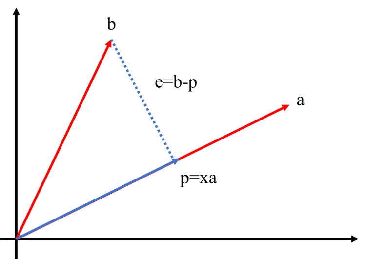
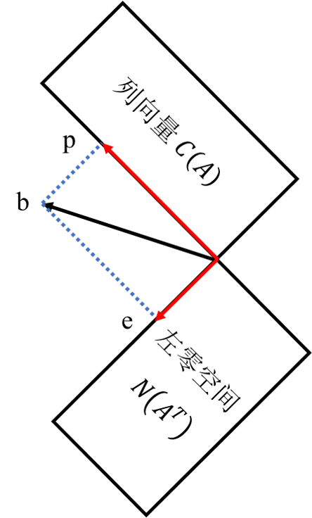

## 前言

MIT 18.06，之前看过，但是都忘了，所以这回快速的复习一下，记好一些的笔记，要做题！

重振小镇做题家之荣耀，我辈义不容辞！

https://mitmath.github.io/1806/

贴一张老爷子的照片，感谢！

---------------------------------

## 1. 方程组的集合解释

> **线性代数：求解方程组**

$$\begin{cases}& 2x - y =0 \\\\ &-x + 2y = 3 \end{cases} \rightarrow \begin{bmatrix} 2 &-1 \\\\ -1 &2 \end{bmatrix} \begin{bmatrix}\bold{x} \\\\\bold{y} \end{bmatrix} = \begin{bmatrix} 0 \\\\ 3 \end{bmatrix} \rightarrow AX=B $$

### 行图像 (Row picture)

两条直线的交点就是这个方程组的解

### 列图像 (Column picture)

$$ \begin{bmatrix} 2 &-1 \\\\ -1 &2 \end{bmatrix} \begin{bmatrix} \bold{x} \\\\ \bold{y} \end{bmatrix} =  \begin{bmatrix} 0 \\\\ 3 \end{bmatrix}\rightarrow x \begin{bmatrix} 2 \\\\ -1 \end{bmatrix} + y \begin{bmatrix} -1 \\\\ 2 \end{bmatrix} = \begin{bmatrix} 0 \\\\ 3 \end{bmatrix} \rightarrow Ax=b$$

这个方程的目的就是找到合适的$x$和$y$使得前两个向量组合可以得到后一个向量 **[也就是找到正确的线性组合]**，这里是列向量的线性组合

新的问题：**对于任意的b(右侧向量)，是否都能求解$Ax=b$**
也就是：列的线性组合能否覆盖整个空间？

### 矩阵

方程的矩阵形式：

$$Ax=b$$

矩阵A乘以向量x得到右侧的向量b

矩阵和向量的乘法的两种解：

- 使用列图像进行乘法（推荐）

    矩阵的每一列都看成是一列向量，外部的向量b其实就是每一列向量的系数

    或者可以将矩阵的每一列看成一个空间的基地，外部的向量b就是根据这个基地在每个方向上的长度

$$ \begin{bmatrix}     2 &5 \\\\ 1 & 3 \end{bmatrix} \begin{bmatrix}     1\\\\2 \end{bmatrix} = 1 \begin{bmatrix}     2\\\\ 1  \end{bmatrix} + 2 \begin{bmatrix}     5\\\\ 3 \end{bmatrix} =\begin{bmatrix}     12\\\\ 7 \end{bmatrix} $$

- 使用行图像进行计算

$$ \begin{bmatrix} 2 &5 \end{bmatrix} \begin{bmatrix}     1 \\\\ 2 \end{bmatrix} =12 $$

## 2. 消元法求解线性方程组

### 消元得到上三角矩阵

$$ \begin{cases}     x+  &2y+ &z  &=2  \\\\     3x+ &8y+ &z  &=12 \\\\         &4y+ &z  &=2 \end{cases} \rightarrow Ax=b \qquad A=\begin{bmatrix}     1 &2 &1 \\\\     3 &8 &1 \\\\     0 &4 &1 \end{bmatrix} $$

按顺序进行消元，对角线上的元素称为主元(pivot)，因为需要使用对角线上的元素迭代的消去下面等式中的对应元素。但是0不能作为主元

$$ A= \begin{bmatrix}      1 &2 &1 \\\\      3 &8 &1 \\\\      0 &4 &1  \end{bmatrix} \stackrel{(2,1)}{\rightarrow} \begin{bmatrix} 1 &2 &1  \\\\      0 &2 &-2 \\\\      0 &4 &1  \end{bmatrix} \stackrel{(3,2)}{\rightarrow} \begin{bmatrix} 1 &2 &1  \\\\      0 &2 &-2 \\\\      0 &0 &5  \end{bmatrix} = U$$

> 箭头上方表示想要消去的元素的位置

这里消元的目的就是为了从$A$得到上三角矩阵$U$.

### 消元法失效

如果主元是0的时候，需要进行行交换，让非0元素占据主元的位置。

如果行交换无法使主元是非0元素，那么这个方程就没有解，这个矩阵也就是不可逆的。

### 回代

当使用消元法从$A$得到$U$之后，就需要把右侧向量$b$带入，引入$b$作为新的一列向量加入到矩阵中，也就是**增广矩阵**

$$ \begin{bmatrix}       1 &2 &1 &2 \\\\       3 &8 &1 &12 \\\\       0 &4 &1 &2   \end{bmatrix} $$

因为对左侧矩阵进行变化的同时，右侧向量也会跟着做同样的变化，所以按照上面的消元法：

$$  \begin{bmatrix}       1 &2 &1 &2 \\\\       3 &8 &1 &12\\\\       0 &4 &1 &2  \end{bmatrix}  \stackrel{(2,1)}{\rightarrow}  \begin{bmatrix}  1 &2 &1  &2  \\\\       0 &2 &-2 &6 \\\\       0 &4 &1  &2   \end{bmatrix}  \stackrel{(3,2)}{\rightarrow}  \begin{bmatrix}  1 &2 &1  &2 \\\\       0 &2 &-2 &6 \\\\       0 &0 &5  &-10  \end{bmatrix} \rightarrow c=\begin{bmatrix}    2 \\\\ 6 \\\\ -10\end{bmatrix}$$

所以最终方程的形式是这样的：

$$\begin{cases}     x+  &2y+ &z   &=2  \\\\         &2y- &2z  &=6 \\\\             &    &5z  &=-10\end{cases}\rightarrow Ux=c$$

接下来进行回代求解：$z=-2; y=1; x=2$

### 矩阵形式描述消元法

#### 使用行进行计算

$$ \begin{bmatrix}     1 &2 &7 \end{bmatrix} \begin{bmatrix}     2 & 3 & 4 \\\\     1 & 3 & 4 \\\\     2 & 3 & 5 \end{bmatrix} =  \begin{bmatrix}2 &3 &4\end{bmatrix}\times 1 + ... + \begin{bmatrix}2 &3 &5\end{bmatrix}\times 7 = \begin{bmatrix}18 &30 &47\end{bmatrix}  $$

**左行右列，左乘行变换，右乘列变换**

- 列向量是乘在矩阵的**右边**，对矩阵的每一列进行线性合并，得到的是**列向量**
- 行向量是乘在矩阵的**左边**，对矩阵的每一行进行线性合并，得到的是**行向量**

#### 消元矩阵

$$\begin{bmatrix}      1 &2 &1 \\\\      3 &8 &1 \\\\      0 &4 &1  \end{bmatrix} \stackrel{(2,1)}{\rightarrow} \begin{bmatrix} 1 &2 &1  \\\\      0 &2 &-2 \\\\      0 &4 &1  \end{bmatrix} \Rightarrow \begin{bmatrix}     1  &0 &0 \\\\     -3 &1 &0 \\\\     0  &0 &1 \end{bmatrix} \begin{bmatrix}        1 &2 &1 \\\\        3 &8 &1 \\\\        0 &4 &1   \end{bmatrix} = \begin{bmatrix}   1 &2 &1  \\\\        0 &2 &-2 \\\\        0 &4 &1     \end{bmatrix}$$

原来的消元法就变成了一个特定的矩阵：**消元矩阵**

$$E_{21} = \begin{bmatrix}     1  &0 &0 \\\\     -3 &1 &0 \\\\     0  &0 &1 \end{bmatrix}$$

他的每一行都是对矩阵的行变换，同时也被称为**初等矩阵$E$**，因为是对(2,1)位置上进行消元，所以可以写成$E_{21}$

所以，整个过程使用矩阵形式表达：

$$E_{32}(E_{21}A)=U$$

矩阵乘法满足结合律，所以可以将括号移动，变成一个矩阵，来实现所有的消元任务。但是矩阵乘法不满足交换律，不可轻易调换他们的顺序

$$(E_{32}E_{21})A=U$$

### 置换矩阵 (pemutation)

对行进行调换：

$$ \begin{bmatrix}     0 &1 \\\\     1 &0 \end{bmatrix} \begin{bmatrix}     a &b \\\\     c &d \end{bmatrix} = \begin{bmatrix}     c &d \\\\     a &b \end{bmatrix} $$

其中，$P=\begin{bmatrix}    0 &1 \\\\    1 &0\end{bmatrix}$就是**置换矩阵**，将两行进行位置的调换

同理，如果想对列进行置换，那么需要将矩阵进行右乘，**左行右列**

可以看到，因为想要消除置换矩阵带来的影响，那就是把它再置换回去，那么置换矩阵的逆就是置换矩阵的转置

$$P^{-1}=P^{T}$$

分清**转置(T，是一个操作)** 和 **置换(P，是一个矩阵)**，两个不一样的东西

### 矩阵的逆

$$\begin{bmatrix}     1  &0 &0 \\\\     -3 &1 &0 \\\\     0  &0 &1 \end{bmatrix} \begin{bmatrix}        1 &2 &1 \\\\        3 &8 &1 \\\\        0 &4 &1   \end{bmatrix} = \begin{bmatrix}   1 &2 &1  \\\\        0 &2 &-2 \\\\        0 &4 &1     \end{bmatrix}$$

初等矩阵$E_{21} = \begin{bmatrix}     1  &0 &0 \\\\     -3 &1 &0 \\\\     0  &0 &1 \end{bmatrix}$，从行2中减去了三倍的行1，现在我想回做这一步，也就是找到某一个矩阵取消这次消元（左乘），即两者相成为单位阵$I$：

$$E^{-1}_{21}E_{21}=I$$

那么对于$E_{21}$来说，他的含义相当于是从行2减去了三倍的行1，那么想消去这个行变换的影响，就应该让行2加回来三倍的行1，所以

$$E^{-1}_{21}=\begin{bmatrix}     1  &0 &0 \\\\     3 &1 &0 \\\\     0  &0 &1 \end{bmatrix}$$

## 3. 矩阵的乘法和逆

### 矩阵乘法

矩阵乘法：$AB=C$

#### 点乘法

其中矩阵$C$的3行4列的元素$C_{34}=A_{row-3}\cdot B_{col-4}=\sum_{k=1}^{n}{a_{3k}b_{k4}}$

#### 列向量法

$$A_{m\times n}B_{n\times p} = C_{m\times p}$$

可以将乘法考虑成一个矩阵右乘以一个列向量，得到一个列向量。也就是**矩阵A**右乘矩阵B中的**每一个列向量**

那么，**矩阵C的各列是矩阵A中各列的线性组合**

#### 行向量法

与列向量法类似，可以将乘法考虑成矩阵B左乘矩阵A中的行向量，

**矩阵C的各行是矩阵B中各行的线性组合**

#### 列 X 行

常规方法中，是A的行$\times$B的列，得到是相对应位置的标量

但是这里可以是A的列$\times$B的行

$AB$是A的各列$\times$B的各行的矩阵的和

#### 分块乘法

将矩阵进行分块，对每一个分块进行乘法

$$ \begin{bmatrix}   A_{1} & A_{2} \\\\   A_{3} & A_{4} \end{bmatrix} \begin{bmatrix}   B_{1} & B_{2} \\\\   B_{3} & B_{4} \end{bmatrix} = \begin{bmatrix}   A_{1}B_{1} + A_{2}B_{3} & A_{1}B_{2}+A_{2}B_{4} \\\\   A_{3}B_{1} + A_{4}B_{3} & A_{3}B_{2}+A+{4}B_{4} \end{bmatrix} $$

### 矩阵的逆 (Inverse)

只考虑方阵(square matrix) $A$

#### 逆是否存在

如果存在，可以成立：$A^{-1}A=I$，$I$为单位阵

其中，这里的是左逆，也可以有右逆，表达为：$AA^{-1}=I$

对于方阵，左逆=右逆，即$A^{-1}A=I=AA^{-1}$

如果逆存在，那么矩阵A是可逆的，也就是**非奇异**的(non-singular)

#### 奇异矩阵

如果存在非0向量$x$使得$Ax=0$，那么这个矩阵$A$是奇异的

也就是其实在矩阵A中的列向量，最少有一对向量是共平面的

#### 可逆矩阵

求矩阵的逆：

$$ \begin{bmatrix}   1 & 3 \\\\ 2 &7 \end{bmatrix} \begin{bmatrix}   a & c \\\\ b &d \end{bmatrix} = \begin{bmatrix}   1 & 0 \\\\ 0 &1 \end{bmatrix} \rightarrow AA^{-1}=I $$

> Gauss-Jordan：同时处理两个方程组

对增广矩阵($[AI]$)进行消元，得到$E[A|I]=[EA|EI]=[I|E]$，那么$E$就是$A^{-1}$

$$ \begin{bmatrix}  \begin{array}{cc|cc}   1 & 3 & 1 & 0 \\\\    2 &7 & 0 & 1    \end{array}   \end{bmatrix}    \rightarrow  \begin{bmatrix}   \begin{array}{cc|cc}  1 & 3 & 1 & 0 \\\\   0 &1 & -2 & 1  \end{array}  \end{bmatrix}   \rightarrow   \begin{bmatrix}     \begin{array}{cc|cc}  1 & 0 & 7 & -3 \\\\   0 &1 & -2 & 1      \end{array}  \end{bmatrix} $$

#### 矩阵乘积的逆

$A$和$B$都是可逆矩阵，那么他们乘积的逆是$(AB)^{-1}=B^{-1}A^{-1}$

#### 矩阵转置的逆

$$(A^{-1})^{T} A^{T}= I$$

## 4. 矩阵A的LU分解

考虑三维矩阵，对A进行消元得到U，即

$$E_{32}E_{31}E_{21}A=U$$

可以写成$A=LU$形式，即：

$$A=E_{21}^{-1}E_{31}^{-1}E_{32}^{-1}U$$

其中U表示的上三角矩阵，L表示的下三角矩阵

$$ \begin{cases}   A = LU \\\\   EA=U \end{cases} $$

下面讨论这两种形式，为什么要变成$A=LU$的形式

对于$A=LU$如果不存在行互换，消元乘数可以直接写进$L$里面

**举个例子**

$$ E_{32}=\begin{bmatrix}   1 &0 &0 \\\\ 0 &1 &0 \\\\ 0 & -5 &1 \end{bmatrix} E_{31} = I \quad E_{21}=\begin{bmatrix}   1 &0 &0 \\\\ -2 &1 &0 \\\\ 0 &0 &1 \end{bmatrix} $$

对矩阵进行消元，进行上述消元变化：$E_{21}$和$E_{32}$

$$ E=E_{32}E_{31}E_{21} = \begin{bmatrix}   1 &0 &0 \\\\ -2 &1 &0 \\\\ 10 &-5 &1 \end{bmatrix} $$
这种形式下可以看到行1通过行2影响到了行3，在(1,3)位置出现了10

$$ L = E_{21}^{-1}E_{32}^{-1}= \begin{bmatrix}    1 &0 &0 \\\\ 2 &1 &0 \\\\ 0 &0 &1 \end{bmatrix} \begin{bmatrix}    1 &0 &0 \\\\ 0 &1 &0 \\\\ 0 & 5 &1  \end{bmatrix} = \begin{bmatrix}   1 &0 &0 \\\\ 2 &1 &0 \\\\ 0 &5 &1 \end{bmatrix} $$

在这种形势下，2和5不会冲突产生10，也就是消元乘数可以直接写到$L$里

## 5. 置换、转置与向量空间

### 置换 (Permutation, $P$)

置换矩阵是行重新排列了的单位矩阵，是用来完成行互换的矩阵

对于需要进行置换操作的消元，$A=LU$就会变成了$PA=LU$

所有的置换矩阵都是可逆的，并且$P^{T} = P^{-1}$

对于n维方阵，共有$n!$个置换矩阵

### 转置 (Transpose)

$(A^{T})_{ij}=A\_{ji}$

### 对称矩阵 (symmetric)

对称矩阵：转置变换以后，没有变化的矩阵 $A^{T}=A$

所有的矩阵R转置乘以R都是对称的

$$ \begin{bmatrix}   1 &3 \\\\ 2 &3 \\\\ 4 &1 \end{bmatrix} \begin{bmatrix}   1 &2 &4 \\\\ 3 &3 &1 \end{bmatrix} = \begin{bmatrix}   10 &11 &7 \\\\   11 &13 &11 \\\\   7  &11 &17   \end{bmatrix} $$

证明：

$$(R^{T}R)^{T} = R^{T}R$$

### 向量空间

空间：满足加法和数乘（即可以进行线性运算），比如： $\mathbb{R}^{2}$，表示所有的二维实向量。(二维：即向量用两个实数表述)

$$ \begin{bmatrix}   3 \\\\ 2 \end{bmatrix}, \begin{bmatrix}   0 \\\\ 0 \end{bmatrix}, \begin{bmatrix}   \pi \\\\ e \end{bmatrix}, \cdots $$

$\mathbb{R}^{n}$包含所有的n维实向量

子空间：需要满足线性运算，但同时又是空间的子集，比如$\mathbb{R}^{2}$的子空间：

- $\mathbb{R}^{2}$本身
- 所有经过原点的直线
- (0,0)点

#### 列空间

从矩阵中构造一个子空间：

$$A=\begin{bmatrix}  1 &3 \\\\ 2 &3 \\\\ 4 &1 \end{bmatrix}$$

矩阵A的所有列都在$\mathbb{R}^{3}$空间中，他的列的所有线性组合都成一个子空间：**列空间**，记作$C(A)$

## 6. 列空间和零空间

向量空间：一些向量组成的空间，对加法和数乘运算封闭

有子空间$S$和$T$，他们的交集$S\cap T$仍是子空间

### 列空间

$$ A=\begin{bmatrix}   1 &1 &2 \\\\   2 &1 &3 \\\\   3 &1 &4 \\\\   4 &1 &5 \\\\ \end{bmatrix} $$

矩阵A的列看做向量，那么矩阵A的列空间是$\mathbb{R}^{4}$的子空间，记作$C(A)$

$C(A)$由这三个列向量线性组合的所有向量构成，因为矩阵A的三个列向量不是线性无关的，所以$C(A)$是$\mathbb{R}^{4}$中的二维子空间

下面开始讨论这个子空间有“多大”，并将它和线性方程组$Ax=b$联系起来，即

$Ax=b$是否对任意的$b$都有解，**满足什么条件的$b$可以满足$Ax=b$**

$Ax=b$有解当且仅当$b\in C(A)$

### 零空间

$A$的零空间包含$Ax=0$中所有的解$x=\begin{bmatrix}  x_{1} \\\\ x_{2} \\\\ x_{3}\end{bmatrix}$，对于矩阵$A$，他的零空间属于$\mathbb{R}^{3}$

$Ax=0$的特解：

$$ \begin{bmatrix}   0 \\\\ 0 \\\\ 0 \end{bmatrix}, \begin{bmatrix}   1 \\\\ 1 \\\\ -1 \end{bmatrix} $$

所以A的零空间包含了$c\begin{bmatrix}  1 \\\\ 1 \\\\ -1\end{bmatrix}$

所以A的零空间就是$\mathbb{R}^{3}$中的一条直线

## 7. 求解零空间Ax=0

之前讲过了列空间和零空间的基本概念，现在主要关注的是如何去求解列空间和零空间

$$ A=\begin{bmatrix}   1 &2 &2 &2 \\\\   2 &4 &6 &8 \\\\   3 &6 &8 &10 \end{bmatrix} $$

下面通过消元来求解$Ax=0$，消元并不会改变$Ax=0$的解

$$  A=\begin{bmatrix}   1 &2 &2 &2 \\\\   2 &4 &6 &8 \\\\   3 &6 &8 &10 \end{bmatrix}  \rightarrow  \begin{bmatrix}     1 &2 &2 &2 \\\\     0 &0 &2 &4 \\\\     0 &0 &2 &4   \end{bmatrix}  \rightarrow  \begin{bmatrix}     \colorbox{yellow}{\color{red}{1}} &2 &\colorbox{yellow}{2} &2 \\\\    \colorbox{yellow}{0} &0 &\colorbox{yellow}{\color{red}{2}} &4 \\\\     \colorbox{yellow}{0} &0 &\colorbox{yellow}{0} &0   \end{bmatrix}=U $$

最终得到了这种矩阵的阶梯形式(echelon form)，非零元素以一种阶梯形式出现。其中红色表示的就是矩阵的**主元(pivots)**

矩阵主元的个数称为该矩阵的**秩(rank)**

现在从$Ax=0$变换到了$Ux=0$，他的解没有变，也就是零空间没有变

所以下面通过$U$来求解$A$的零空间

主元所在列称为**主列(pivot column)**，也就是矩阵中的黄色部分；其他的列称为**自由列(free columns)**

> 自由列表示可以任意、自由的分配数值；列2和列4的乘数是任意的，即可以任意的分配$x_{2}$和$x_{4}$。当$x_{2}$和$x_{4}$固定下来，$x_{1}$和$x_{3}$随之固定

所以需要任意假定一个$x_{2}$和$x_{4}$数值，但是因为零向量肯定是零空间中的一个解，所以把自由列所对应的元素全假定成0没有意义，这里一般是采用one-hot想法，逐一假设成1来进行求解(这里的解应该是零空间的特解)

$$ x_{2}=1,x_{4}=0 \Rightarrow \begin{bmatrix}   -2 \\\\ 1 \\\\ 0 \\\\ 0 \end{bmatrix};x_{2}=0,x_{4}=1 \Rightarrow \begin{bmatrix}   2 \\\\ 0 \\\\ -2 \\\\ 1 \end{bmatrix} $$

所以，$Ax=0$的解就是

$$ c_{1}\begin{bmatrix}   2 \\\\ 0 \\\\ -2 \\\\ 1 \end{bmatrix}+ c_{2}\begin{bmatrix}   -2 \\\\ 1 \\\\ 0 \\\\ 0 \end{bmatrix} $$

如果矩阵$A_{m\times n}$的秩$r=2$，表示只有r个方程起作用。他的自由列、自由变量就有$n-r$个，可以采用one-hot形式进行取值，得到特解

> 可以看到，**使用列向量来理解**整个矩阵、方程组的求解，理解将会变得非常的顺畅

-----------------------------

下面继续对行阶梯形式的$U$进行再一次的简化，得到的简化行阶梯形式记为$R$ (Reduced row echelon form)。而简化行阶梯形式主元上下全是0，主元为1

$$U=\begin{bmatrix} 1 & 2 & 2 & 2 \\\\ 0 & 0 & 2 & 4 \\\\ 0 & 0 & 0 & 0 \end{bmatrix} \rightarrow \begin{bmatrix} 1 & 2 & 0 & -2 \\\\ 0 & 0 & 1 & 2 \\\\ 0 & 0 & 0 & 0 \end{bmatrix}=R$$

简化行阶梯形式$R$中包含了这些信息：

$$ R=\begin{bmatrix}  \colorbox{yellow}{1} & 2 & \colorbox{yellow}{0} & -2 \\\\  \colorbox{yellow}{0} & 0 & \colorbox{yellow}{1} & 2  \\\\  0 & 0 & 0 & 0  \end{bmatrix} \stackrel{col2\iff col3}{\longrightarrow}  \begin{array}{l}   \begin{bmatrix}  \colorbox{yellow}{1} & \colorbox{yellow}{0} &\colorbox{pink}{2}  & \colorbox{pink}{-2} \\\\  \colorbox{yellow}{0} & \colorbox{yellow}{1} &\colorbox{pink}{0}  & \colorbox{pink}{2} \\\\  \colorbox{orange}{0} & \colorbox{orange}{0} &\colorbox{orange}{0} &\colorbox{orange}{0} \end{bmatrix}\\\\   \quad c_{1} \quad c_{3} \quad c_{2} \quad c_{4} \end{array} \rightarrow \begin{bmatrix}  \colorbox{yellow}{I} \colorbox{pink}{F} \\\\ \colorbox{orange}{0\quad 0} \end{bmatrix} $$

其中$I_{r\times r}$，自由列$F_{r\times n-r}$

在经过列变换后，我们再求$Rx=0$的解

构造**零空间矩阵**：他的各列由特解组成，记为$N$，即满足$RN=0$

那么通过上面列变换之后的简化行阶梯形式，我们可以很容易得到

$$N=\begin{bmatrix}  -F \\\\ I\end{bmatrix}=\begin{bmatrix}  -2 & 2 \\\\ 0 & -2 \\\\ 1 &0 \\\\ 0 &1\end{bmatrix}$$

再把相应的行2和行3调换回去就可以了，就得到了之前得到的特解

## 8. 求解Ax=b

> 有了前面的铺垫，现在正是进入到求解线性方程组。
> 
> 线性代数的根本目的就是为了求解线性方程组

$$  A=\begin{bmatrix}   1 &2 &2 &2 \\\\   2 &4 &6 &8 \\\\   3 &6 &8 &10 \end{bmatrix}  \Rightarrow  \begin{cases}   x_{1} +&2x_{2}+&2x_{3}+&2x_{4} = b_{1} \\\\   2x_{1}+&4x_{2}+&6x_{3}+&8x_{4} = b_{2} \\\\   3x_{1}+&6x_{2}+&8x_{3}+&10x_{4} = b_{3} \end{cases} $$

考虑$Ax=b$的增广矩阵$[A|b]$：

$$ \begin{bmatrix}   \begin{array}{cccc|c}     1 &2 &2 &2  &b_{1} \\\\     2 &4 &6 &8  &b_{2} \\\\     3 &6 &8 &10 &b_{3}  \end{array}    \end{bmatrix}  $$

同上进行消元

$$  \begin{bmatrix}    \begin{array}{cccc|c}      1 &2 &2 &2  &b_{1}        \\\\      0 &0 &2 &4  &b_{2}-2b_{1} \\\\      0 &0 &0 &0  &b_{3}-b_{2}-b_{1}   \end{array}     \end{bmatrix}   $$

所以有解的条件就是$b_{3}-b_{2}-b_{1}=0$，因为第三个方程左边全是0

### 可解性

$Ax=b$有解，当前仅当$b$属于$A$的列空间时

由上面的$Ax=b$的求解过程可知，换一种表述为：

如果$A$各行的线性组合得到零行，那么$b$中元素的同样组合必然也是零，就像$b_{3}-b_{2}-b_{1}$

### 求Ax=b的所有解

1. 第一步只求一个特定的解，即特解(particular solution)

   其中一个方法就是，把所有的**自由变量**设为0，求出$Ax=b$的主变量

   按照上面进行举例: $x_{2}=0, x_{4}=0$可以得到

   $$\begin{cases} x_{1} +2x_{3} =1 \\\\ 2x_{3}=3 \end{cases} $$

   可得：$x_{1}=-2, \quad x_{3}=\frac{3}{2}$，特解向量为$x_{p}=\begin{bmatrix}-2 \\\\ 0 \\\\ \frac{3}{2} \\\\ 0 \end{bmatrix}$

2. 第二步，求解$A$的零空间$x_{n}$

3. 最终的解就是特解加上零空间中的任意向量$x=x_{p}+x_{n}$

   因为$Ax_{p}=b$，$Ax_{n}=0$

### 使用秩讨论Ax=b的求解

对于$m\times n$的矩阵$A_{m\times n}$，他的秩是$r$ ($r\le m, r\le n$)

#### 列满秩 (r=n<m)

每一列都有主元，没有自由变量。

这个时候$A$的零空间只有零向量$N(A) = \\{ 0\\}$

如果$Ax=b$有解，只存在一个解，就是特解，即$x=x_{p}$

#### 行满秩 (r=m<n)

这种情况下，将会得到$m$个主元，这个时候通过消元法我们可知不会出现零行，所以对于任意的$b$，$Ax=b$都有解

自由变量为$n-r$个

举个例子，有点不好理解

$$A=\begin{bmatrix}  1 &2 &6 &5 \\\\ 3 &1 &1 &1\end{bmatrix}$$

矩阵的秩是2，得到的简化阶梯型：

$$R=\begin{bmatrix}
  1 &0 &\_ &\_ \\\\ 0 &1 &\_ &\_
\end{bmatrix}$$

$R$中没有零行，左边是单位阵，右边就是自由变量组成的矩阵$F$，可以任意设定

#### 满秩 (r=m=n)

这种矩阵肯定是方阵，他是可逆矩阵，简化阶梯型$R=I$，零空间只有0向量，$Ax=b$有且只有唯一解

> 矩阵的秩决定了方程组解的数目

## 9. 线性相关、向量空间的基和维数

“向量组”是线性相关、无关；“向量组”生成一个空间；“向量组”作为一组基

**他们都是针对的向量组进行讨论，而不是矩阵**

### 线性无关

> 什么条件下，向量$x_{1}, x_{2}, \cdots, x_{n}$是线性无关的？

如果不存在结果为零向量的组合，则向量组线性无关（除非系数全0）

当向量$x_{1}, x_{2}, \cdots, x_{n}$是矩阵$A$的列向量，如果矩阵$A$的零空间只存在零空间，那么这个向量组线性无关，即这个矩阵$A$的秩$r=n$

### 向量空间

设向量组$v_{1},v_{2},\cdots,v_{l}$生成(span)了一个向量空间，表示这个空间包含了这些向量的所有线性组合

向量空间的**基**：指一系列的向量$v_{1},v_{2},\cdots,v_{d}$，他们线性无关、可以生成整个向量空间

对于给定空间，$\mathbb{R}^{2},\mathbb{R}^{n},...$,空间中基的个数是相等的，即空间的**维度** 

$$ A=\begin{bmatrix}   1 &2 &3 &1 \\\\   1 &1 &2 &1 \\\\   1 &2 &3 &1 \end{bmatrix} $$

他的列空间$C(A)$，前两列向量就是这个列空间的基，那么这个**列空间的维数**就是矩阵$A$的秩。

(注意，这里说的不是矩阵$A$的维度，而是矩阵$A$的列空间的维度！)

零空间表达是这些向量组怎么线性相关的，零空间的维度是$dim N(A) = n-r$

## 10. 矩阵的四个基本子空间

对于矩阵$A_{m\times n}$

1. 列空间$C(A)\in \mathbb{R}^{m}$
   
2. 零空间$N(A)\in \mathbb{R}^{n}$

3. 行空间$C(A^{T}) \in \mathbb{R}^{n}$: 矩阵$A$转置的列的所有线性组合 

  > 因为一般不太喜欢处理行向量，所以进行转置之后处理列向量。爱的魔力转圈圈~~~

4. 左零空间$N(A^{T})\in \mathbb{R}^{m}$

关心这些空间的**一组基**，以及他们的**维数**

|子空间|维度|一组基|
|--|:--:|:--:|
|列空间|矩阵$A$的秩$rank(A)$|矩阵$A$的r个主列 (注意这里是矩阵$A$，不是$U$或是$R$)|
|行空间|矩阵$A$的秩$rank(A)$|行最简矩阵$R$的前r行|
|零空间|$n-r$|$Ax=0$得到的特殊解 (每个自由变量都可以得到一个特殊解)|
|左零空间|$m-r$|对$A$进行初等行变换到$R$的**矩阵$E$的**最后$m-r$行|

**关于行空间的一组基：**

$$A=\begin{bmatrix}  1 &2 &3 &1 \\\\ 1 &1 &2 &1 \\\\ 1 &2 &3 &1\end{bmatrix} \rightarrow \begin{bmatrix}  1 &0 & 1 &1 \\\\ 0 &1 &1 &0 \\\\ 0 &0 &0 &0\end{bmatrix}$$

因为在化成最简行阶梯形式$R$的过程中经历了行变化，此时$C(A)\neq C(R)$，但是他们的行空间却是相等的，所以行空间的一组基就是最简行阶梯形式$R$的前r行

**关于左零空间：**

$A^{T}y=0$，$y$就在$A$转置矩阵的零空间中

对两边进行转置，可得：$y^{T}A=0$，这个时候$y_{T}$对$A$进行左乘，所以得名左零空间

使用高斯-若当法(就是之前求逆的那个方法)，来求左零空间

$$ E\begin{bmatrix}  A_{m\times n}| I_{m\times m}\end{bmatrix} \rightarrow \begin{bmatrix}  R_{m\times n} | E_{m\times m}\end{bmatrix} $$

因为最简行阶梯矩阵$R$的形式是酱紫的：

$$E_{m\times m}A_{m\times n}=R_{m\times n}=\begin{bmatrix}  \colorbox{yellow}{I} \colorbox{pink}{F} \\\\ \colorbox{orange}{0\quad 0} \end{bmatrix}$$

$R$的下面$m-r$行都是0，所以对应于$E_{m\times m}$的最后$m-r$行就是左零空间的基

> 左乘是行变换(左行右列)，$E_{m\times m}$最后几行，左乘$A$得到的行都是0，所以是左零空间的基

## 11. 矩阵空间和秩1矩阵

### 矩阵空间

> 把矩阵当做向量，满足加法和数乘

这里讨论所有的3x3矩阵组成的空间$M$

对于$M$，他的一组基是

$$ \begin{bmatrix}  1 &0 &0 \\\\ 0 &0 &0 \\\\ 0 &0 &0 \end{bmatrix} \begin{bmatrix}  0 &1 &0 \\\\ 0 &0 &0 \\\\ 0 &0 &0 \end{bmatrix} \cdots \begin{bmatrix}  0 &0 &0 \\\\ 0 &0 &0 \\\\ 0 &0 &1 \end{bmatrix} $$

所以$M$的维度是9，(维度的定义即需要至少九组线性无关的基来生成整个空间)

$M$的子空间：所有的上三角矩阵、对称矩阵、对角矩阵，....

||维度||
|:--:|:--:|:--:|
|对称矩阵$S$|6| 对称矩阵不是对角矩阵|
|上三角矩阵$U$|6||
|对角矩阵$D$|3||

### 秩1矩阵

所有的秩1矩阵都可以写成䘝列向量乘以一个行向量的形式，即$A=uv^{T}$

$$A = \begin{bmatrix}  1 &4 &5 \\\\ 2 &8 &10 \end{bmatrix}=\begin{bmatrix}  1 \\\\2\end{bmatrix}\begin{bmatrix}  1 &4 &5\end{bmatrix}$$

通过秩1矩阵，可以搭建出来任何矩阵，比如秩4矩阵通过4个秩1矩阵进行线性组合就可以搭建出来

举个例子：

$S$表示所有4维空间中的向量$v=\begin{bmatrix}   v_{1}\\\\v_{2}\\\\v_{3}\\\\v_{4} \end{bmatrix}\in \mathbb{R}^{4}$，并且满足$v_{1}+v_{2}+v_{3}+v_{4}=0$

首先$S$是$\mathbb{R}^{4}$中的一个子空间，因为向量$v$满足加法和数乘的封闭

其次，$S$空间的基向量和维数：

令$Av=0$，可得到一个符合条件的矩阵$A=\begin{bmatrix}  1 &1 &1 &1\end{bmatrix}$，那么$S=N(A)$，$S$其实就是$A$的零空间，所以他的维数是3

同理，$S$的一组基是

$$ \begin{bmatrix}  -1 \\\\ 1 \\\\ 0 \\\\ 0 \end{bmatrix}, \quad \begin{bmatrix}  -1 \\\\ 0 \\\\ 1 \\\\ 0 \end{bmatrix}, \quad \begin{bmatrix}  -1 \\\\ 0 \\\\ 0 \\\\ 1 \end{bmatrix} $$

矩阵$A$的列空间是$\mathbb{R}^{1}$，矩阵$A$的转置零空间$N(A^{T})$是零维的，这个子空间只有一个空集，没有基

## 12. 线性代数的应用：图和网络

## 14. 正交向量与正交子空间

**正交向量(orthogonal vectors)：** 在n为空间中，这些向量的夹角是90° (垂直的另一种说法)。即 $x^{T}y=0$

简单的一种证明（从直角公式开始推）：

$$||x||^{2}+||y||^{2} = ||x+y||^{2}$$

$$\begin{array}{c} x^{T}x+y^{T}y&=(x+y)^{T}(x+y) \\\\\\\\   &\quad =x^{T}x+y^{T}y + 2x^{T}y \end{array}$$

**正交子空间(orthogonal subspace)：** 子空间$S$和子空间$T$正交，表示$S$中的每个向量都和$T$中的每个向量正交

- 行空间正交于零空间 $\because Ax=0$，$x$与$A$中的所有行都正交，同时垂直于他们的线性组合（即行空间）
  
  他们两个是$\mathbb{R}^{n}$空间的正交补(orthogonal complements) [补集]

- 同理，列空间正交于左零空间

-----------------------------------

如何求一个误解方程组的解，即当 $Ax=b$ 无解的时候，如何去解这个方程组(特别是$m>n$情况下)：**最小二乘法**

对矩阵$A_{m \times n}$来说，一个特别好的矩阵: $A^{T}A$

- $A^{T}A$是$n\times n$的方阵
- $A^{T}A$是对称阵
- $N(A^{T}A) = N(A)$， $rank(A^{T}A)=rank(A)$，所以$A^{T}A$可逆当且仅当$A$的各列线性无关，零空间只有一个零向量

 $Ax=A^{T}b$ 无解时， 可以通过 $A^{T}A\hat{x}=A^{T}b$ 求最优解， 但是 $A^{T}A\hat{x}=A^{T}b$ 和  $Ax=A^{T}b$ 的解是不一样的，所以加个小帽子以区分

## 15. 子空间投影

### 一维空间

$a$ 是一维空间，想要了解到在空间$a$上离向量$b$最近的一点

$a$ 上离 $b$ 最近的一点是 $p$，$p$ 和 $b$ 正交，$p$ 和 $b$ 之间的误差是 $e=b-p$

投影 $p$ 在空间 $a$ 上，是 $a$ 的 $x$ 倍 （$x$是一个标量，而$a$和$b$是向量），所以关键就是怎么求 $x$

$$a^{T}(b-xa) = 0$$

$$\therefore x=\frac{a^{T}b}{a^{T}a}$$

最终，$b$ 在 $a$ 上的 **投影** 就是

$$p=a\frac{a^{T}b}{a^{T}a}$$

由上式可知，投影是通过一个 **投影矩阵(projection matrix)** $P$ 完成的：

$$p=Pb, \qquad P_{n\times n} = \frac{aa^{T}}{a^{T}a}$$

下面主要来分析投影矩阵的一些性质：

- 投影矩阵的列空间 $C(P)$ 是通过 $a$ 的一条线，$rank(P)=1$
- 这个矩阵是对称的 $P^{T}=P$
- 投影矩阵的平方还是自己 $P^{2}=P$， (相当于投影两次)

### 高维空间

> 为什么需要投影？
> 
> $Ax=b$可能会误解，只能求解最接近这个解的解，所以通过投影来微调$b$，即 $A\hat{x}=p$， $p$ 是 $b$ 在列空间上的投影
> 
> $A\hat{x} = p = A(A^{T}A)^{-1} A^{T} b$
> 
> $\therefore A^{T}A\hat{x} = A^{T}b$

现在有一个向量 $b$ 想要投影到 $A$ 的列空间上，得到投影向量 $p$

令 $A$ 的列空间中两个基向量为 $a_{1}, a_{2}$

那么投影向量的表达为： $p = \hat{x_{1}}a_{1} + \hat{x_{2}}a_{2} = A\hat{x}$

同一维中的推理，需要通过垂直来辅助：

$$e = (b-p) = (b-A\hat{x}) \quad \bot \quad C(A)$$

$$ \therefore \begin{cases}   a_{1}^{T}(b-A\hat{x}) = 0 \\\\ a_{2}^{T}(b-A\hat{x}) = 0 \end{cases} $$

$$\therefore A^{T}(b-A\hat{x})=0$$

$e$ 在 $N(A^{T})$ 的空间中，即 $e\bot C(A)$，殊途同归。最终希望得到的 $\hat{x}$ 如下表达：

$$A^{T}A\hat{x} = A^{T}b$$

-------------------------------

**下面就是最重要的投影三个公式：**

系数 $\hat{x}$：

$$\hat{x} = (A^{T}A)^{-1} A^{T} b$$

投影 $p$：

$$p=A\hat{x}=A(A^{T}A)^{-1} A^{T} b$$

投影矩阵 $P$:

$$P = A(A^{T}A)^{-1} A^{T}$$

如果 $A$ 是一个可逆的方阵，那么他的列空间是整个$n$维空间，那么 $P=I$，相当于我投我自己，就没有用，所以上面是唯一一种形式

同一维情况一样

- 这个矩阵是对称的 $P^{T}=P$
- 投影矩阵的平方还是自己 $P^{2}=P$

## 16. 投影矩阵和最小二乘

### 投影矩阵

如果 $b$ 在列空间 $C(A)$ 中，$Pb = b$
如果 $b$ 垂直于列空间 $C(A)$ 中，$Pb = 0$

在几何上表示：列空间垂直于左零空间。对于一个典型的$b$，投影到列空间得到$p=Pb$

投影部分和误差部分加起来其实就是向量 $b$ ，即 $p+e = b$

而误差部分 $e=b-p=b-Pb = b(I-P)$ 其实相当于 $b$ 在左零空间上的投影

因为投影不管投影多少次都不会在变，所以平方的性质仍然存在 $(I-P)^{2} = (I-P)$

### 最小二乘法

举个例子：$(1,1); (2,2); (3,2)$ 拟合出来一条直线

设最优的直线是 $b = C+Dt$，需要确定 $C$ 和 $D$ 的参数。

带入上面三个点的参数，得到方程：

$$ \begin{cases}   C + D = 1 \\\\   C + 2D = 2 \\\\   C + 3D = 2 \\\\ \end{cases} $$

$$ \begin{bmatrix}   1 &1 \\\\ 1 &2 \\\\ 1 &3  \end{bmatrix} \begin{bmatrix}   C \\\\ D \end{bmatrix} = \begin{bmatrix}  1 \\\\ 2 \\\\ 3\end{bmatrix} \rightarrow Ax = b$$

这个方程是无解的，但是他可以有最优解，最优意味着最小化他的误差

$$\min{||e||^{2}}\rightarrow \min{||Ax-b||^{2}} = \min{(e_{1}^{2}+e_{2}^{2}+e_{3}^{2})}$$

$$\min{\[(C+D-1)^{2}+(C+2D-2)^{2}+(c+3D-2)^{2}\]}$$

所以可以通过对$C$和$D$求偏导进行求最优解

但是使用投影的方法可以利用线性方程组很快

$$\begin{bmatrix}   1 &1 &1 \\\\ 1 &2 &3 \end{bmatrix} \left\[\begin{array}{cc|c}   1 &1 &1 \\\\ 1 &2 &2 \\\\ 1 &3 &2  \end{array}\right\] = \left\[\begin{array}{cc|c}  3 &6 &5 \\\\ 6 &14 &11 \end{array}\right\]$$

> 这里还有一个小技巧，就是求解$A^{T}Ax=A^{T}b$的时候可以直接对$A^{T}[A|b]$进行计算

$$ \begin{cases}   3C + 6D = 5 \\\\ 6C + 14D = 11 \end{cases} $$

--------------------------------

下面对于最小二乘法只有一个难题，就是需要证明$A$是线性无关的时候，$A^{T}A$是可逆的

即$A^{T}Ax=0$只有一个零解

两边都点乘$x^{T}$，得到 $x^{T}A^{T}Ax=0$

$$(Ax)^{T}(Ax)=0 \Rightarrow Ax=0$$

> $x^{T}x$转置成本身相当于求$x$的长度的平方

因为$A$线性无关，所以$Ax=0$只有一个零解

