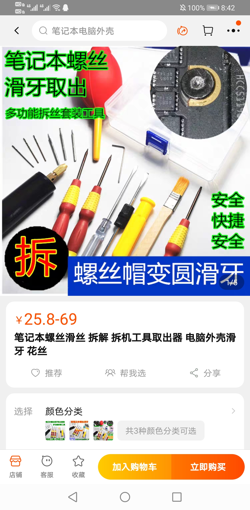
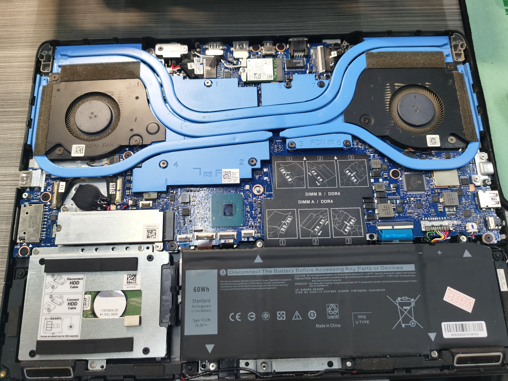
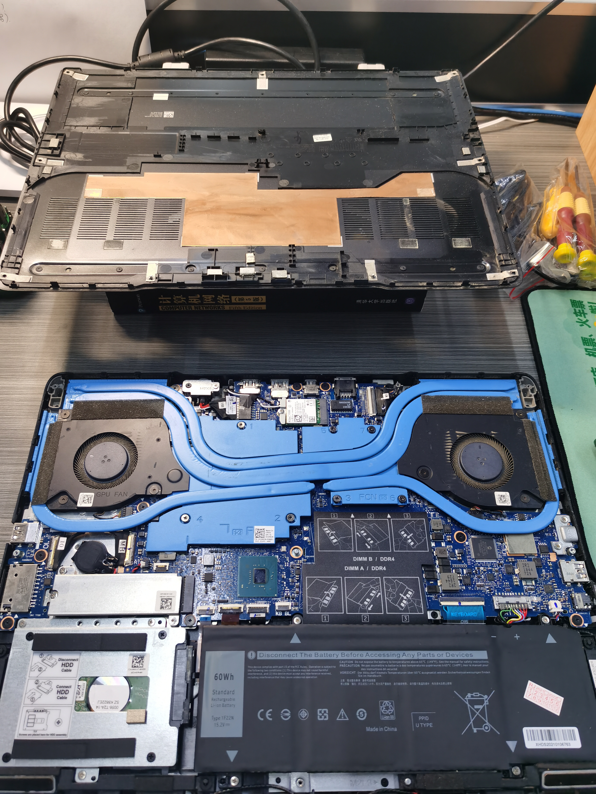
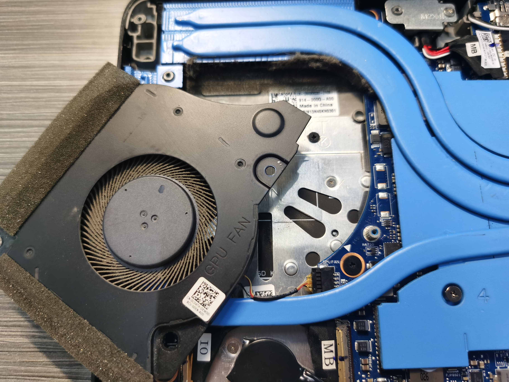
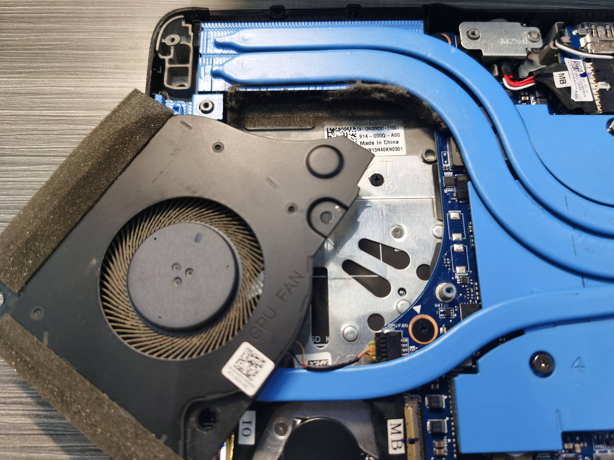
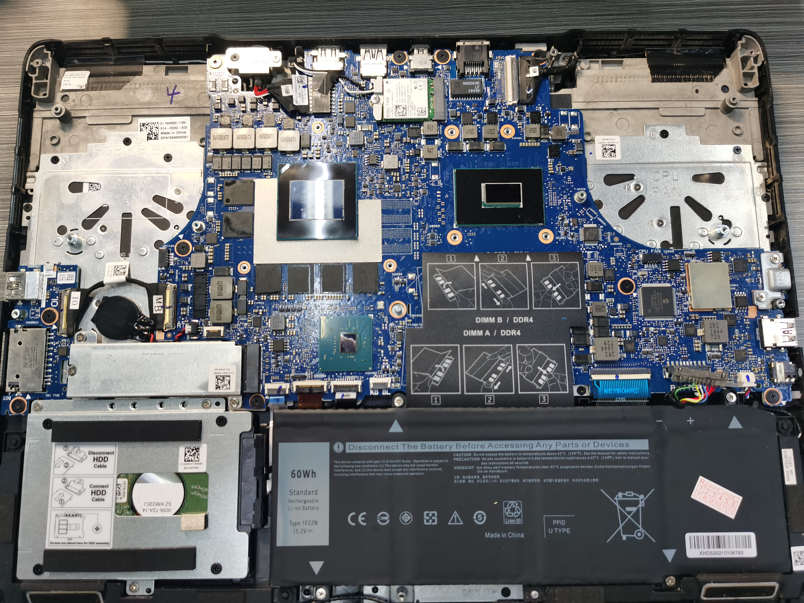
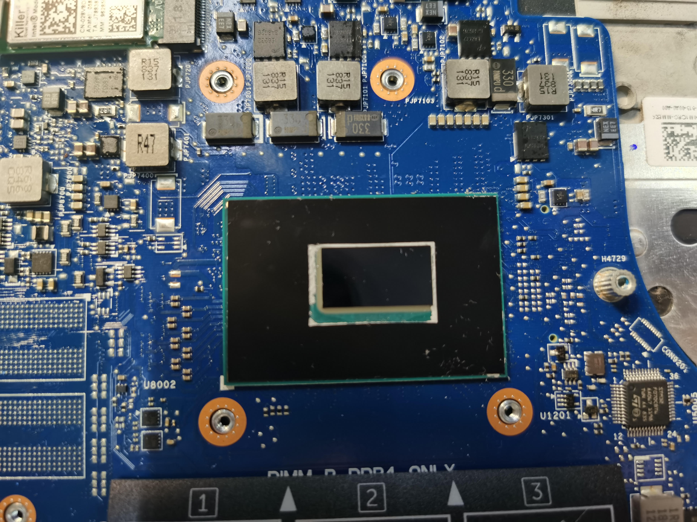
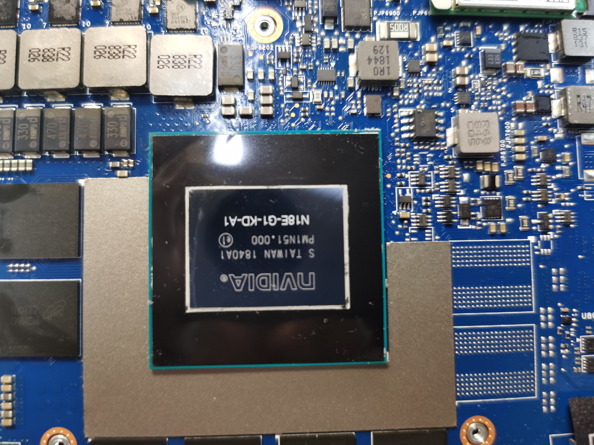
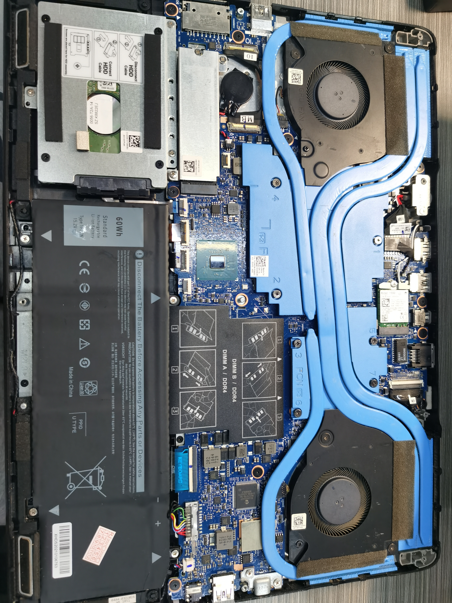
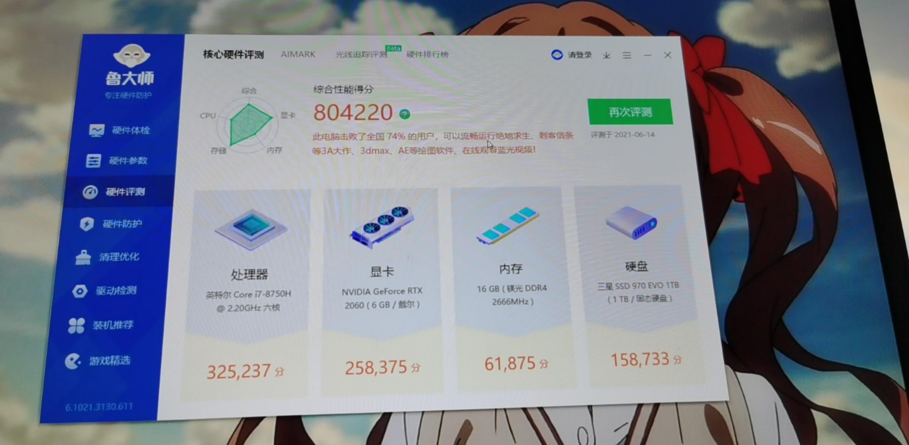

## 嘎嘎嘎

早就想拆机清一下灰，电池也换过一遭了，但是换电池的时候把螺丝拧花了，所以就作罢了。

于是就买了这个东西，电动的一个小工具，有磨芯。但是买回来了也一直放着没有实际去用。

今天正好端午假期，又是期末有点松懈的时候，所以就想着把风扇清灰、换硅脂什么的。

## 拆机日常

打开笔记本，还是很好看的

之前就是这个风扇的螺丝被划了，（小声逼逼：自己的电脑不能给别人修，自己也绝不要修别人的电脑，哈哈哈，不然修坏了搞得自己不开心）

第一次打开风扇，结果看到风扇的风口都已经被厚厚的一层棉絮堵住了（右上面可以看到）。我也不知道为什么会吹进来棉絮？？？

19年的618买的电脑，到现在也才两年时间，就积累下了这么多的灰，太可怕liao

这个风扇的插口也是很不容易拔下来，于是拆了整个铜管找到合适的位置两边撬才撬出来（千万不能用蛮劲！！！）

### 拆风扇

### 拆铜管

把两边的风扇和铜管拆下来，平生第一次拆机看到了GPU和CPU，激动

把之前的硅脂用酒精湿巾擦干净，千万不能带水！！！这可是电气啊啊啊

小心不要被电容挂到纸巾的纸屑，里面的温度挺高，纸屑会被点燃出危险。

擦过的CPU和GPU还是亮闪闪，布灵布灵的

### CPU

### GPU

### 重涂硅脂

硅脂的目的在网上查了一下，主要是为了芯片和铜管之间有间隙，空气导热不良。

于是需要在铜管和芯片之间涂上导热性比较好的材料来填补补充这个缝隙。

GPU之前是涂了X形状的，但是说涂满会好一点，于是就用着送的刷子刷了刷，但是刷不匀就成那个样子了。盖上铜管之后应该会变均匀的。

CPU之后涂得，就老老实实还是涂成了X字形

### 恢复原状

恢复原状，万幸的是还能开机，我还能写下这篇博客。

风扇和以前响的声音不太一样了。其他没啥。不过还是担心了好一阵。

在徐绍勋的忽悠下跑了个分，看着还行哇

