## VS2019安装

### 下载Visual Studio Installer安装包

> https://visualstudio.microsoft.com/zh-hans/downloads/

Visual Studio 现在统一由安装包进行管理，下载之后点击之后，可以选择要安装的内容：

> 社区版足够满足日常需求。专业和企业版的功能更偏向团队合作以及一些专业开发。

### Visual Studio 安装

1. 选择**使用C++的桌面开发**，安装C++基本环境

    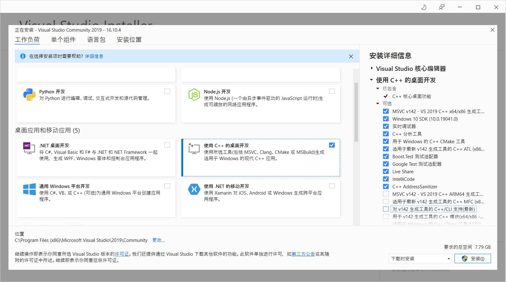

    > 在选择**使用C++的桌面开发**之后，右边框安装的详细信息中便会显示具体的安装内容

2. 在单个组件中，勾选"C++/CLI支持"

    

    勾选之后可能增加的不光是"C++/CLI支持"这一个组件，可能包含了上游组件，比如图中的".NET Framework XXX"，不要去掉勾选，留着就行。
    
3. 选择安装位置

    最好保持默认的C:系统盘的位置不要改变。

    > 因为我的主力语言现在不是C，C:在固态上，容量小，所以尽量把不经常用的东西搞到F:机械盘上。
    >
    > 但是这个在后面就遇到了Windows Kits安装在F:/下，而不是指定的F:/install/下的问题。
    >
    > 所以，后面无奈又卸载了Windows SDK，重新下载安装了SDK进行安装：

    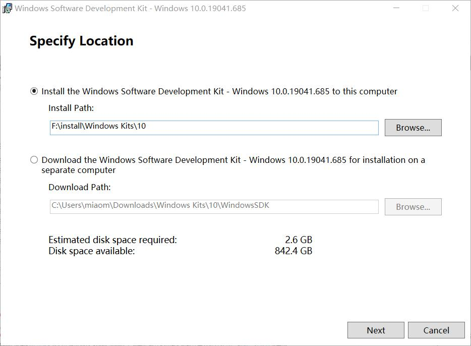

    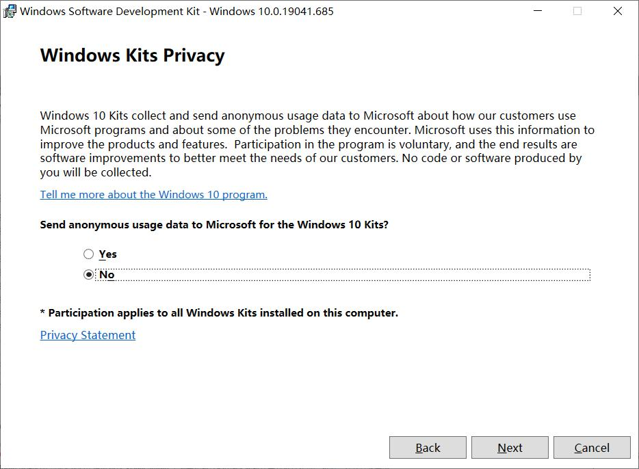

    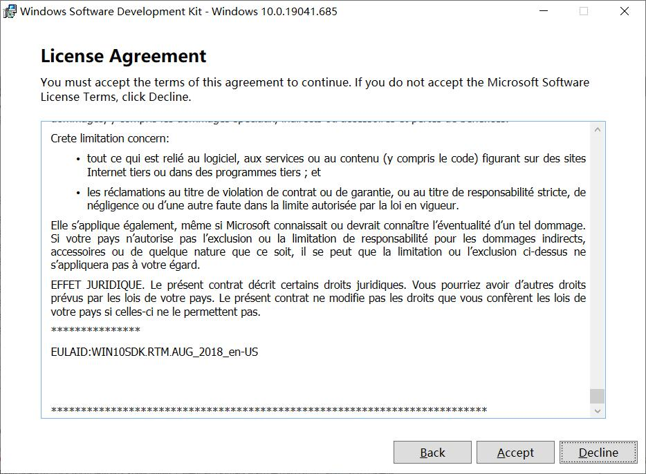

    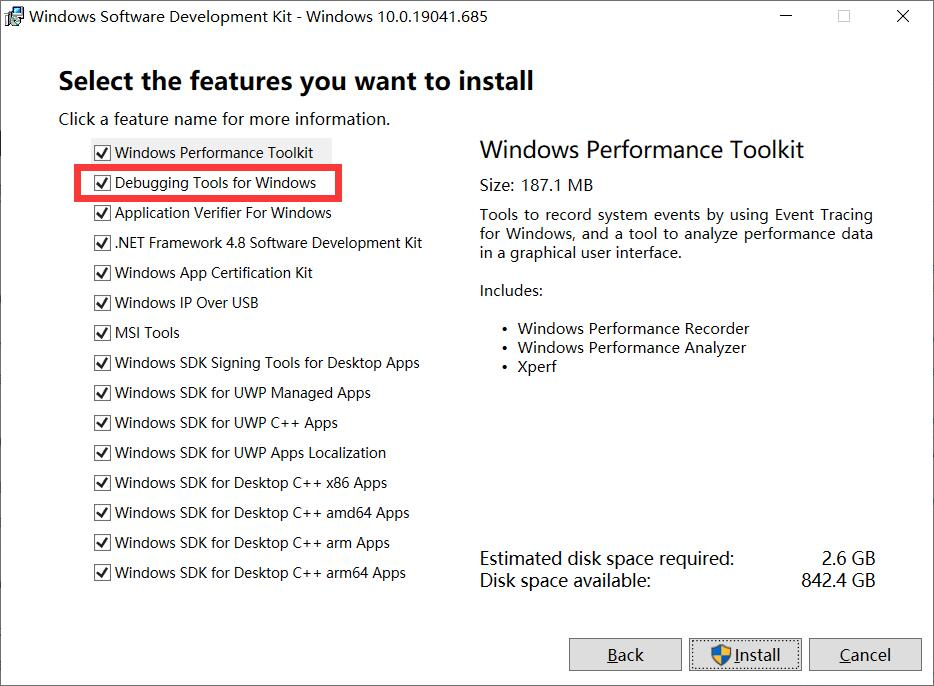

    > **注意**，正常步骤中，SDK安装的选项中不包含 "Debugging Tools for Windows"，所以需要下面的第三步进行更改配置，添加这一必需选项

    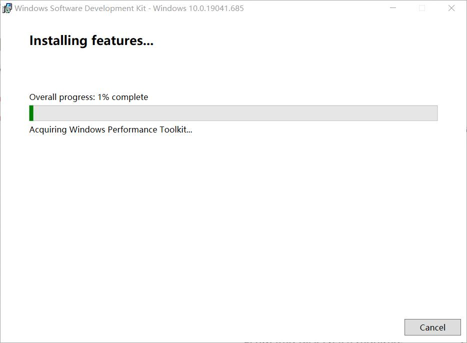

    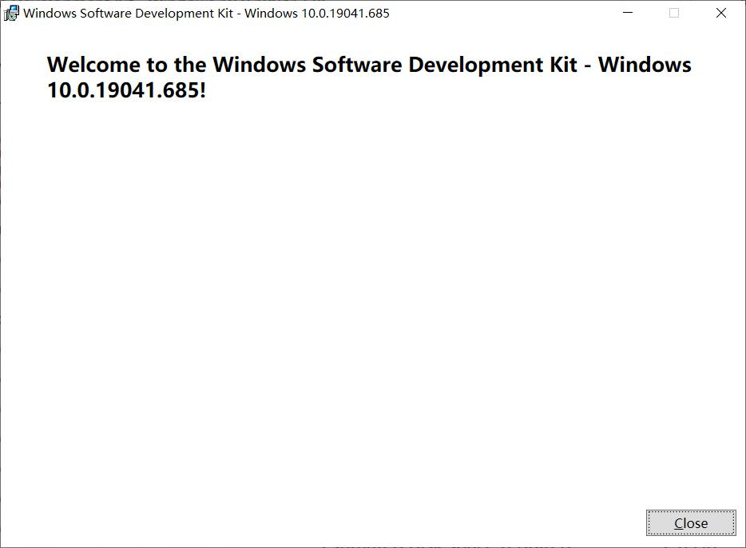

### Windows SDK配置

> 上回书说道，我因为更改了安装位置，所以导致Windows Kits安装位置不对，所以卸载重新安装了一下，在安装过程中配置好了，这里就不需要再添加了。所以这里简单演示一下配置流程，重要是安装上Debugging Tools for Windows.

1. 控制面板中找到Windows Software Development kit

    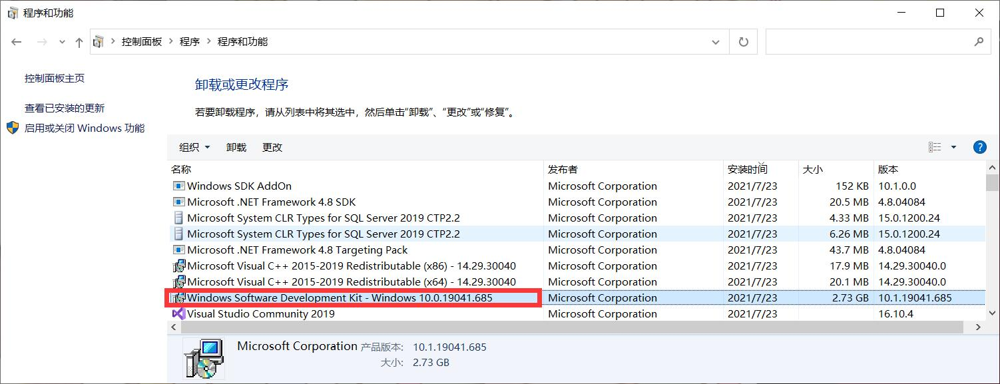

2. 点中SDK右键选择更改

3. 选择更改

    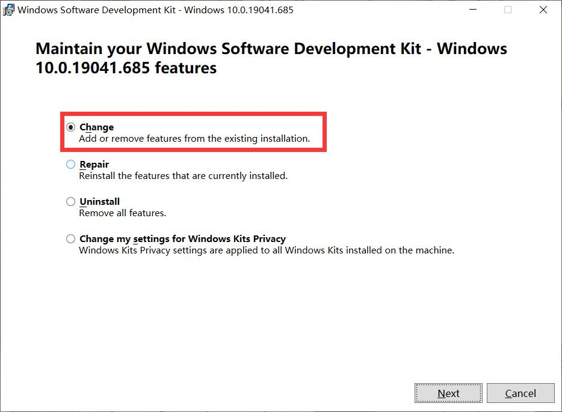

4. 勾选"Debugging Tools for Windows"后点击 "Change"

    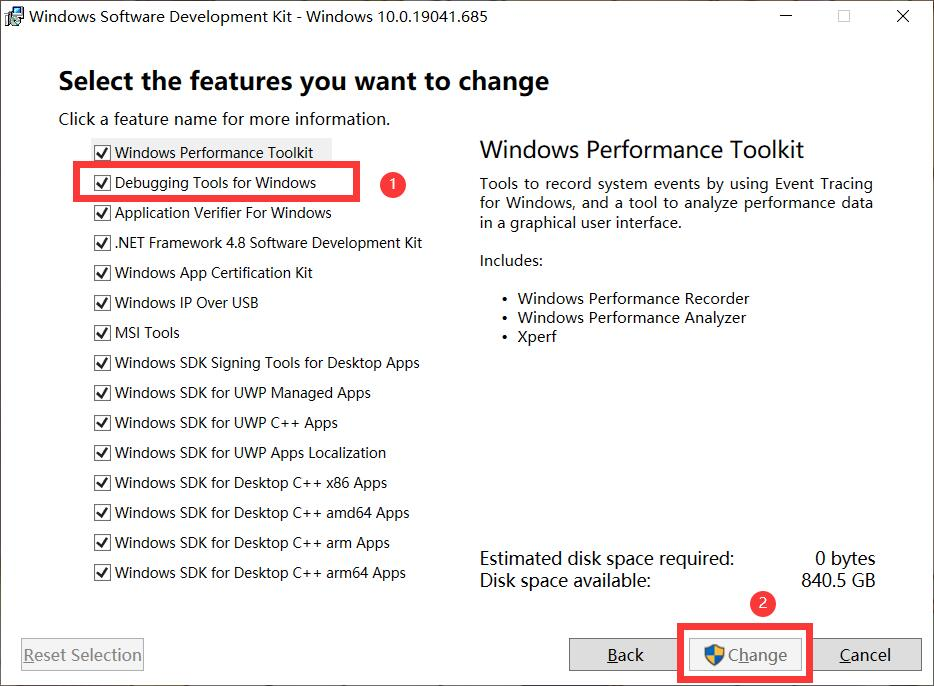

### VS2019 测试

1. 打开VS2019后，点击创建新项目：

    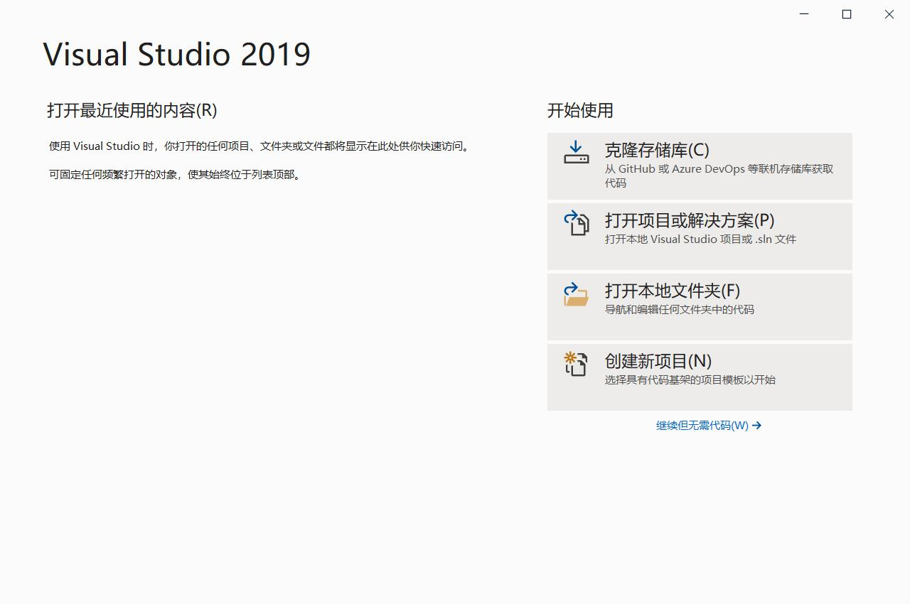

2. 选择"空项目"，下一步

    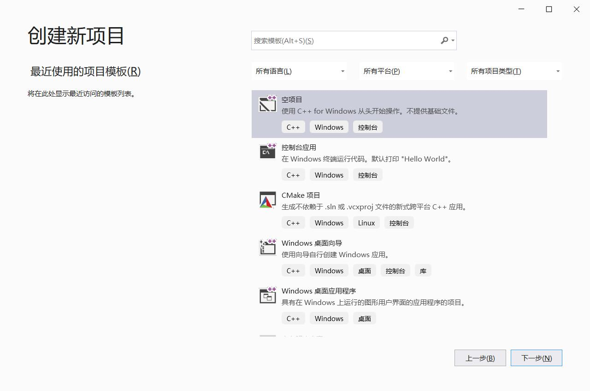

3. 配置新项目，选择项目位置，下一步

    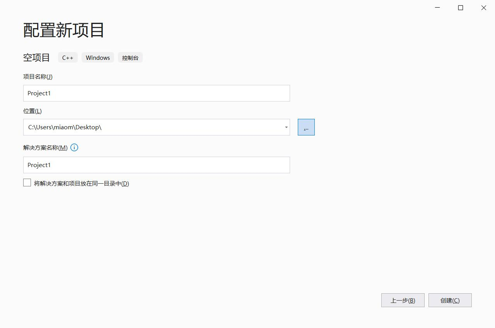

4. "源文件"右键，选择添加→新建项

    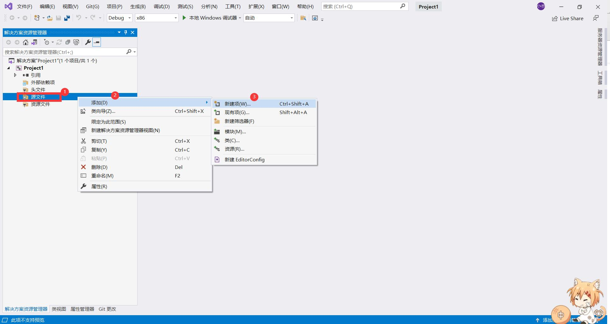

    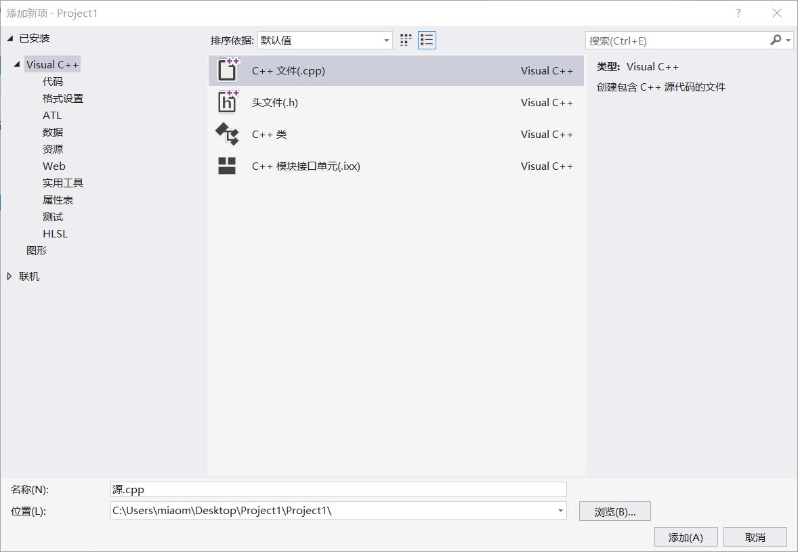

5. 经典Hello一下world

    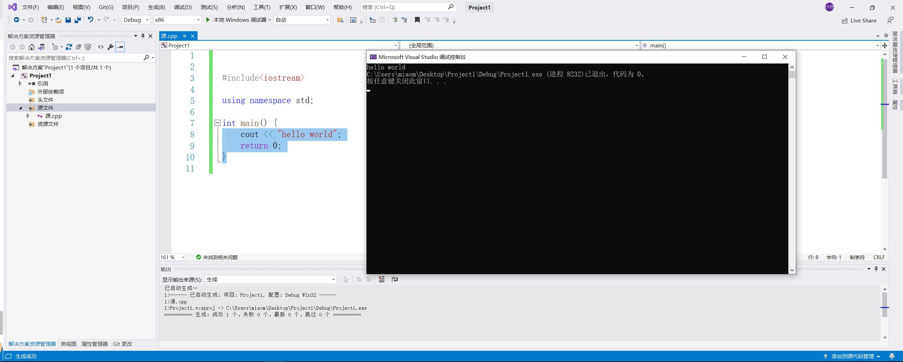