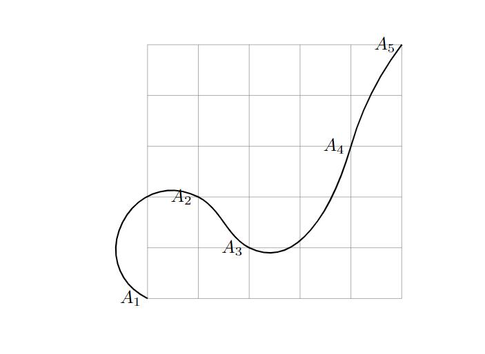
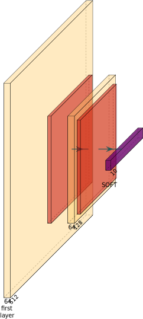

## 常用的tikz作图

- [常用的tikz作图](#常用的tikz作图)
  - [经过多个点的光滑曲线](#经过多个点的光滑曲线)
  - [神经网络](#神经网络)
- [问题](#问题)
  - [node节点中的文字换行](#node节点中的文字换行)

### 经过多个点的光滑曲线

```latex
\documentclass{article}
\usepackage{tikz}

%% 使用tikz库
\usetikzlibrary{through,hobby}

\begin{document}

\begin{tikzpicture}[use Hobby shortcut]
    \draw[help lines] (0,0) grid (5,5);

    %% 定义坐标点
    \coordinate[label=left:$A_1$] (A1) at (0,0);
    \coordinate[label=left:$A_2$] (A2) at (1,2);
    \coordinate[label=left:$A_3$] (A3) at (2,1);
    \coordinate[label=left:$A_4$] (A4) at (4,3);
    \coordinate[label=left:$A_5$] (A5) at (5,5);

    %% 绘制曲线
    \draw[line width=.8pt] (A1) .. (A2) .. (A3) .. (A4) .. (A5);
\end{tikzpicture}

\end{document}
```



### 神经网络

Tikz三方库：
- https://github.com/HarisIqbal88/PlotNeuralNet
- http://www.giantpandacv.com/%E8%B5%84%E6%BA%90%E5%85%B1%E4%BA%AB/%E5%BF%AB%E9%80%9F%E5%AD%A6%E4%B9%A0%E4%BD%BF%E7%94%A8tikz%E7%BB%98%E5%88%B6CNN%E7%A4%BA%E6%84%8F%E5%9B%BE/
- https://tikz.net/neural_networks/

发现一个好玩的东西，在使用PlotNeuralNet的同时开着VScode，将.tex生成的文件作为VScode工作文件夹。
这样在PlotNeuralNet生成.tex的同时，Latex Workshop检测到.tex文件变动，就会自己生成相应的pdf



## 问题

### node节点中的文字换行

加入align=center选项，使用\\进行换行

```latex
\node at(17,1.5,0) [align=center]{interpolated \\ slice};
```