> “有锡争，无锡宁”

流水账式的旅行日记来喽

## 2021.06.12

老早就想着端午的时候要不要出去玩，于是在星期五的时候临时决定出去玩

然后想了想去最终还是辜负了崇明。原本想去看崇明的花博，奈何实在太远

于是就在下了算法课，我们三个人一拍即合就决定去无锡了

不知道为什么，这天晚上没有睡着，可能是激动太久了吧，好久没有和同学一块出去玩。

### 虹桥站

第二天出发时的虹桥站，人潮涌动，和之前的虹桥看不出多大的分别

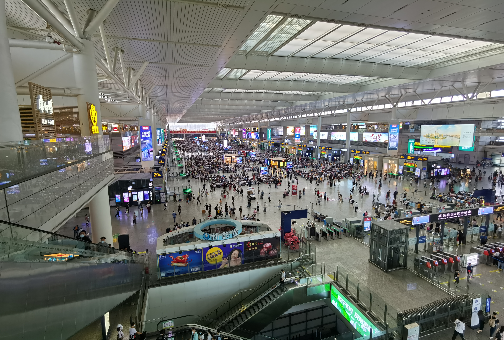

### 无锡站

六点起床集合，七点半的火车，一个小时的车程，八点半就到了无锡。

感叹时代的辉鸿、国家的伟大。只需要几个小时，省级之间来回穿梭。在以前真的是不敢想。

还记得小时候出去旅游，起码要计划在一周以上，去和回分别就起码要占用一天的时间。七天的假期最多五天在外面。

到了无锡，火车站有些破旧，印象一般。相比于苏州，无锡的车站还是差了一点。也是之前和别人聊天，得到了相同的印象。

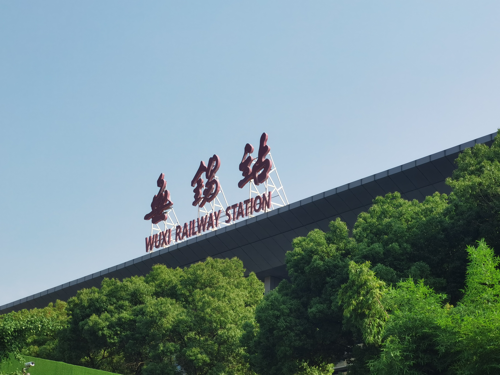

### 惠山古镇

出车站，本来想打车，结果打到了黑车，就下车决定做公交车。

沿着公交车看无锡沿途的风景，感觉可以和太原相媲美（哈哈哈。但是后来和师兄聊，查了一下GDP兼职差得太多了，可能我去的是一个假无锡，没有去无锡新城

支付宝可以使用电子的公交车卡、地铁卡。只是写着的是太湖公交卡，迟疑了好久。

后来发现华为手机的钱包里也可以使用NFC的那种公交卡。上海的红卡公交卡有全国联保的都可以在很多城市里用。

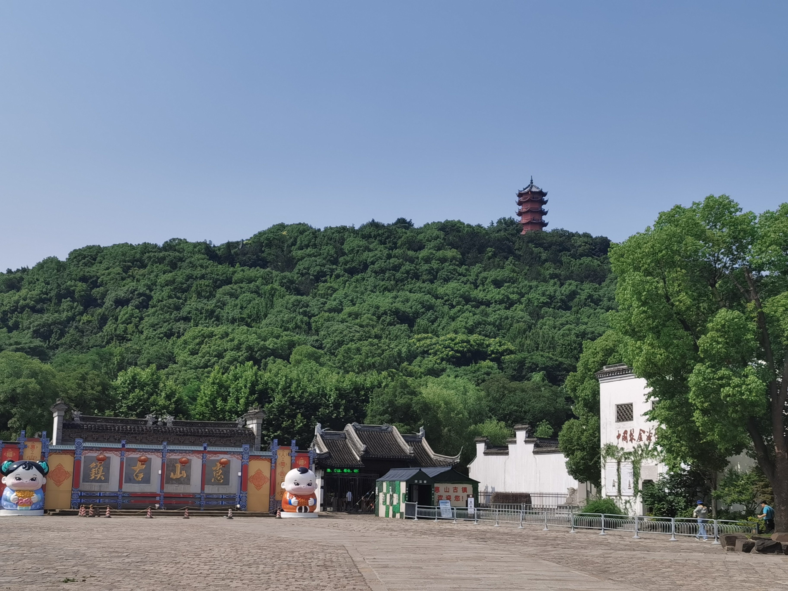

不得不说，无锡的山山水水是真的好，绿影盎然，这一点在后面是印象越来越深。

首先到的是惠山古镇，我们看了地图，无锡车站-惠山-鼋头渚-南长街-旅店，正好是一个圈，于是就定了这样的计划。

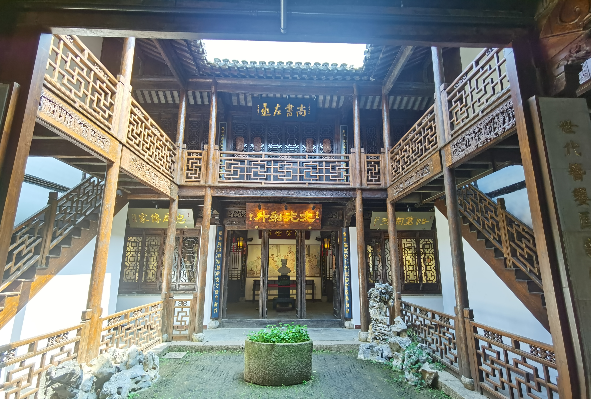

古镇里面有好多留下的建筑，是我印象中的那种江南烟雨楼，山水画中掩映着的黑白房屋。

里面印象深刻的是范仲淹的祠堂（不是图中的）。里面的各种楼屋都特别别致，有格调。

相比于北方的屋子，这里的屋子里面的采光是真的好，特别通透，感觉心胸敞亮。北方的屋子感觉，进去了里面都是黑乎乎的，必须得点灯傲油。

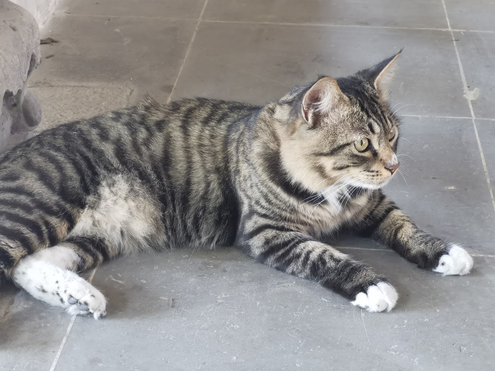

偷拍的门神猫猫

往里走时看到的神奇标语，很难不让人联想。

看到游览图才知道，这里是惠山古镇，但是古镇靠着的大部分是锡山，锡山旁边是惠山。

说是山，但是在北方人眼里就是郁郁葱葱的大土丘，红红火火恍恍惚惚哈哈哈哈。

惠山和锡山之间还有一条索道。山上有天下第二泉，传说阿炳就是在这里写下的二泉映月。

关于无锡的又来，之前是听老郭的说书知道的，今天又加深了印象。

古时候锡特别的珍贵，难以提炼，但是在这里发现了锡山，可以挖掘大量的锡。于是这里成为了兵家必争之地，战火不停。

到了汉朝，这里的锡被挖完了，这里才变得逐渐安宁。于是有了谚语，有锡争，无锡宁，这里正式是无锡。

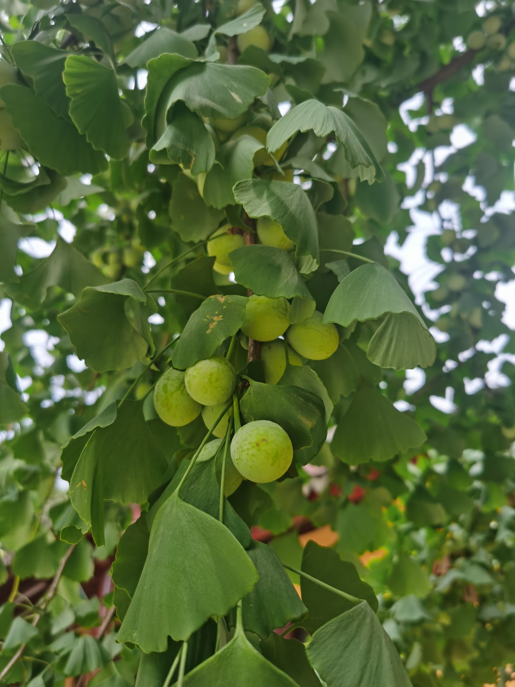

在青年路上待了六年，两边种满了银杏，但是这是我第一次看到银杏果，之前可能也看过，但是我不记得了。

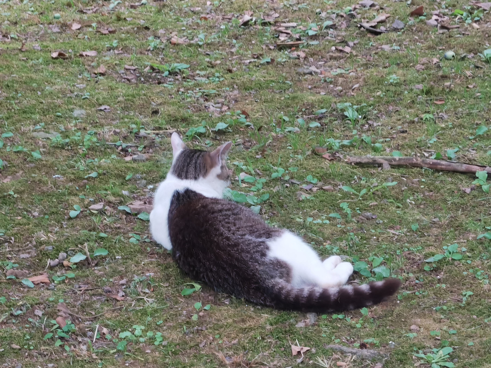

古镇里一处僻静角落里，有一个老大爷在练太极，旁边这只翘屁嫩猫就在旁边静静陪着，我想偷拍结果被拒绝了，只能拍下他的背影，果然得不到的才是最好的。

佛前莲花

### 江南里

我对无锡其实一点了解都没有，除了知道这个地方。邵勋提到无锡就想到了无锡的排骨，但是强哥想到的是无锡的水蜜桃，红红火火恍恍惚惚哈哈哈哈。

中午逛完好大好大的惠山古镇之后，想吃一些无锡特色的，但是找了半天都找到是路边的饭店，感觉不太靠谱，怕被坑，于是毅然决然到了万达。

刚爬到吃的那一层，就看到楼梯口的江南里，觉得应该是无锡当地的，就进去吃。

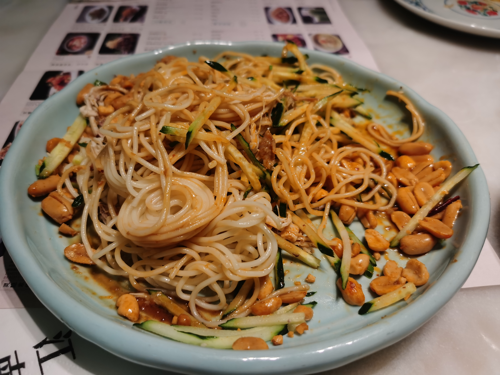
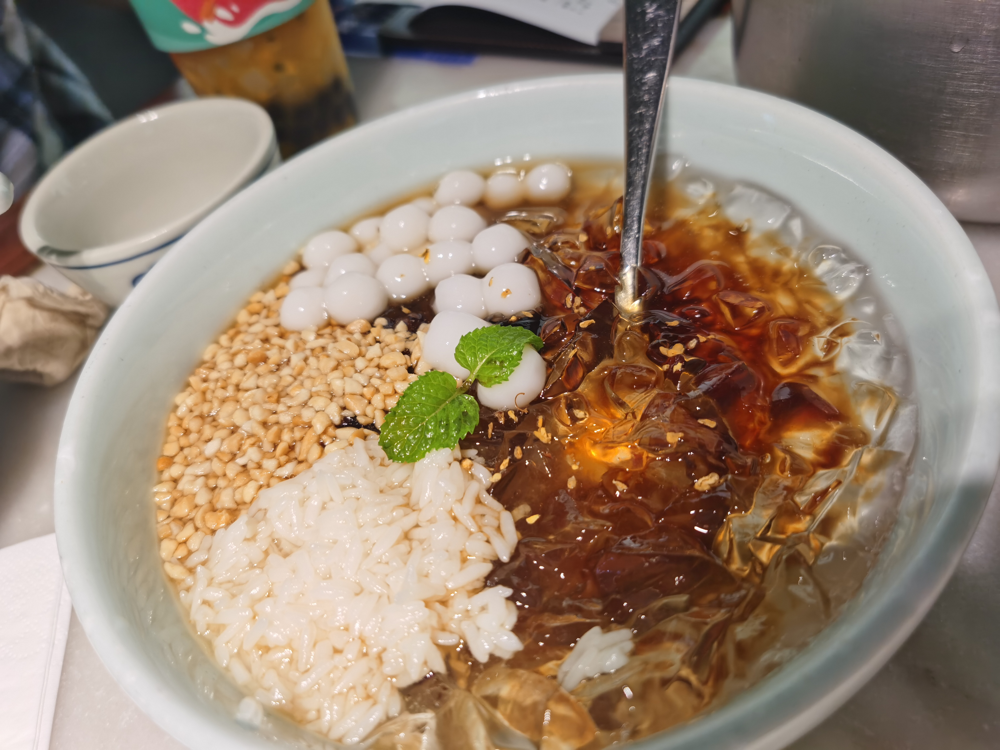
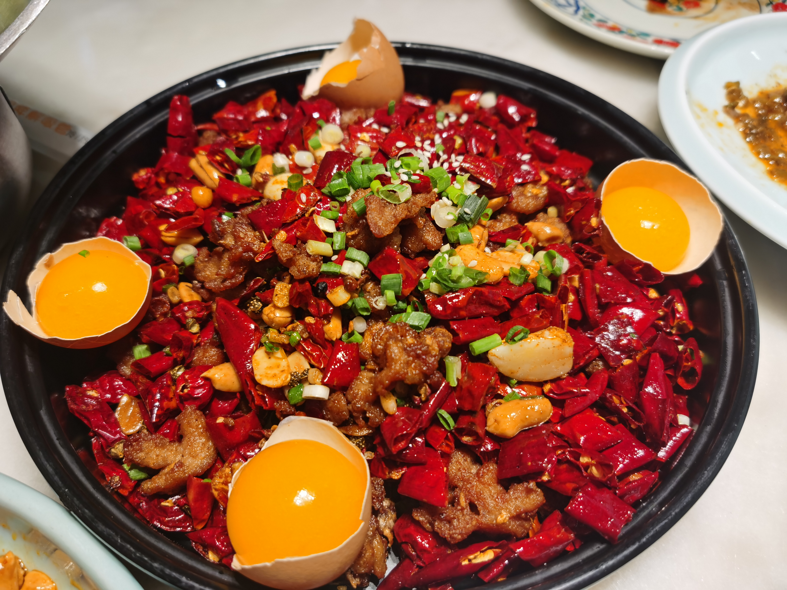
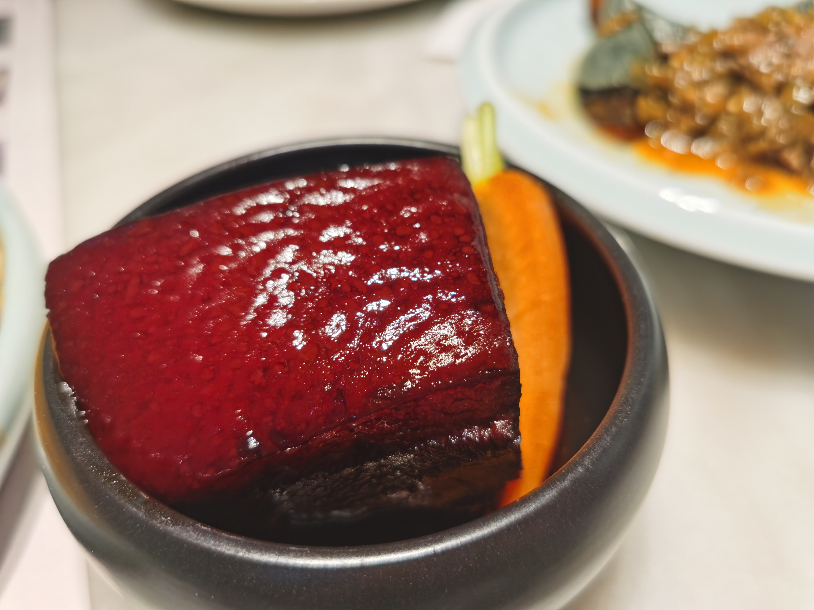

有一说一，味道是真的太漂亮了。起码体会到用心做饭了。

特别想说的是柠檬辣子鸡。鸡蛋壳里面感觉是芒果的雪媚娘那样的。鸡丁的味道特别的正，火候绝了，有脆有嫩！

> 在美团上重新查了一下，叫芒果蛋黄辣子鸡

还有一个是虎皮皮蛋，牛肉片，辣椒丁，虽然是凉菜，但是层次感真的是太棒了。

鸡丝凉面，永远的神，稍微酱汁有一点少。

还有一个忘记拍照了，是糖醋里脊，绝了。外表酥脆，里面紧致。能吃到外面酥脆的感觉，又能平常到肉的那种香甜。

我们三个人，人均差不多80多一点，最后吃不下了，物美价廉。

当时还选了脆皮猪手和脆皮肥肠，之前听过脆皮肥肠，但是没有吃过，又是两个脆皮的，所以最终要了脆皮肥肠，但是大肠有点硬了，稍微咬不动，不建议尝试。

后来才知道上海也有江南里，以后请客知道去哪里了。

### 太湖

下午转战到了太湖，鼋(yuan)头(tou)渚(zhu)，字真的是太难念了

鼋头渚公园真的也很大，买了套票，坐船到了湖心（划掉）小岛

走的着实是很累，岛上供着玉皇大帝，是道教的仙岛，说是蓬莱放到古时候应该也没有问题

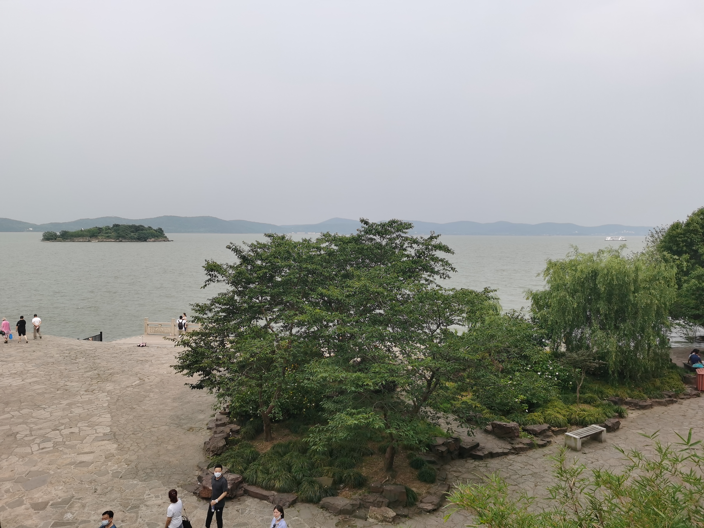

海的那边是敌人，哈哈哈

### 南长街

走了一天的路，有点累了，来到了南长街

突然发现了周董开的奶茶店，就是后面的魔杰的茶，点了一杯柠檬茶，想酸一点，店里面还有莫吉托，配合着周董的歌，但是不知道有没有酒，就没有点，想着酸一点会解乏一些。

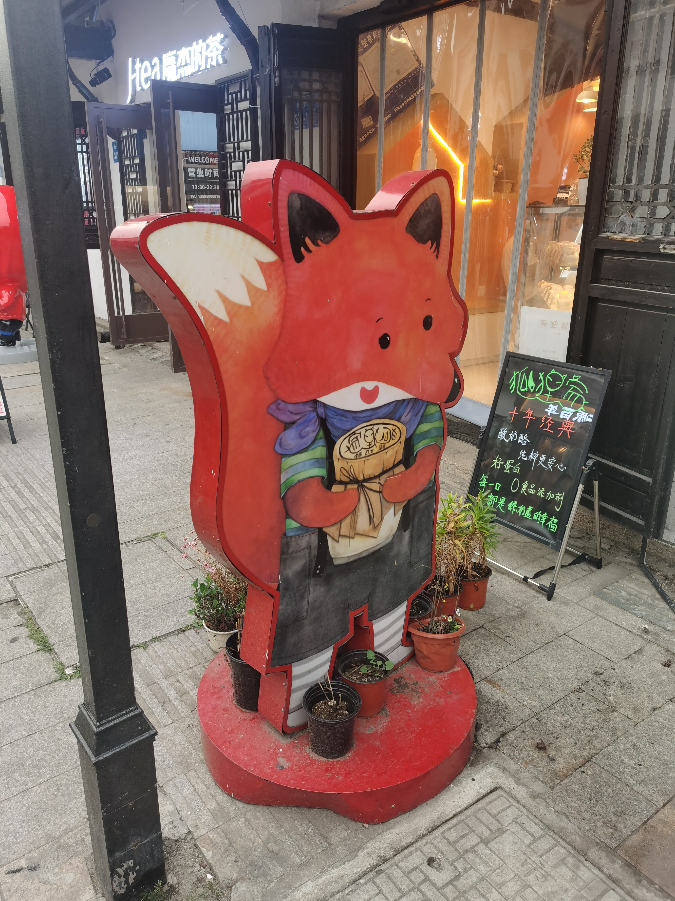

照片里面拍的狐狸家是酸奶店，也是超好喝的，在之前去苏州的时候喝过

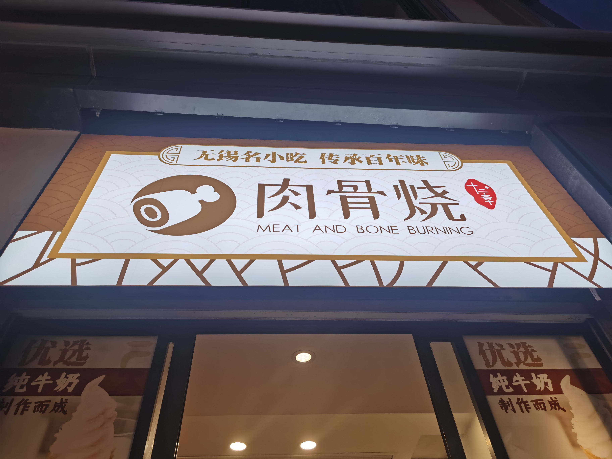

一直被灌输着无锡最著名的排骨，然后邵勋和我说在无锡这就是肉骨烧。

于是就在这家店买了扇骨排，回到酒店是已经有点凉了，不过还是很好吃的。

但是一句话点醒梦中人，这里面的选的一个是新疆孜然，一个是四川麻辣，怎么就成了无锡特产。

后来邵勋才和我说，他是看到一家卖无锡排骨的店上写着肉骨烧，所以就认为肉骨烧就是无锡排骨，哈哈哈

> 疑是排骨肉骨烧

江南烟雨

### 步数

第一天走的步数，嘎嘎嘎

## 2021.06.13

### 南禅寺

> 南朝四百八十寺

不得不说，无锡真的是风水宝地，到处都是寺庙，香火旺盛，信众很多。

早上起来先到了南禅寺旁边的早餐店吃了馄饨和包子。顶着簌簌小雨来到了寺庙中，做客佛门。

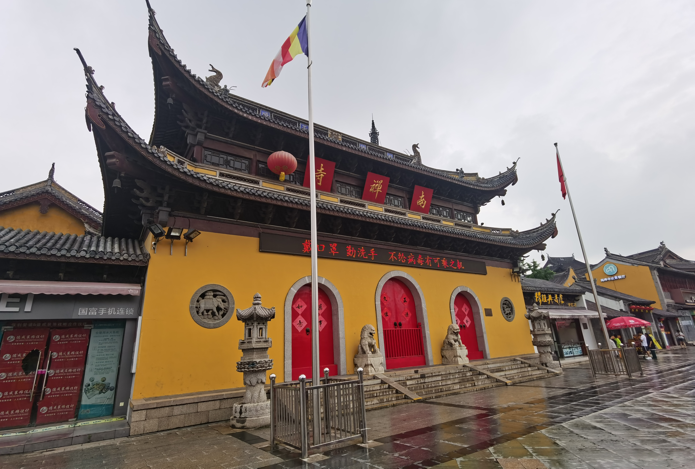

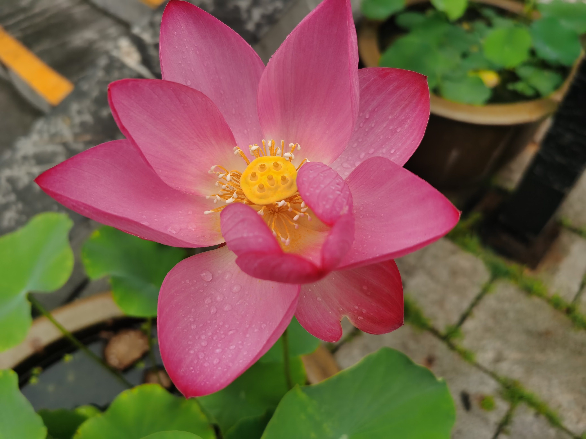

佛前莲花

### 灵山胜境

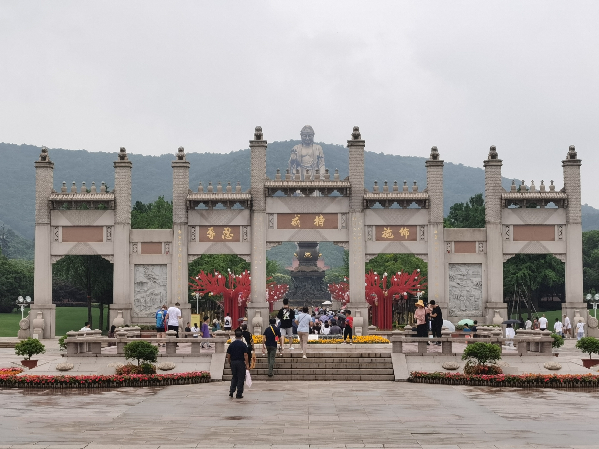

做公交和地铁，大概两小时左右到了灵山胜境。

传说玄奘取经回来之后，来到这里觉得和西天灵山很像，于是就把这里称作小灵山。

5A级景区，建设的非常的好。不过不是古迹，是现代人新建的，即使这样也很壮观，里面很多使用现代科技复现神迹，看了非常的壮观。

在佛前看到了一只灵龟，一直远远遥望着五印坛城，不一会儿，灵龟转了方向，凝视着远处的大佛。

在瞻仰大佛的时候，感觉大佛在冲我微笑。

### 回

从灵山出来以后，坐着公交回到了市里，坐着座位，感觉要比来的时候快了很多

（来的时候公交车上还碰到了一个长得很好看的小姐姐，嘻嘻嘻）

坐上地铁，买了火车票，紧急凑凑的，刚到火车站买完水就开始检票上车了，无锡之旅正式结束。

非常充实，精彩的旅行。可能也是太久没有和同学一起出来了，或者是憋了一个学期，需要放松，抛掉了所有的烦恼，当回来的时候，可以直面现在的境遇。