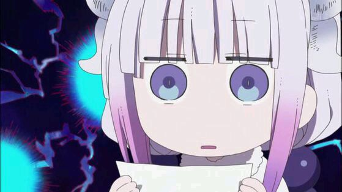

# 梦之海

- [梦之海](#%e6%a2%a6%e4%b9%8b%e6%b5%b7)
    - [梦之海](#%e6%a2%a6%e4%b9%8b%e6%b5%b7-1)
    - [西洋](#%e8%a5%bf%e6%b4%8b)
    - [诗云](#%e8%af%97%e4%ba%91)
    - [光荣与梦想](#%e5%85%89%e8%8d%a3%e4%b8%8e%e6%a2%a6%e6%83%b3)
    - [地球大炮](#%e5%9c%b0%e7%90%83%e5%a4%a7%e7%82%ae)
    - [人生](#%e4%ba%ba%e7%94%9f)
    - [思想者](#%e6%80%9d%e6%83%b3%e8%80%85)
    - [圆圆的肥皂泡](#%e5%9c%86%e5%9c%86%e7%9a%84%e8%82%a5%e7%9a%82%e6%b3%a1)
    - [镜子](#%e9%95%9c%e5%ad%90)
    - [赡养上帝](#%e8%b5%a1%e5%85%bb%e4%b8%8a%e5%b8%9d)
    - [赡养人类](#%e8%b5%a1%e5%85%bb%e4%ba%ba%e7%b1%bb)
    - [欢乐颂](#%e6%ac%a2%e4%b9%90%e9%a2%82)
    - [山](#%e5%b1%b1)
    - [太原之恋](#%e5%a4%aa%e5%8e%9f%e4%b9%8b%e6%81%8b)
    - [2018年4月1日](#2018%e5%b9%b44%e6%9c%881%e6%97%a5)
    - [时间移民](#%e6%97%b6%e9%97%b4%e7%a7%bb%e6%b0%91)
    - [烧火工](#%e7%83%a7%e7%81%ab%e5%b7%a5)
    - [圆](#%e5%9c%86)

### 梦之海
山东举办冰雪艺术节，这是一个外星人来到，同艺术家们交流，自称为冰雪艺术家，之后说要雕刻一座特别美丽的艺术品于是他把地球上几乎所有的水都抽干，在环地球轨道上建立了一幅巨大的冰雕，壮丽。但是由此而来，地球陷入了漫长的枯水期。外星人走了之后，人类想尽办法，终于把环地球轨道的冰块摘了下来

——以上摘自<a href="./蝴蝶.txt">《蝴蝶》</a>我的书评

### 西洋

一切都要从郑和下西洋开始，郑和游历到索马里时，没有下令返航，而是继续航行，验证天圆地方的概念，于是...郑和来到了欧洲，并且征服了欧洲。

到了现在，北爱尔兰在一百年的协定期限后，脱离了中国独立了[其实就是香港回归的翻版]。之后主角的儿子很是愤怒。而后主角奉命在新大陆的联合国任职。儿子是一个极端的民族主义者，宣扬着百年前中国的强大[即使在书里的世界观里，现代的中国也可以说是日不落帝国]。而后一个欧洲移民的小女孩引起了主角的主意，他是一个画家，来中国新大陆求学，虽然学的是中国话，但是他还是想复兴本土画，而后与儿子呆的时间太长，作者想和这个女孩多呆一会儿，并且为他儿子对这位女孩的粗鲁行为道歉。而后...主角就想到了回家。

>大刘对历史下手了,hhh。怎么说呢，感觉在故事情节上处理的并不是很好，中间有很多值得商榷的地方，而且故事情节推进的感觉还是很凌乱的，摸不清头脑。
>但是有几点还是值得去探究一下的，就是这篇短篇里的几个问题：个人力量真的可以改变历史吗？历史真的有他的必然性吗？几个比较宏观的问题，比如：拿破仑的出现是历史必然的吗？如果拿破仑没有出现，那么会出现拿好伦吗？如果当时拿破仑没有出现，法国会在大革命中进步吗？和书中讲到的差不多，如果当时郑和没有下令返航，而是继续航行，那么世界史会改变吗？基于这个点进行探究还是比较有意思的，但是就是大刘在这方面处理的太凌乱了，差评。

### 诗云

故事和吞食者是连着的。吞食者驾驶着戴森球准备飞离太阳系，但是遇上了作为能量体的神级文明，于是吞食者的使者大牙又出现了，开始百般的讨好，将人类这种低等生物进献给神。虽然人类在吞食者中大部分作为牲畜进行饲养，但是为了人类的肉质，有诗人这一职业，教人们念诗。于是这个诗人伊衣就被进献给了神。他说诗歌很伟大，神不行，于是自己给自己起了个名字叫李白，但是造不出来像以前的那种诗词。于是神想出了一个办法，暴力搜索，将所有的诗词存起来，但是存储这么大量的信息可能需要整个太阳系的质量，顺带连吞食者他们也灭了[在这过程中，吞食者向神级文明进行挑战，但是被秒杀]。量子计算器启动了作诗软件，存储了所有的诗歌，最后小恐龙和小人类们幸福的生活在了一起。

>中国传统文化和科幻结合一直是我比较期许的一个方向，虽说诗云确实写的还可以，但是总感觉怪怪的...首先，文化的差异是存在于每一个个体的，一千个读者有一千个哈姆雷特，所以神造不出来诗词是可以理解的，但是神级文明应该早就有这种觉悟了，为什么非要像炫耀一样，储存所有诗歌，那碰见另一种文明的什么心灵上的balabala，他还继续大费周章的去做这件事？？？而且，我觉得每个文明都会有像诗歌这种心灵上的东西，更何况是神级文明。

### 光荣与梦想

西亚战乱不断，民不聊生，而美国则是主要的发动者。奥运会又要开了，于是联合国倡导下，一项名为和平视窗的计划进行了开展：只要西亚代表队的积分战胜了美国，美国就退出西亚，而如果西亚输了， 则需要接受相应的条款，割地赔款。辛妮曾经是马拉松队员，但现在只能以拾荒为生，而作为前体操世界冠军的莱利则成为了美国人的应召女郎，萨利是射击冠军。于是北京奥运会上，莱利为了人生的最后一刻做出来超人无法理喻的难度，直至摔落的那一刻，而萨利则是要求西亚政府支付他一笔客观的费用，而最后他并没有得到那笔钱所以放弃了参加比赛。最后出场的辛妮，已经知道西亚在这场奥运会中必败，但是他拼出了全力一直在领先当前的马拉松世界冠军，紧咬不放，终于跑到了头，带着她的光荣与梦想。最终，西亚输了，但是辛妮的精神点燃了西亚的圣火，大街小巷，风声鹤唳草木皆兵……

>典型的大刘，浓郁的爱国情怀

### 地球大炮

主角沈华北患了绝症，于是冷冻到未来。当他来到未来时，却发现他的儿子沈渊成了人人喊打的罪人。因为他的儿子用它的权利和能力将地球打通了，愤怒的人们把沈华北扔进他儿子的那个地球大洞中，因为这个大洞，南极的臭氧层被破坏，南极最后一片净土成为垃圾场，地球一片污浊……就在沈华北进行再一次的徘徊时，被救了出来。于是他继续进行了冷冻，穿越到未来，这一次他看见他儿子设计的大洞被作为地球到太空的利器，其中过了地心之后，还会一直加速，于是人们可以轻松来到太空，进行太空移民。

>把地球打穿这个想法其实一直有，但是大刘用这种还算比较科学的解释阐释了出来，算是圆了一个愿，但是其中的BUG就不指出来了。但是将这个洞作为太空电梯确实是大胆。

### 人生

一个科学家发明了一项技术，可以将幼儿导入人的所有记忆，已达到人类生命的延续，但是作为婴儿，因为已经有了对世界的认识，觉得还是子宫好，于是在出世之前，用脐带自缢而死。

### 思想者

两个人意外发现了宇宙间恒星的一次闪烁，并且开始预测，于是等了10年，再一次相遇，又观测到了，又等了20年。一个是医生，一个是天文学家，展开了联想，加入宇宙是一个人的大脑，而闪烁其实是每个神经元之间的激动呢？

>唯美，绚丽，但是前面处理的不好，把宇宙那种时间和空间的广袤描述出来了，但是缺少一些宇宙宏观的感觉，但是已经很不错了

### 圆圆的肥皂泡

圆圆的父母相应国家的号召来到大西北工作，成为国家建设的狂热响应者。而他们的工作是在大西北种植树木，通过冰弹将树种埋在沙地里，春天一到，冰水融化，里面的树苗就可以发芽生长了，使得普通的树苗的成活率提高了一倍，但是他的妈妈却在一次播种冰弹的过程中由于飞机失事而殒命。圆圆自小喜欢吹泡泡，疯狂的迷恋上了吹泡泡，而从小到大圆圆都是全班最优秀的，到了中学，班主任向圆圆的父亲反映圆圆还在吹泡泡，父亲觉得女儿这么大还这么轻浮，但是老师却觉得这个孩子思想性格洒脱一些也未尝不可，显然父亲并不认同老师的观点。而到了高考结束，圆圆考了全省第三，作为奖励，圆圆向父亲要了许多洗衣液和化学药剂什么的，请来了电视台，吹了一个巨大的泡泡，拿到了吉尼斯世界纪录。而他的父亲成了这座西北城市的最后一任市长，因为中央已经决定将撤销这座开荒者的城市。圆圆一路高歌猛进，读完了博士后，通过纳米技术创立公司取得了非凡的成就。但是女儿有钱以后，却花手头仅有的一个亿研究泡泡，因为要吹一个大大的泡泡，而父亲想让女儿把这一个亿用在他和妻子心心念念的城市的念头也就打消了。当父亲过生日这一天，圆圆给他的父亲送来了一个礼物就是那个史无前例的巨大的泡泡，整个泡泡将整个城市包裹了起来，由于风力太小，泡泡没有被吹跑，整个城市的环境开始变得污浊。而后有时圆圆嘻嘻哈哈的出了一个计策，引了一条火沟将泡泡烧掉了。这个时候的父亲突然灵机一动，想到可以用女儿研发的巨大的泡泡将海水搬运到这寸草不生的大西北，于是，这座城市重生了！

>超喜欢这篇哒！！！
>凭借我的想象力，我真的难以想象通过一个小小的泡泡可以写科幻，而且可以写的这么精彩。其实这篇小说里，科幻只不过是一个描述的工具，内核是相当的硬的，才能使得故事组织的如此的精彩。特别是父亲和女儿的对比，有强烈的时代的气息，不能说谁是对的，也不能说谁是错的，父亲和母亲像那个时代上山下乡的人们一样响应国家号召去抛洒自己的青春，但是相同意义上，难道圆圆不是在勇敢的追求自己的人生么？《球状闪电》里大刘有一句话虽然说得没有那么经典，但是很有意思，大意就是不管你的人生怎么活着，你总该有一个明确的目标，不管这个目标是好是坏，冲着这个目标活完此生。所以，在这个意义上，其实圆圆和他的父母都是一样的，他们都是有他们的精神内核的，他们丝毫不空虚，但是很显然，大刘应该在文章里加一个反面的教材，可能那样的这层意义就可以更加突出，但那样的话文章可能显得有些凌乱。
>而且大刘其实对那批建设者们也是充满了崇拜羡慕的感情吧，包括最后的结局真的是惊艳到我了，通过泡泡做的泡泡长城，如果真的在现实生活中出现那该是怎样的绚丽壮观，晴朗的夜空，巨大的泡泡飞临山顶上空，仿佛将宇宙都扭曲，遥远星辰散发的一点点星光成为一道道闪光穿越时光的隧道，在泡泡的映射下来到地球，太浪漫了。

### 镜子

刑警们追查犯人白冰，但是永远也追查不到，好像犯人似乎永远可以提前知道他们的动向似得。而同一时间，白冰来到看守所看望一个犯人宋诚。宋诚是纪检委官员，但是因为检举首长的贪污行为，而被制造罪名成为了犯人，这个时候，白冰也叫来了首长以及一直抓捕他的吕文明。白冰向他们解释为什么他们一直抓不到他们，因为这个时代的量子计算机已经十分的发达，计算能力已经达到了可以创造宇宙的地步，而物理学也有了十分前卫的突破，宇宙大爆炸理论的模型已经成熟。所以白冰作为软件工程师，创造了创世软件，通过调整宇宙大爆炸的参数，真正的创造了我们现在的这个世界，所以他可以知道当前时间点以前的所有事情，包括宋诚被诬陷的事情。一切真相大白，于是首长手下的吕文明和一直抓捕白冰的公安局局长陈继明相继自杀，而首长则是在写了一封完整的事情坦白书，在最后一天兢兢业业的工作，交代了贪腐败露之后如何稳定政局，包括后继的人选，完全的一心一意的为人民服务，包括封查了自己家族涉嫌贪腐的企业……看了看小时候的自己的店样子，之后对宋诚说：把他的软件上交国家后，让他交出所有的备份，之后需要杀了他。宋诚明白了其中深意，于是找白冰想要杀掉他，但是白冰说一切都晚了，他通过递归可以看到遥远的未来了，未来显示，在现在地球的另一端，一位博士也将创世软件研制成功了，而剩下的调参几乎是推手可得，将来的人类几乎暴露在了真空中，没有了罪恶，没有了人性，人类的创造力消失了，人类就灭亡了。

>关于创世软件的想法是一个比较普通的想法，但是可以和现实的官场联系起来真的很不一般，而且感觉确实是山西的现状。而其中的宇宙观，宇宙注定论是一种很普遍的理论，认为时间线是唯一的，从宇宙开始到结束，所有的过程从宇宙一开始就是确定的；同样的，还有一中宇宙理论是宇宙的选择理论，认为宇宙的时间线是由无数种可能的时间片构成的，所有在这一时间片上的因素导致下一时间片的选择，所以这个宇宙是充满随机与不确定性的。很显然在这篇故事里，是第一种宇宙观，但是也有很多科幻电影选择第二种。但是可能不可能宇宙是这两种宇宙的结合呢？

### 赡养上帝

地球来了一批外星人，他们自称为上帝，他们说他们的文明已经步入老年，他们的个体完全依靠于。之前的先辈留给他们的智能来照顾。因此想到地球来度过晚年，并将技术作为回报提供给人类。初期，每家都分配到一个上帝来赡养，大家其乐融融，之后人类渐渐嫌弃这个外来者，不愿意招待他们。而对于他们的技术，人类以目前的技术水平更是没有办法理解，而上帝们此时也不愿再呆在了地球上，准备继续星球之间的流浪。临走之前，他告诉地球人，为了安度晚年，他们在其他几颗星球上，像地球一样栽培了生命，但那几个文明文明程度很高但却生性好战，并且已经发现地球了，让地球人小心迎战。

——以上摘自<a href="./蝴蝶.txt">《蝴蝶》</a>我的书评

### 赡养人类

上一篇的后续。一艘飞船来到地球，说明来意是占领，但可以提供一片生存空间给人类。因为在他们的星球上，出现了及其不均的贫富差异，整个星球的资源被一人所拥有，甚至空气与水源。别的人不得已逃难到地球，并且向地球人承诺，提供目前地球人的最低生活标准。于是世界各地开始了分摊财富的行动。而主人公从小作为一名杀手，这次被委托工作，解决那些不想拿钱的穷人，但是一路上他在冷酷的同时，也看到了自己的一点醒悟。

——以上摘自<a href="./蝴蝶.txt">《蝴蝶》</a>我的书评

### 欢乐颂
人类元首们在最后一次开联合国大会，联合国就要解散了，于是人们准备举办一场隆重的葬礼为最后的联合国送葬。而在联合国音乐会上，人们唱着阴郁的歌曲，但是这个时候，中国元首发现奇怪的现象，渐渐人们发现，原来是一面巨大的镜子到临地球，将地球的倒影反射了回去，而在空间站上的宇航员确认了镜子的存在，这时发现这面巨大的镜子是外星文明，纯能化的高级文明。他自称为宇宙音乐家，到各地弹唱音乐，于是用几光年之外的中子星爆发当做节拍器，通过太阳进行宇宙歌曲的弹奏，而弹奏的时候，人们看到高级文明自诩在宇宙中也不过是沧海一粟，所以认识到了人类在宇宙中比喻为沙粒其实还是有些过分。所以决定将联合国继续维持下去，并且中间还让神用太阳弹奏了一曲欢乐颂，通过太阳的辐射传播到世界各地。

>只能说大刘超喜欢镜子...但是欢乐颂是欧盟会歌，为什么强加到联合国上？？？hhh宇宙中也还有一丝温存

### 山

这个男人冯帆，从小远离大山，所以对大山有着不可捉摸的迷恋之情，大学选择了地质专业。但是在大学登山社的一次活动中，他们遭遇到了猛烈的暴风雪，冯帆选择了隔断登山索，让自己活下去，而其他四名队友中还有他的女朋友，但是从此他背上了道德的枷锁。但是他的导师说，你不可以就这样死去，如果你想赎罪，就一辈子远离大山。所以他听从导师的话，从此漂泊在海上做地质调查。但是有一天呢，外星人来了，因为巨大的引力将海隆起，形成一个巨大的海山。于是冯帆与船长一行人告别，登上这个海山。登上海山之后，冯帆与外星人交流。他们来自地底，由岩石构成身体，但是他们不知道自己是来自地底，并且不知道万有引力的概念，经历千辛万苦之后，他们才终于冲破地表，第一次看到了行星。于是他们又开始了新的征程，谁能说宇宙是不是有岩石之中的世界呢？人生的大山始终在那里，冯帆又将继续攀登……

>有点感觉《海上钢琴师》的感觉，虽然并没有看过海上钢琴师。而且大刘笔下的主角都有点不太正常。但是中间描述外星人的那段实在是很精彩，我有点怠惰了hhh

### 太原之恋

计算机诅咒，原先是为了报复伤害一个女生的男友而制造的，但是后来这个计算机病毒被放到网上，人们肆意的更新他。比如，当他在做饭时，由于智能化，可以操控他家的煤气泄漏从而制造爆炸杀死他，或者制造感冒，并从要药厂开始让他吃错药，或是操控自动驾驶撞悬崖……这个时候刘慈欣来了，还有他的朋友大角。他俩喝醉酒了，于是重新修改了这个病毒，但是最后喝多了，将通配符定位了中国.山西省.太原市.*，也就是要把整个城市的人杀死，用各种方法……但是最后，人们发现诅咒5.0诞生了，其中的通配符是 * . * . *  . *

### 2018年4月1日

“我”在一家IT公司工作，基延技术的诞生使得人类可以通过基因改造的方式延长寿命至300岁，但是基延的费用十分昂贵，只有少数人可以消费的起。同时还有一个神奇的组织叫做IT共和国，虚拟国际中的一个超级大国，但是他们准备在现实世界获得同等地位。

而主角为了和心爱的女友地老天荒，准备金融犯罪，利用自己的职务便利将公司的500万新人民币作为己用，让自己成为基延人，虽然会受到所有人的鄙视和没收所有的财产，但是“我”已经是一个基延人了。

但是这个时候突发新闻，在联合国否认IT共和国的地位时，IT共和国向实体共和国宣战，开始对世界金融系统进行攻击，也就是世界马上要均贫富了。“不要说我们一无所有，我们要把世界格式化。”但是这个时候，“我”还没有把钱转到自己的账户汇给基延中心。我心中慌得一批，但是这时候才发现这是同事丽丽的愚人节玩笑。

晚上“我”把简简约出来，但是没想到简简先和“我”提出了分手。简简要冬眠去未来，而到那个时候，“我”已经是100多岁的老人了。而分手之后，我把钱转给了基延中心，准备做基延……

### 时间移民

因为这个时代的环境和人口的压力，政府决定进行时间移民，8000万人将在液氮中凝固。

* 第一站，120年后，黑色时代。充斥着战争和屠杀。但是武器厉害到了动用就一定会有巨大伤亡的程度，所以各国基本上都是在计算机上进行战争的演算，而现在，国家的元首在计算过之后，不相信结果真能决定成败，于是决定发动真的流血的战争。虽然这个时代的元首很有责任感，说要接受这批时间移民，但是大使委婉的拒绝了。

* 第二站，600年后。全球所有陆地被铺上了一种材料，而六个太阳在空中环绕，山被抹平。人们不需要学习，可以直接向大脑中输入知识，而也没有了孩子的概念，他们可以一直活着，把记忆留着拷贝到另一个大脑里去。“知识能解释一切的时代过去了”，大使决定继续前进。

* 第三站，1000年后。世界成了有形世界和无形世界。人们在机器中当着自己的王，创造各种不同的世界。人们变成了软件……时间移民们已经很难适应这些生活了。于是大使作出一个惊人的决定，所有时间移民进入超睡，直至最终目的地。

* 第四站，11000年后，回家。文明的迹象当然无存，一切多好像地球最开始的样子。

###  烧火工

主角的女朋友生病了，于是他来到荒岛上请求老一辈的烧火工去救冰儿。于是历经磨难，考验主角的品行之后，老人带主角去擦亮了冰儿的星星，冰儿也就痊愈了。之后主角成了烧火工的接班人，每天准时点燃太阳去。

>大刘写的一篇童话故事，其实水平有限，没看懂是什么意思。

### 圆

三体中秦始皇制作计算机的那一段。只不过加了一些其他的东西。

终于写完了，好不容易啊，康娜酱最可爱了φ(>ω<*)