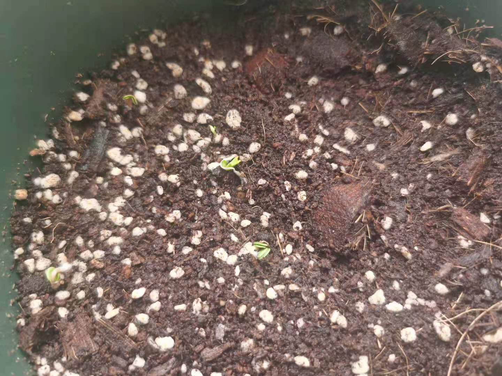
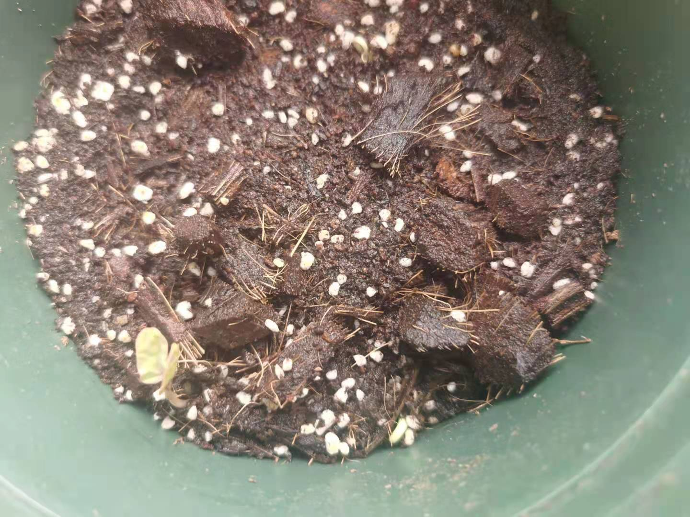
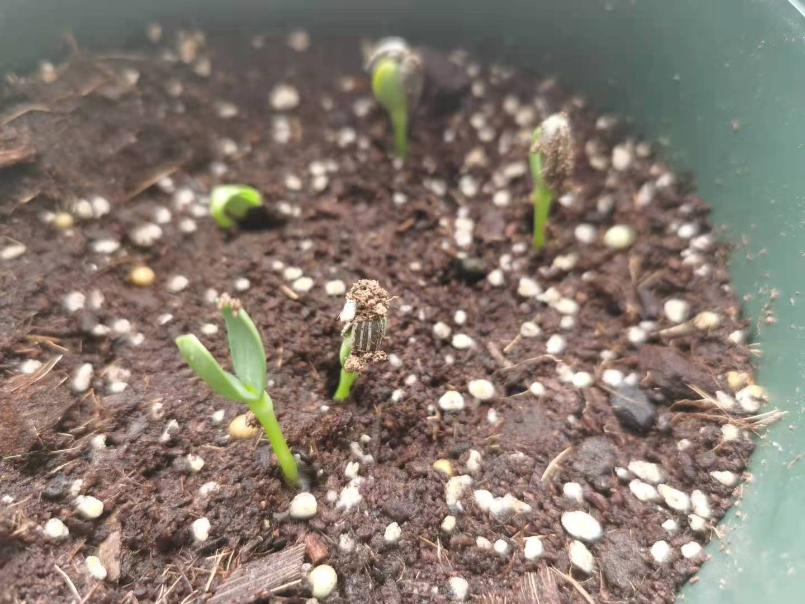

## DAY 0

种菜的想法其实很突然，可能是看到了无穷小亮的视频，可能是实验不顺利，反正就在一系列无法追溯缘由的因果之下，买了九种花果蔬菜的种子，买了盆，买了土。

但是一直没有种，可能由于懒吧。

2021年5月22日，上午到中午，被袁隆平院士逝世的消息所悲恸，与我而言，他们象征着共和国在那个年代所创下的辉煌，
而我自诩为一名科学家（虽然不知道还能在科研的道路上继续前行多久），尚不知道有没有能力接过这沉重的历史接力棒，他们的存在让我感到莫名的安心，国家的脊梁就在那里，
我们还可以有充足的时间来长大，来犯错，就好像一个孩子可以无忧无虑的尽情的在知识的海洋中遨游

但是他们走了，我们就是脊梁

也是为了纪念袁老吧，在晚上的时候我把这些花花中了下去，总共九种：

> 草莓、西红柿、紫苏、牵牛花、蒲公英、薄荷、向日葵、薰衣草、萝卜

## DAY 2 (05.24)

### 水萝卜

### 向日葵

## DAY 3 (05.25)

### 水萝卜

### 向日葵

### 牵牛花

## DAY 4 (05.26)

### 水萝卜

### 向日葵

### 牵牛花

### 西红柿

### 薄荷

## DAY 5 (05.27)

### 水萝卜

### 向日葵

### 牵牛花

### 西红柿

### 薄荷

